# Le Son — script de live encyclopédique

*Provoxys · document maître éditorial · consolidation du 23 septembre 2026 · sans durée imposée*

> **Thèse du live.** Une vibration naît dans un corps, traverse un milieu, rencontre une oreille ou un instrument, devient nombre, musique, trace, diagnostic, puis indice astrophysique. À chaque étape, demander : **qu’est-ce qui vibre, dans quel milieu, que mesure-t-on, et qu’entend-on réellement ?**

**Ouverture à dire.** « Fermez les yeux une seconde. Si je frappe sur cette table, le bois vibre, l’air se comprime, votre oreille reçoit une variation de pression. Vous n’avez pas entendu “la table” : vous avez entendu un trajet. Ce soir, on va suivre ce trajet depuis une grotte jusqu’au bord de l’espace interstellaire. Et chaque fois qu’un son prétendra guérir, révéler l’univers ou effrayer un animal, on lui posera les mêmes quatre questions. »

## Choisir son parcours

**On peut comprendre le fil sans savoir lire les équations.** Commencer par l’idée de chaque acte, observer un exemple, puis rejoindre son **bilan**. Les liens « Étape suivante » forment un parcours continu. Le développement complet, les formules, les portraits et les 56 fiches d’ateliers restent tous disponibles entre ces repères.

| Niveau de lecture | Ce qu’on y cherche | Repères dans le texte |
| --- | --- | --- |
| **Fil essentiel** | Comprendre ce qui se passe et pourquoi cela compte. | Question de départ, idée centrale, bilan et réponse commentée. |
| **Comprendre le mécanisme** | Relier une observation à son explication. | Exemples, schémas, « Pour entrer dans le chapitre », lectures de graphiques et pauses. |
| **Aller plus loin** | Calculer, comparer les modèles ou explorer les sources. | « Lire la formule », lectures symboliques **À dire**, développements experts et références. |

Les niveaux sont des choix de lecture, pas des catégories de public. On peut commencer sans calcul, puis revenir à une formule. Les étoiles des ateliers indiquent une priorité de conception ; elles ne mesurent pas la difficulté du chapitre. Les règles d’édition et les conventions détaillées sont conservées dans le [mode d’emploi du maître](#mode-emploi-maitre).

| Étape | Question qui porte le récit | Lire l’essentiel puis faire le point |
| --- | --- | --- |
| Ouverture | Qu’est-ce qui se déplace quand un son arrive ? | [Entrer](#ouverture) · [Bilan](#bilan-ouverture) |
| I. Lieu et nombre | Comment comparer des sons avant de posséder des appareils ? | [Entrer](#acte-i) · [Bilan](#bilan-i) |
| II. Mesure | Comment transformer une impression en résultat vérifiable ? | [Entrer](#acte-ii) · [Bilan](#bilan-ii) |
| III. Musique | Pourquoi des notes ensemble peuvent-elles sembler lisses ou rugueuses ? | [Entrer](#acte-iii) · [Bilan](#bilan-iii) |
| IV. Oreille | Entendons-nous simplement ce qui entre dans l’oreille ? | [Entrer](#acte-iv) · [Bilan](#bilan-iv) |
| V. Machine | Comment garder, transmettre et reconstruire une vibration ? | [Entrer](#acte-v) · [Bilan](#bilan-v) |
| VI. Écho | Comment un son permet-il de mesurer sans voir ? | [Entrer](#acte-vi) · [Bilan](#bilan-vi) |
| VII. Société et intox | Que peut-on vraiment conclure d’un son ou d’une démonstration ? | [Entrer](#acte-vii) · [Bilan](#bilan-vii) |
| VIII. Vivant | Comment le monde sonore change-t-il d’une espèce à l’autre ? | [Entrer](#acte-viii) · [Bilan](#bilan-viii) |
| IX. Espace | Que signifie écouter une étoile, un plasma ou des données ? | [Entrer](#acte-ix) · [Bilan](#bilan-ix) |

**Suivre sans entendre tous les effets.** L’écoute est une possibilité, jamais une condition de compréhension. Chaque démonstration retenue s’accompagne d’une description et d’un support visuel ou chiffré. Un graphique montre le signal ; il ne prouve pas à lui seul ce qu’une personne perçoit. On peut choisir de ne pas écouter, ne pas percevoir l’effet ou répondre autrement que prévu. Les [solutions de lecture et de participation](#suivre-demonstrations) précisent comment poursuivre dans chaque cas.

**Sécurité sonore.** Commencer tout atelier casque ou haut-parleur à faible volume. Les niveaux générés par un navigateur ne sont pas des dB SPL étalonnés. Une enceinte ordinaire ne reproduit ni un infrason à 1 Hz ni un cri de chauve-souris à 80 kHz : dans ces cas, montrer le signal ou annoncer explicitement sa transposition. Ne pas réaliser de tube de Rubens ou d’expérience à flamme sans dispositif et encadrement adaptés.

**Parcours.** [Ouverture](#ouverture) · [I. Le lieu et le nombre](#acte-i) · [II. Le siècle de la mesure](#acte-ii) · [III. La musique](#acte-iii) · [IV. L’oreille](#acte-iv) · [V. La machine](#acte-v) · [VI. L’écho](#acte-vi) · [VII. Société et intox](#acte-vii) · [VIII. Les autres auditeurs](#acte-viii) · [IX. Hors de l’air](#acte-ix) · [Clôture](#cloture).

**Navigation détaillée.**

- **Ouverture** : [fil](#fil) · [physique](#physique) · [mathématiques](#maths) · [six phénomènes](#phenomenes).
- **I–II, histoire** : [préhistoire](#prehistoire) · [Antiquité](#antiquite) · [Moyen Âge et Renaissance](#moyen-age) · [XVIIe siècle](#xvii) · [Mersenne](#mersenne) · [XVIIIe–XIXe](#xviii).
- **III, musique** : [gammes et instruments](#musique) · [battements](#battements) · [accords et rythme](#accords).
- **IV, audition** : [psychoacoustique et localisation](#psycho) · [oreille et sécurité](#oreille) · [voix et corps](#bio-humaine).
- **V–VI, machines** : [enregistrement et transduction](#enregistrement) · [numérique](#numerique) · [sonar](#sonar) · [Langevin](#langevin) · [ultrasons](#ultrasons) · [Doppler](#doppler).
- **VII, société** : [salles](#archi) · [rites, ville, droit et cinéma](#secteurs) · [industrie et art](#bruit-industrie) · [onze fiches intox](#intox).
- **VIII, vivant** : [bioacoustique](#bio) · [infrasons](#infrasons) · [ultrasons animaux](#ultra-animaux).
- **IX, espace** : [phonons](#quantique) · [ondes dans l’espace](#espace) · [Gurnett](#gurnett) · [astronomie](#astro-ultra).
- **Préparation** : [frise](#frise) · [glossaire](#glossaire) · [expériences et vidéos](#experiences) · [sources](#sources) · [suivi documentaire](#suivi-documentaire) · [banque visuelle](banque-visuelle-son.md) · [56 ateliers](01-experiences-interactives.md).

## Ouverture — une onde, un milieu, une oreille

**Fil essentiel.** Le son transmet une perturbation de proche en proche. Les particules du milieu bougent autour de leur position ; elles ne traversent pas toute la salle avec le son. Grave ou aigu décrit surtout une fréquence ; faible ou fort engage aussi l’amplitude et notre perception.

**Choisir la suite.** [Comprendre avec les exemples](#physique) ou [faire le point](#bilan-ouverture).

**Transition à dire.** « Avant de parler de musique, de médecine ou d’espace, il faut comprendre ce qui voyage. Regardez une particule d’air : elle avance et recule près de sa place. Ce qui traverse la salle, c’est la perturbation. »

**Geste de plateau.** Suivre une particule et un front de compression (S01), puis comparer l’air à la cloche à vide simulée (S03). La particule reste près de sa position ; le front voyage.

### Le fil unique

Après l’ouverture sur l’onde et son milieu, le geste initial traverse neuf actes : **le lieu et le nombre**, **la mesure**, **la musique**, **l’oreille**, **la trace**, **l’écho**, **la société et les intox**, **le vivant**, puis **l’espace**. Trois personnages donnent un visage aux bascules : **Mersenne** mesure une corde ; **Langevin** interroge un écho ; **Gurnett** lit dans une onde de plasma une frontière que nul œil n’a vue. Une seule règle les accompagne : nommer l’objet qui vibre et la transformation qui permet de l’entendre.

### Qu’est-ce que le son — physique de base

**Pour entrer dans le chapitre.** Imaginer une file de personnes qui se transmettent une petite poussée : le message avance sans que chacune traverse la file. C’est une analogie de transmission, pas une description exacte des molécules. Observer d’abord V01, puis lire les six grandeurs ci-dessous. Le calcul de Newton–Laplace peut attendre : on peut rejoindre [les phénomènes](#phenomenes) ou [le bilan de l’ouverture](#bilan-ouverture).

Un son est une **perturbation mécanique qui se propage dans un milieu matériel**. Dans un gaz ou un liquide, l’onde acoustique usuelle est longitudinale : compressions et raréfactions se transmettent tandis que les particules oscillent près de leur position moyenne. Un solide peut aussi porter des ondes de cisaillement et des ondes de surface. Les plasmas possèdent plusieurs familles d’ondes collectives, dont certaines acoustiques ; toutes ne sont pas du son. Pas de milieu matériel, pas de propagation acoustique : une onde électromagnétique ou gravitationnelle appartient à une autre famille.

**À l’écran — V01.** Onde longitudinale — pression représentée schématiquement *→ schéma provisoire, remplacé dans le dossier par l’atelier S01 : L’atelier montre la même rangée de particules, mais calculée, avec λ mesurable et le son joué.*

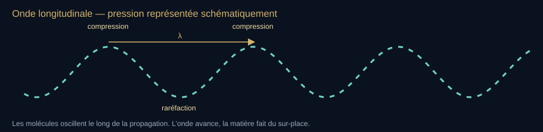

**Lecture du schéma.** La courbe représente la pression en fonction de la position à un instant donné, pas une trajectoire des molécules. Deux maxima de compression sont séparés par λ ; les déplacements moléculaires sont longitudinaux. Le mouvement des tirets est décoratif, sans vitesse étalonnée.

[Fiche visuelle et transcription](banque-visuelle-son.md#v01) · [Ouvrir le SVG autonome](assets/schemas-son/v01-onde-longitudinale.svg)

À projeter dès l’ouverture. Dire : « ce n’est pas le vent, c’est une information de pression. »

#### Grandeurs

**Les trois premières questions.** Est-ce que cela se répète vite (**fréquence**) ? Quelle est l’ampleur de la variation (**amplitude**) ? À quelle vitesse la perturbation voyage-t-elle (**célérité**) ? Changer l’une ne change pas automatiquement les deux autres.

**Repères d’unités.** Hz = cycles par seconde ; kHz = milliers de Hz ; MHz = millions de Hz. Plus loin, mHz = millièmes de Hz et µHz = millionièmes de Hz : la majuscule M et la minuscule m n’ont pas le même sens. Une période est la durée d’un cycle. Le [glossaire](#glossaire) reste accessible à tout moment.

- **Fréquence $f$** : nombre de cycles par seconde, en hertz (Hz). Hauteur perçue (grave / aigu) pour un son périodique.
- **Période $T = 1/f$**.
- **Longueur d’onde $\lambda$** : distance entre deux compressions homologues.
- **Célérité $c$** : $c = \lambda f$. Dans l’air sec à $20^\circ\mathrm{C}$, $c \approx 343\,\mathrm{m\,s^{-1}}$.
- **Amplitude / pression acoustique $p$** : liée à l’intensité et, pour l’oreille, à la sonie (mais la sonie n’est pas linéaire : courbes de Fletcher–Munson, 1933).
- **Intensité $I$** : puissance moyenne transportée par unité de surface, en W/m². Le niveau de **pression** sonore $L_p$ ci-dessous utilise la pression efficace $p$ (RMS), pas la pression de crête :

**Lire la formule — le sens avant les symboles.** Le décibel compare une pression acoustique à une pression de référence. Doubler la pression ajoute environ 6 dB ; cela ne veut pas dire que la sensation est exactement deux fois plus forte. Le logarithme sert à exprimer des rapports très grands avec des nombres maniables.

$$
L_p = 20\log_{10}\frac{p}{p_0}\quad\text{avec }p_0 = 20\,\mu\mathrm{Pa}\text{ dans l’air.}
$$

 **À dire —** « L pé égale vingt log base dix de pé sur pé zéro, avec pé zéro égale vingt micro-pascals dans l’air. »

<!-- atelier:S01 -->
> **Atelier S01 — Onde longitudinale** · *★★★ · effort S · 🔊 · remplace le schéma V01*
>
> **Comment l’utiliser.** Choisir une fréquence avec le curseur, lancer le son, puis cliquer « suivre une molécule » : une particule de la rangée se colore. Mettre en pause pour mesurer λ entre deux zones serrées.
>
> **Ce que ça montre.** Une rangée de particules d’air qui oscillent sur place pendant que les zones de compression avancent ; la courbe de pression p(x) dessous, et λ qui rétrécit quand f monte (c = λ f).
>
> **Sens de lecture.** Regarder d’abord la particule colorée : elle ne part jamais. Puis suivre une zone sombre (compression) : c’est elle qui traverse. La leçon tient dans l’écart entre les deux.
<!-- /atelier -->

#### Équation de Newton–Laplace

Newton, dans les *Principia* (1687), pose essentiellement $c = \sqrt{P/\rho}$ en traitant la compression comme *isotherme*. Avec les valeurs d’aujourd’hui, cette formule donne ~280 m/s à 0 °C, 16 % sous la mesure ; Newton lui-même publie 968 pieds/s (1687) puis 979 (1713), soit ≈ 295–298 m/s avec les données de son temps, et retouche ses hypothèses pour combler l’écart. Laplace (mémoire de 1816, après des travaux dès ~1802) corrige : les compressions d’une onde sonore sont trop rapides pour échanger de la chaleur. Processus *adiabatique* :

**Lire la formule — le sens avant les symboles.** La célérité dépend à la fois de la résistance du milieu à la compression et de la masse à mettre en mouvement. À masse volumique fixée, une plus grande rigidité fait voyager la perturbation plus vite. La racine carrée signifie qu’il faut multiplier le rapport par quatre pour doubler la célérité.

$$
c = \sqrt{\frac{\gamma P}{\rho}} = \sqrt{\frac{K}{\rho}}
$$

 **À dire —** « cé égale racine de gamma pé sur rhô, égale racine de ka sur rhô. »

Ici $P$ est la pression moyenne, $\rho$ la masse volumique et $K$ le module de compressibilité adiabatique ; la formule vise de petites perturbations. On note $\gamma = C_p/C_v \approx 1{,}40$ pour l’air diatomique. **À dire —** « gamma égale cé pé sur cé vé, environ un virgule quarante »

Reste : $c=\lambda f$, $T=1/f$.

**À dire —** « cé égale lambda f » · « té égale un sur f »

$\sqrt{1{,}4}\times 280 \approx 331\,\mathrm{m\,s^{-1}}$ à $0^\circ\mathrm{C}$ : accord avec l’expérience (280 m/s est la valeur isotherme calculée avec $P$ et $\rho$ modernes, pas le chiffre publié par Newton).

**À dire —** « racine de un virgule quatre, fois deux cent quatre-vingts, environ trois cent trente-et-un mètres par seconde. »

##### Ordres de grandeur à avoir en bouche

| Milieu (conditions typiques) | Célérité approx. |
| --- | --- |
| Air sec, 20 °C, 1 atm | 343 m/s |
| Air, 0 °C | 331 m/s |
| Eau douce, ~20 °C | ~1480 m/s |
| Eau de mer | ~1500 m/s |
| Acier | ~5000–6000 m/s (longitudinal) |
| Tissu mou / corps humain (US médical) | ~1540 m/s (convention) |
| Vide spatial | pas d’onde de pression audible |

Colladon & Sturm, lac Léman, 1826 : première mesure sérieuse de la vitesse du son dans l’eau, nettement supérieure à celle dans l’air — cloche immergée, signal lumineux de départ et réception sur un second bateau, à environ 14 km. La valeur mesurée est d’environ 1 435 m/s dans une eau à environ 8 °C ; elle n’est donc pas à comparer sans correction aux 1 480 m/s à 20 °C du tableau.

<!-- atelier:S02 -->
> **Atelier S02 — Newton–Laplace** · *★★ · effort S · 🔊*
>
> **Comment l’utiliser.** Sélectionner un milieu et une température ; basculer entre « Newton (isotherme) » et « Laplace (adiabatique) ». L’option « flûte dans l’hélium » rejoue la même note simulée dans le gaz choisi.
>
> **Ce que ça montre.** La célérité de petites perturbations dans chaque milieu, avec les hypothèses affichées ; dans l’air, comparaison isotherme/adiabatique et courbe c(T). Les 295–298 m/s publiés par Newton sont un repère historique distinct du calcul moderne isotherme à 280 m/s.
>
> **Sens de lecture.** Comparer les deux valeurs pour l’air à 0 °C : 280 contre 331 m/s, l’écart de 16 % que Laplace referme avec γ. Ensuite seulement changer de milieu.
<!-- /atelier -->

#### Spectre utile pour le live

- **Infrasons** : < 20 Hz. Séismes, explosion, éléphants, météores, souffleries, armes, « rumble » des tempêtes. Chapitre dédié : [les infrasons](#infrasons).
- **Audible humain typique** : ~20 Hz – 20 kHz (jeune oreille saine). Bande du téléphone historique ~300–3400 Hz ; la parole réelle déborde cette bande. Sensibilité max autour de 2–5 kHz.
- **Ultrasons** : > 20 kHz. Chauves-souris, dauphins, sonar, échographie, nettoyage, soudure, contrôle non destructif.

**À l’écran — V02.** Schéma 2 — Spectre : infra · audible · ultra *→ schéma provisoire, remplacé dans le dossier par l’atelier S56 : Nouvel atelier « La règle des fréquences » : axe logarithmique 0,01 Hz → 1 GHz, bandes infra / audible / ultra, repères animaux, instruments et machines au survol.*

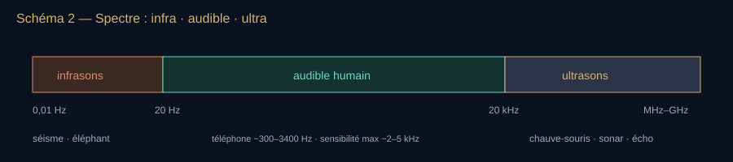

**Lecture du schéma.** Les frontières sont des repères pour une jeune oreille humaine, pas des murs biologiques. Les bandes très élevées relèvent d’autres transducteurs et de conditions de propagation spécifiques.

[Fiche visuelle et transcription](banque-visuelle-son.md#v02) · [Ouvrir le SVG autonome](assets/schemas-son/v02-spectre-acoustique.svg)

Les frontières 20 Hz / 20 kHz sont statistiques, pas des murs. Enfants, chiens, rats, dauphins n’ont pas le même rectangle.

<!-- atelier:S56 -->
> **Atelier S56 — La règle des fréquences** · *★★ · effort S · 🔊 (dans l’audible seulement) · remplace le schéma V02*
>
> **Comment l’utiliser.** Glisser le curseur le long de l’axe et lire ce qui vit à cette fréquence ; activer les calques ; écouter la fréquence quand elle est dans l’audible (le bouton se grise ailleurs).
>
> **Ce que ça montre.** Un seul axe pour tout le dossier : microbaroms à 0,2 Hz, éléphants, orgue de 32 pieds, voix, oreille (20 Hz–20 kHz, maximum 2–5 kHz), chauve-souris, échographe, fréquence plasma de Voyager — avec λ dans l’air affichée pour chaque position.
>
> **Sens de lecture.** Repérer d’abord la fenêtre humaine, étroite au milieu de l’axe ; puis voir combien d’êtres et de machines vivent à sa gauche et à sa droite. Les frontières 20 Hz / 20 kHz sont des repères statistiques, pas des murs.
<!-- /atelier -->

#### Atténuation — pourquoi l’ultra n’est pas un infra inversé

Dans l’air, les pertes visqueuses et thermiques ainsi que la relaxation moléculaire absorbent l’énergie sonore. Le terme classique croît comme $f^2$ ; la loi totale dépend aussi de la température, de l’humidité et de la pression et n’est pas une unique puissance valable partout. Vers 50 kHz, l’absorption peut dépasser 1 dB/m dans des conditions ordinaires ; la portée utile dépend en plus du niveau émis, de la cible et du bruit de fond. Dans l’eau de mer, les contributions de l’acide borique, du sulfate de magnésium et de l’eau pure sont décrites notamment par Francois–Garrison. Les faibles pertes relatives de certaines bandes favorisent le biosonar marin. Le milieu change aussi la célérité, la longueur d’onde et l’impédance : ce n’est pas la seule absorption qui distingue les deux sonars, et les références de niveau dans l’eau et dans l’air restent différentes.

### Mathématiques du son — le minimum rigoureux

**Choix de lecture.** Cette section est une boîte à outils, pas un examen d’entrée. Pour suivre le récit, retenir trois relations : fréquence plus grande → cycles plus rapprochés dans le même milieu ; corde idéale plus longue → note plus grave ; fréquences voisines superposées → battements. On peut aller directement aux [six phénomènes](#phenomenes), puis revenir ici au moment où une formule devient utile.

**Petite clé des signes.** « = » signifie égal ; « ≈ » indique une approximation ; « ∝ » une proportionnalité ; « Δ » une différence ; « Σ » une somme. Une racine carrée répond à la question « quel nombre multiplié par lui-même donne celui-ci ? ». Une intégrale additionne des contributions très petites. Les lettres sont définies localement : le même caractère peut changer de sens d’un modèle à l’autre.

Ces objets permettent de calculer ce que le récit fait observer. Les écrire au tableau au moment où ils servent, puis y revenir ; leur présence ici donne un point de référence commun.

#### Équation d’onde (d’Alembert, 1747)

**Lire la formule — le sens avant les symboles.** Cette équation relie la façon dont la pression change au cours du temps à la façon dont elle diffère entre points voisins. Le symbole ∂ indique une variation ; les exposants 2 désignent ici des dérivées secondes, pas la pression au carré. ∇² rassemble les variations spatiales dans les différentes directions. L’idée à garder : une déformation locale se transmet.

$$
\frac{\partial^2 p}{\partial t^2} = c^2 \nabla^2 p
$$

 **À dire —** « d deux pé sur d té deux égale cé deux nabla deux pé. »

En une dimension : $p_{tt} = c^2 p_{xx}$. Solutions de d’Alembert : $f(x-ct)+g(x+ct)$ — une onde qui part à droite, une à gauche. Toute la salle, toute la corde, tout le tuyau est déjà là.

**À dire —** « pé té té égale cé deux pé ix ix » · « f de x moins cé té plus g de x plus cé té »

#### Corde de Mersenne

Fréquence fondamentale d’une corde de longueur $L$, tension $\tau$, masse linéique $\mu$ :

**Lire la formule — le sens avant les symboles.** Une corde plus longue vibre plus lentement ; une tension plus grande accélère la vibration ; une masse par mètre plus grande la ralentit. L désigne la longueur, τ la tension, μ la masse linéique. Pour la corde idéale, les modes suivants vibrent deux, trois, quatre fois plus vite que le premier.

$$
f_1 = \frac{1}{2L}\sqrt{\frac{\tau}{\mu}} \qquad f_n = n f_1
$$

 **À dire —** « f un égale un sur deux L, racine de tau sur mu. f n égale n f un. »

Conséquences live, mesurables sur un monocorde : doubler $L$ descend d’une octave ; quadrupler $\tau$ monte d’une octave ; doubler $\mu$ divise la fréquence par $\sqrt{2}$, soit six demi-tons tempérés ; quadrupler $\mu$ baisse d’une octave. Comparer à tension et longueur constantes.

**À l’écran — V03.** Schéma 3 — Modes d’une corde fixée aux deux bouts *→ schéma provisoire, remplacé dans le dossier par l’atelier S04 : La corde calculée affiche ses modes en barres et en profils ; les trois dessins fixes deviennent trois états de l’atelier.*

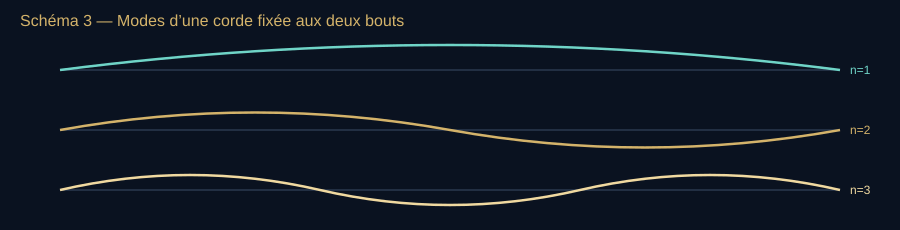

**Lecture du schéma.** Nœuds de déplacement aux extrémités ; n = 1, 2, 3 donnent fondamentale, octave et douzième. La corde est idéale ; sa raideur peut déplacer les partiels.

[Fiche visuelle et transcription](banque-visuelle-son.md#v03) · [Ouvrir le SVG autonome](assets/schemas-son/v03-modes-corde.svg)

Nœuds aux extrémités. $n=2$ est l’octave. $n=3$ la douzième (octave + quinte). C’est déjà toute la série harmonique.

<!-- atelier:S04 -->
> **Atelier S04 — La corde de d’Alembert** · *★★★ · effort L · 🔊 · plein écran · remplace le schéma V03*
>
> **Comment l’utiliser.** Pincer la corde à la souris, écouter, lire la fréquence mesurée. Doubler la tension, puis la longueur ; pincer au milieu, puis près du chevalet.
>
> **Ce que ça montre.** Une corde résolue numériquement (équation d’onde 1D) : deux ondes qui partent et se réfléchissent, les modes affichés en barres, et f₁ = (1/2L)√(τ/µ) confrontée à la mesure. Le son sort de la simulation, pas d’un sample.
>
> **Sens de lecture.** D’abord la forme de la corde juste après le pincement (deux fronts qui s’éloignent), puis les barres de modes : pincer au milieu éteint les harmoniques pairs. Enfin vérifier que quadrupler τ monte d’une octave.
<!-- /atelier -->

#### Tuyaux

Ouvert-ouvert : $f_n = n\,c/(2L)$. Fermé-ouvert idéal : seulement les impairs, $f_n = (2n-1)\,c/(4L)$. Ce modèle aide à comprendre le registre chalumeau de la clarinette ; une clarinette réelle, percée de trous et munie d’un pavillon, ne se réduit pas à un tuyau idéal. Correction d’embouchure : $L$ effectif $>$ $L$ géométrique — déjà le souci de Mersenne quand il mesure.

**À dire —** « f n égale n cé sur deux L » (ouvert) · « f n égale deux n moins un, cé sur quatre L » (fermé-ouvert)

<!-- atelier:S05 -->
> **Atelier S05 — Tuyaux ouverts et fermés** · *★★ · effort M · 🔊*
>
> **Comment l’utiliser.** Choisir la longueur, basculer ouvert / fermé, écouter le timbre. Faire monter la température pour voir un orgue se désaccorder.
>
> **Ce que ça montre.** Les profils de pression et de vitesse des modes, la série n c/2L contre (2n−1) c/4L, le spectre du son joué.
>
> **Sens de lecture.** Comparer les deux séries à longueur égale : le fermé sonne une octave plus bas et n’a que les impairs, d’où la couleur « creuse » de la clarinette.
<!-- /atelier -->

#### Battements

**Lire la formule — le sens avant les symboles.** Compter les pulsations revient à compter l’écart entre les deux fréquences. Avec 440 et 442 Hz, l’amplitude gonfle deux fois par seconde. Les barres autour de la différence demandent de garder une valeur positive, quel que soit l’ordre de soustraction.

$$
f_{\mathrm{batt}} = |f_a - f_b|
$$

 **À dire —** « f battement égale valeur absolue de f a moins f b. »

Deux diapasons à 440 et 442 Hz : on entend 2 battements par seconde. C’est l’accordeur vivant, et le début de la rugosité de Helmholtz. Analyse complète : [chapitre battements](#battements).

#### Gamme juste vs tempérament égal

Juste (rapports entiers) : octave $2/1$, quinte $3/2$, quarte $4/3$, tierce majeure $5/4$, tierce mineure $6/5$, ton majeur $9/8$.

Tempérament égal à 12 degrés, compromis pour toutes les tonalités depuis le XVIIIe (théorisé bien avant, généralisé avec le piano) :

**Lire la formule — le sens avant les symboles.** Dans le tempérament égal, chaque demi-ton multiplie la fréquence par le même petit facteur. Après douze pas, on a doublé la fréquence : une octave. k compte les pas depuis la note de départ ; une puissance évite d’écrire toutes les multiplications.

$$
f_k = f_0 \cdot 2^{k/12} \qquad \text{demi-ton} = \sqrt[12]{2} \approx 1{,}05946
$$

 **À dire —** « f k égale f zéro fois deux puissance k sur douze. Demi-ton égale racine douzième de deux, environ un virgule zéro cinq neuf quatre six. »

La quinte tempérée $2^{7/12} \approx 1{,}4983$ au lieu de $1{,}5$. Écart : ~1,96 cent (un cent = $1/100$ de demi-ton, $1200\log_2(f_2/f_1)$). Assez petit pour l’oreille occidentale moderne, assez grand pour un chanteur a cappella qui « juste » autrement.

#### Série de Fourier

**Lire la formule — le sens avant les symboles.** Fourier décrit un signal périodique comme un mélange de vibrations simples. Le signe Σ demande de les additionner ; n numérote les harmoniques ; les coefficients a et b en règlent le dosage et la phase. L’infini décrit le modèle : une reconstruction pratique en utilise un nombre fini.

$$
s(t) = a_0 + \sum_{n=1}^{\infty}\bigl(a_n\cos(2\pi n f_0 t)+b_n\sin(2\pi n f_0 t)\bigr)
$$

 **À dire —** « s de té égale a zéro plus somme de n égale un à l’infini de a n cosinus de deux pi n f zéro té plus b n sinus de deux pi n f zéro té. »

Un la de hautbois et un la de piano ont le même $f_0$ et des $\{a_n,b_n\}$ différents. Helmholtz écoute ça avec des sphères de laiton. Aujourd’hui un spectrogramme.

<!-- atelier:S17 -->
> **Atelier S17 — Fourier à la main** · *★★★ · effort L · 🔊 · plein écran*
>
> **Comment l’utiliser.** Dessiner une période au doigt, ou choisir un carré. Augmenter N harmonique par harmonique et écouter la reconstruction à la fréquence choisie.
>
> **Ce que ça montre.** Les coefficients a_n, b_n calculés, la somme partielle superposée au dessin, le phénomène de Gibbs aux angles, les épicycles qui tournent.
>
> **Sens de lecture.** Partir de N = 1 (un sinus) et monter : le dessin se remplit et le timbre s’épaissit en même temps. Les oreilles suivent les yeux ; c’est le sens même de « le timbre est un dosage ».
<!-- /atelier -->

#### Décibel, Doppler, Sabine — formules de service

**Lire la formule — le sens avant les symboles.** Rappel du niveau de pression : le nombre en décibels exprime un rapport à 20 micropascals dans l’air. Sans préciser la référence, comparer deux nombres en dB peut être trompeur ; le zéro de cette échelle n’est pas une absence de vibration.

$$
L_p = 20\log_{10}(p/20\,\mu\mathrm{Pa})
$$

 **À dire —** « L pé égale vingt log dix de pé sur vingt micro-pascals. »

**Lire la formule — le sens avant les symboles.** Doppler compare la cadence d’émission à la cadence de rencontre des fronts d’onde. Le signe dépend de qui se rapproche ou s’éloigne. Cette écriture est un aide-mémoire ; les cas séparés et leurs signes sont expliqués au [chapitre Doppler](#doppler).

$$
f' = f\,\frac{c \pm v_o}{c \pm v_s}
$$

 **À dire —** « f prime égale f fois cé plus ou moins vé o, sur cé plus ou moins vé s. »

**Lire la formule — le sens avant les symboles.** Dans le modèle de Sabine, le son persiste davantage dans un grand volume et moins quand les surfaces absorbent davantage. A additionne chaque surface multipliée par son coefficient d’absorption. À volume inchangé, doubler A divise le temps de réverbération par deux.

$$
T_{60} \approx \frac{0{,}161\,V}{A}\quad (A=\sum \alpha_i S_i)
$$

 **À dire —** « té soixante environ égale zéro virgule cent soixante-et-un V sur A, A égale somme des alpha i S i. »

Observation de plateau : si tu changes $V$ d’une salle sans toucher les matériaux, $T_{60}$ bouge. Si tu ajoutes du public, $A$ monte, la salle sèche. Sabine a passé ses nuits à le mesurer avec des coussins.

### Ce que fait une onde quand elle rencontre le monde — six phénomènes, une seule physique

**Pour entrer dans le chapitre.** Partir d’un son derrière une porte : une partie revient, une partie traverse la paroi, une partie passe par l’ouverture ; la pièce transforme ensuite ce qui reste. Les six noms servent à séparer ces mécanismes. Lire d’abord leurs phrases de résumé, puis ouvrir l’explication du phénomène observé ; les calculs de salle restent facultatifs.

Réflexion, réfraction, diffraction, interférence, résonance, atténuation. Le script les emploie partout (Épidaure, Sabine, SOFAR, chauves-souris, basse du voisin) ; ici ils sont posés une fois, avec la règle qui les commande tous : *tout se juge à l’échelle de la longueur d’onde*. Un obstacle est « grand » ou « petit » par rapport à $\lambda$, jamais en mètres.

**À l’écran — V04.** Schéma — la règle de λ *→ schéma provisoire, remplacé dans le dossier par l’atelier S09 : Préset « obstacle contre λ » du bac à ondes : le même mur avec une source à 100 Hz, 1 kHz, 4 kHz.*

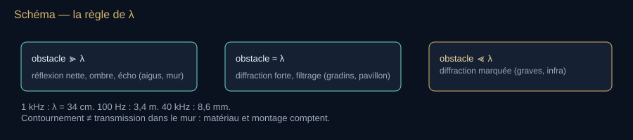

**Lecture du schéma.** Lire les trois rapports de taille ; ne pas confondre diffraction autour de l’obstacle et transmission à travers une paroi. Le matériau et les conditions aux limites comptent aussi.

[Fiche visuelle et transcription](banque-visuelle-son.md#v04) · [Ouvrir le SVG autonome](assets/schemas-son/v04-longueur-onde-obstacles.svg)

#### 1. Réflexion — l’écho et la salle

Sur une paroi grande devant $\lambda$ : angle réfléchi = angle incident. Un écho *distinct* demande un retard d’au moins ~50–80 ms (le seuil où l’oreille sépare deux événements : chapitre psychoacoustique, effet de précédence), soit un mur à environ 9–14 m pour cet aller-retour. Ce repère dépend du signal : des clics peuvent être séparés avec des retards plus courts que la parole. En dessous, les réflexions fusionnent avec le son direct : c’est la réverbération, celle que Sabine chronomètre. La fraction réfléchie dépend du saut d’impédance $Z=\rho c$ (chapitre ultrasons) : air/béton renvoie presque tout, les matériaux poreux peuvent en absorber une grande part selon leur épaisseur, leur montage et la fréquence ; une simple différence d’impédance ne décrit pas tout leur fonctionnement.

**À dire —** « l’angle réfléchi égale l’angle incident » · « zé égale rhô cé »

#### 2. Réfraction — le son qui « porte » le soir

La célérité dépend de la température ($c \approx 331{,}3\sqrt{1+T/273{,}15}$ m/s, $T$ en °C : +0,6 m/s par degré). Quand $c$ varie avec l’altitude, les fronts d’onde tournent vers le côté lent (loi de Snell continue). Journée : sol chaud, air froid en haut → le son se courbe vers le haut, zone d’ombre au sol. Soir et nuit : inversion de température → le son se courbe vers le sol et une voix traverse un lac. Même mécanisme dans l’océan avec la pression et la température : c’est le canal SOFAR (chapitre société / mer) et, dans le Soleil, la remontée des modes p (chapitre astronomie).

**Lire la formule — le sens avant les symboles.** Quand la célérité change d’une région à l’autre, la direction de propagation peut changer. Les angles θ sont mesurés depuis la normale à l’interface. Pour l’air, la seconde relation rappelle que la température agit sur la célérité ; elle n’impose pas une vitesse à la source.

$$
\frac{\sin\theta_1}{c_1}=\frac{\sin\theta_2}{c_2}\qquad c(T) \approx 331{,}3\sqrt{1+\frac{T}{273{,}15}}
$$

 **À dire —** « sinus thêta un sur cé un égale sinus thêta deux sur cé deux » · « cé de T environ égale trois cent trente-et-un virgule trois, racine de un plus T sur deux cent soixante-treize virgule quinze »

#### 3. Diffraction — pourquoi les graves contournent les obstacles

La diffraction désigne l’étalement d’une onde autour d’un obstacle ou à travers une ouverture. Elle est particulièrement marquée lorsque leurs dimensions sont comparables à la longueur d’onde ou plus petites. À 100 Hz, $\lambda$ vaut environ 3,4 m ; à 4 kHz, environ 8,6 cm : la même porte produit des effets très différents. Les graves contournent facilement un angle, le pavillon de l’oreille filtre surtout les aigus, et les petites longueurs d’onde favorisent l’écho sur une petite proie. **Traverser une cloison est un autre problème** : transmission par la paroi mise en vibration, masse, raideur, résonances, fuites et transmissions par les structures. La diffraction explique le contournement ; elle n’explique pas à elle seule la basse du voisin.

#### 4. Interférence et ondes stationnaires — les modes de la pièce

Deux ondes cohérentes s’ajoutent en pression : en phase, elles se renforcent ; en opposition, elles s’annulent (principe de l’anti-bruit actif, brevet de Lueg déposé en 1933, délivré en 1936). Entre deux murs parallèles distants de $L$, l’aller-retour crée des stationnaires aux fréquences $c/2L$ et multiples : ce sont les **modes propres** de la pièce. Pour un parallélépipède :

**Lire la formule — le sens avant les symboles.** La pièce sélectionne des façons de vibrer selon ses trois dimensions. Lx, Ly et Lz sont ses longueurs ; nx, ny et nz comptent les motifs dans chaque direction, sans prendre les trois indices nuls ensemble. Allonger une dimension abaisse les fréquences des modes associés à cette direction.

$$
f_{n_x n_y n_z}=\frac{c}{2}\sqrt{\left(\frac{n_x}{L_x}\right)^2+\left(\frac{n_y}{L_y}\right)^2+\left(\frac{n_z}{L_z}\right)^2}
$$

 **À dire —** « f n x n y n z égale cé sur deux, racine de n x sur L x au carré, plus n y sur L y au carré, plus n z sur L z au carré. »

Pour une dimension de 4 m, le premier mode axial correspondant est à ~43 Hz : la basse « boome » à un endroit et disparaît un mètre plus loin. Au-dessus de la **fréquence de Schroeder** $f_S \approx 2000\sqrt{T_{60}/V}$ (Schroeder 1962), les modes se recouvrent tellement que la salle redevient statistiquement lisse — c’est la frontière entre l’acoustique « modale » des studios et l’acoustique de Sabine.

**À dire —** « f S environ égale deux mille racine de T soixante sur V » — $V$ en mètres cubes, $T_{60}$ en secondes.

<!-- atelier:S09 -->
> **Atelier S09 — Bac à ondes 2D** · *★★★ · effort XL · 👁 (+🔊 sonde) · plein écran · remplace le schéma V04, V05*
>
> **Comment l’utiliser.** Choisir un préset ou dessiner ses murs, poser la source, lancer une impulsion. Déplacer la sonde pour lire p(t) à un endroit ; passer en source continue pour voir les modes.
>
> **Ce que ça montre.** Une simulation d’ondes (FDTD) où réflexion, diffraction, interférence et stationnaires se produisent d’elles-mêmes ; la sonde trace la pression et son spectre.
>
> **Sens de lecture.** Une impulsion d’abord : suivre le front, ses rebonds, son contournement du coin. Puis une source continue à basse fréquence : les taches fixes sont les modes de la pièce ; monter la fréquence, elles se multiplient et se brouillent.
<!-- /atelier -->

#### 5. Résonance — le verre, la salle, le pont

Un système avec une fréquence propre répond fort si on l’excite à cette fréquence, d’autant plus que son amortissement est faible (facteur de qualité $Q$ élevé). Verre de cristal (doigt mouillé = excitation par stick-slip, même famille que l’archet), colonne d’air (Helmholtz), corde (Mersenne), cochlée (chapitre oreille), pièce (modes ci-dessus). Le tableau à garder : la résonance ne crée pas d’énergie, elle l’accumule cycle après cycle. Le verre casse si l’amplitude dépasse la limite du matériau, pas parce qu’une fréquence serait « magique » — encadré Tacoma / Angers au chapitre expériences.

#### 6. Distance et atténuation — inverse du carré, addition, absorption

Source ponctuelle en champ libre : l’intensité se dilue sur une sphère, $I \propto 1/r^2$, soit **−6 dB par doublement de distance**. Pour des sources **non corrélées**, on additionne les intensités moyennes, pas les décibels :

**Lire la formule — le sens avant les symboles.** En champ libre, s’éloigner d’une source ponctuelle répartit son énergie sur une surface plus grande : doubler la distance enlève environ 6 dB. Pour additionner des sources non corrélées, on revient d’abord à leurs contributions physiques ; on n’additionne pas directement leurs nombres en dB.

$$
L(r)=L_1-20\log_{10}\frac{r}{r_1}\qquad L_{\text{tot}}=10\log_{10}\sum_i 10^{L_i/10}
$$

 **À dire —** « L de r égale L un moins vingt log dix de r sur r un » · « L total égale dix log dix de la somme sur i de dix puissance L i sur dix » — deux contributions non corrélées de 60 dB donnent environ 63 dB ; dix contributions égales donnent +10 dB. Deux pressions cohérentes, égales et en phase au point de mesure donnent au contraire +6 dB ; en opposition, elles peuvent s’annuler localement.

S’ajoute l’absorption de l’air (ISO 9613-1 : relaxation de O₂ et N₂, dépendante de l’humidité), négligeable dans une pièce, décisive à l’échelle d’un stade ou d’un sonar : à 20 °C et 70 % d’humidité, de l’ordre de 5 dB/km à 1 kHz, ~23 dB/km à 4 kHz, ~78 dB/km à 8 kHz (à 50 % d’humidité : ~30 et ~105) ; à 40 kHz, plus d’un décibel *par mètre*. C’est le même tableau que le chapitre ultrasons animaux : le tonnerre lointain est grave en partie parce que ses aigus sont morts en route (le spectre grave de la source et la longueur du canal de l’éclair comptent aussi), et le cri de chauve-souris meurt en quelques dizaines de mètres.

##### Les six phénomènes, en une ligne chacun, à dire au plateau

- Réflexion : le mur est un miroir si $\lambda$ est petite devant lui.
- Réfraction : le son tourne vers l’air lent (froid).
- Diffraction : comparer l’obstacle et l’ouverture à $\lambda$ pour prévoir l’étalement et l’ombre ; petit ne signifie pas inexistant.
- Interférence : deux pressions s’additionnent, parfois à zéro.
- Résonance : accumuler, pas créer.
- Distance : −6 dB par doublement, et l’air mange les aigus.

Phrase plateau : « Le son ne connaît pas les mètres. Il ne connaît que ses propres longueurs d’onde, et il compare tout à elles. »

<!-- atelier:S11 -->
> **Atelier S11 — Inverse du carré et décibels** · *★★★ · effort S · 🔊*
>
> **Comment l’utiliser.** Éloigner la source et lire le niveau ; ajouter des sources identiques une à une et regarder le total.
>
> **Ce que ça montre.** L(r) = L₁ − 20 log(r/r₁), la somme énergétique des niveaux (60 + 60 = 63 dB), une échelle de référence chuchotement → réacteur.
>
> **Sens de lecture.** Chaque doublement de distance retire 6 dB ; chaque doublement de sources n’ajoute que 3 dB. Retenir les deux nombres, ils suffisent à démonter la plupart des « dB » de presse.
<!-- /atelier -->

<!-- atelier:S12 -->
> **Atelier S12 — Absorption dans l’air** · *★★ · effort M · 🔊*
>
> **Comment l’utiliser.** Choisir une distance et une humidité, écouter un bruit blanc « après d mètres » ; monter la fréquence du curseur jusqu’à 40 kHz.
>
> **Ce que ça montre.** Le coefficient α(f) de l’ISO 9613-1 en dB/km, le spectre du bruit filtré par la distance.
>
> **Sens de lecture.** À 1 kHz, la courbe est plate (5 dB/km) ; à 8 kHz elle grimpe (78 dB/km) ; à 40 kHz elle dépasse 1 dB par mètre. Le tonnerre lointain et la courte portée du sonar aérien se lisent sur la même courbe.
<!-- /atelier -->

### Bilan — Distinguer les grandeurs

- La perturbation se propage ; les particules du milieu oscillent localement.
- La fréquence compte les cycles par seconde ; l’amplitude décrit l’ampleur de la variation.
- Le milieu, les obstacles et le récepteur transforment ce qui sera reçu.

**Question au public.** Si le son devient plus aigu dans le même air, sa longueur d’onde augmente-t-elle ?

**Réponse et relance.** Elle diminue : à célérité inchangée, davantage de cycles par seconde correspondent à des cycles plus courts dans l’espace. On peut le montrer avec des fronts plus rapprochés sans avoir à entendre une différence.

**Pour reprendre le fil.** Nous avons les grandeurs ; voyons comment on a appris à les comparer.

[Étape suivante](#acte-i) · [Carte du parcours](#parcours-guide)

## I. Le lieu et le nombre

**Fil essentiel.** Avant les équations, on compare des longueurs de corde et les réponses des lieux. Une corde deux fois plus courte peut donner l’octave supérieure, à tension et masse par unité de longueur inchangées. Cette régularité se mesure ; elle ne transforme pas toute tradition musicale en loi physique.

**Choisir la suite.** [Comprendre avec les exemples](#prehistoire) ou [faire le point](#bilan-i).

**Transition à dire.** « Dans une grotte, le son répond. Sur une corde, il se laisse comparer. Les humains ont d’abord construit des lieux, des rites et des instruments ; bien avant de pouvoir écrire une équation, ils avaient déjà des questions expérimentales. »

**Geste de plateau.** Déplacer le chevalet d’un monocorde (S27) : moitié de longueur, octave au-dessus. Montrer ensuite que la légende du marteau de Pythagore est une histoire de transmission, pas un protocole vérifié.

### Avant la science : préhistoire et archéoacoustique

Le son précède l’écriture de plusieurs dizaines de millénaires. On n’a pas de traité, on a des **lieux, des os, des lithophones, des résonances**.

- Instruments possibles dès le Paléolithique supérieur : flûtes en os d’oiseau (ex. Hohle Fels, Allemagne, ~40 000 ans — à citer avec prudence sur l’interprétation musicale exacte), rhombe, lithophones, voix, mains claquées dans les grottes.
- Recherches d’**archéoacoustique** (Iégor Reznikoff, Michel Dauvois dès 1983 ; projet ERC *Artsoundscapes* de Margarita Díaz-Andreu, 2018–2025 ; en parallèle, Rupert Till) : corrélation mesurée entre zones peintes des grottes ornées et zones de résonance / écho. Ce n’est pas une preuve que « tout l’art rupestre est de la musique », c’est une hypothèse forte et désormais mesurée : certaines parois décorées « répondent » dans les graves.
- Poteries néolithiques (culture de Yangshao, Chine, citée dans les chronologies de l’Année internationale du son) portant des motifs de vaguelettes : lecture symbolique possible des ondes, pas une théorie physique.

Angle live : « Avant que le son soit une équation, il est un lieu. La grotte est déjà une salle de concert et un instrument. »

**À l’écran — V05.** Schéma — grotte comme instrument *→ schéma provisoire, remplacé dans le dossier par l’atelier S09 : Préset « grotte » du bac à ondes : galerie irrégulière, source vocale, sonde sur la paroi peinte.*

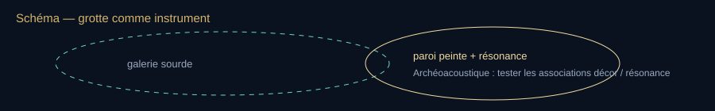

**Lecture du schéma.** Schéma d’une hypothèse archéoacoustique, sans reconstitution certaine d’un rite. Une association spatiale ne prouve pas l’intention des peintres ni une règle valable pour toutes les grottes.

[Fiche visuelle et transcription](banque-visuelle-son.md#v05) · [Ouvrir le SVG autonome](assets/schemas-son/v05-grotte-resonance.svg)

### Antiquité — le son devient nombre, air, architecture

#### Chine, Inde, Proche-Orient

- **Chine**, dès le IIe millénaire av. n. è. : carillons de bronze (ex. cloches *bianzhong* du marquis Yi de Zeng, Ve s. av. n. è.) accordés avec une précision qui suppose une pratique empirique des intervalles. Traités musicaux liés au calendrier et à la cosmologie (gamme des lü).
- **Inde védique et classique** : le *Nada* (son) comme principe ; classification des notes (*svara*), micro-intervalles (*shruti*). Acoustique ici d’abord liturgique et théorique, pas expérimentale au sens galiléen.
- **Égypte / Mésopotamie** : harpes, lyres d’Ur, trompettes de Toutânkhamon. Pas de traité d’ondes conservé comparable aux Grecs, mais une ingénierie instrumentale réelle.

#### Grèce : Pythagore, Archytas, Aristote, Épidaure

**Pythagore de Samos** (c. 570–490 av. n. è.) et l’école de Crotone : tradition (en partie légendaire, rapportée plus tard par Nicomaque, Jamblique, Boèce) du forgeron et du **monocorde**. Rapports simples de longueurs de corde :

- 2:1 → octave
- 3:2 → quinte
- 4:3 → quarte

C’est la première *mathématisation* documentée du son musical en Occident. L’« harmonie des sphères » de Platon prolonge le geste : le cosmos lui-même serait accordé. Ce n’est pas de la physique d’ondes, c’est une ontologie du nombre.

**Archytas de Tarente** (c. 430–350 av. n. è.) : le son naît d’un choc ; l’aigu correspond à un mouvement plus rapide / plus dense. **Aristote** (*De anima*) et la tradition des *Problèmes* pseudo-aristotéliciens : le son est transmis par l’air mis en mouvement ; sans milieu, rien n’arrive à l’oreille. Intuition juste, mécanisme encore flou (il n’a pas la fréquence au sens moderne).

Théâtre d’Épidaure (Péloponnèse). L’agencement périodique des gradins filtre une partie des graves du bruit de fond. Crédit : Wikimedia Commons.
**Théâtre d’Épidaure** (architecte Polyclète le Jeune, construction souvent datée vers 330–300 av. n. è., ≈ 6 000 places au IVe s., puis 13 000–14 000 après l’extension du IIe s. av. n. è.). L’anecdote touristique de la pièce entendue aux derniers gradins dépend du calme ambiant et des conditions d’essai ; elle ne constitue pas une mesure reproductible de l’intelligibilité. Travaux de Nico F. Declercq et al. : les rangées de sièges en calcaire agissent comme un **filtre acoustique** qui atténue les basses < ~500 Hz (vent, feuillage, rumeur) et laisse passer la bande utile de la voix. Ce n’est pas de la magie, c’est de la diffraction périodique.

<!-- atelier:S10 -->
> **Atelier S10 — Gradins d’Épidaure** · *★★ · effort M · 🔊*
>
> **Comment l’utiliser.** Jouer la voix seule, puis le bruit de fond, puis les deux à travers le filtre des gradins. Modifier le pas des marches pour déplacer la coupure.
>
> **Ce que ça montre.** La réponse en fréquence d’un réseau périodique de marches : atténuation sous ~500 Hz, passage de la bande de la voix (Declercq & Dekeyser 2007).
>
> **Sens de lecture.** Lire la courbe de gauche à droite : le creux dans les graves, le plateau dans la bande 500–3 000 Hz. Puis écouter : le vent baisse, la voix reste. Ce n’est pas de la magie, c’est de la diffraction.
<!-- /atelier -->

<!-- atelier:S27 -->
> **Atelier S27 — Monocorde de Pythagore** · *★★★ · effort S · 🔊*
>
> **Comment l’utiliser.** Glisser le chevalet aux repères 1/2, 2/3, 3/4, 4/5 ; jouer la portion et la corde entière ensemble.
>
> **Ce que ça montre.** Le rapport de longueurs, l’intervalle nommé, les cents, les battements entre les deux notes.
>
> **Sens de lecture.** Aux rapports simples, les deux notes fusionnent ; entre les repères, ça frotte. La légende du forgeron est fausse ; la corde, elle, dit vrai.
<!-- /atelier -->

#### Rome et transmission

**Vitruve** (*De architectura*, Ier s. av. n. è.) décrit vases acoustiques, échos, emplacement des théâtres. **Boèce** (c. 480–524), *De institutione musica* : pont majeur vers le Moyen Âge latin, recycle Pythagore et le monocorde.

### Moyen Âge et Renaissance — le son reste d’abord musique

L’Europe médiévale théorise les modes, le plain-chant, puis la polyphonie (Notre-Dame de Paris, école de Léonin / Pérotin). L’acoustique des nefs gothiques est un laboratoire involontaire de réverbération longue : la liturgie s’écrit pour la pierre. Dans le monde islamique, Al-Fârâbî et Avicenne développent des théories musicales des proportions et des instruments ; le rapprochement avec le pouls et la médecine est notamment documenté chez Avicenne. À la Renaissance, **Vincenzo Galilei** (père de Galilée), luthiste et théoricien, critique l’autorité pythagoricienne pure et mesure ; il prépare le terrain expérimental de son fils. **Giovanni Battista Benedetti** (1585) affirme déjà l’égalité entre rapport de hauteurs et rapport de fréquences — idée décisive, encore mal diffusée.

### Bilan — Comparer avant de calculer

- Les lieux et les instruments fournissent des expériences avant les théories d’ondes.
- Un rapport de longueurs peut produire un intervalle musical dans des conditions précises.
- Une légende historique et un protocole vérifiable n’ont pas le même statut.

**Question au public.** Une gamme est-elle imposée entièrement par la physique ?

**Réponse et relance.** Non. Les propriétés des vibrations offrent des possibilités et des contraintes ; les usages musicaux et les choix culturels organisent aussi les notes.

**Pour reprendre le fil.** Passons des régularités observées aux mesures que l’on peut refaire.

[Étape suivante](#acte-ii) · [Carte du parcours](#parcours-guide)

## II. Le siècle de la mesure

**Fil essentiel.** Mesurer, c’est changer une chose à la fois, compter et permettre à quelqu’un d’autre de recommencer. Mersenne relie les dimensions d’une corde à sa fréquence ; Boyle éprouve le rôle du milieu ; les figures de Chladni rendent des modes de vibration visibles.

**Choisir la suite.** [Comprendre avec les exemples](#xvii) ou [faire le point](#bilan-ii).

**Transition à dire.** « Nous quittons les rapports admirés pour les rapports mesurés. Une corde tendue, une pompe à vide et une roue dentée vont faire du son un objet que l’on peut mettre à l’épreuve. »

**Geste de plateau.** Jouer la corde simulée (S04) avec deux tensions et montrer la fréquence mesurée. Faire disparaître le son de la cloche (S03) en réduisant le milieu.

### XVIIe siècle — naissance de l’acoustique expérimentale

C’est le basculement : le son quitte le seul art musical et entre dans la mécanique.

#### Galilée (1564–1642)

*Discours concernant deux sciences nouvelles* (Leyde, 1638), fin de la « Première Journée » : discussion la plus nette de l’époque sur la **fréquence** (*numeri delle vibrazioni*), analogie pendule / corde, rôle de la longueur, de la tension, de la densité linéaire. Il relie consonance et rapports entiers de fréquences.

#### Marin Mersenne (1588–1648), né à Oizé (Sarthe)

Minime parisien, « secrétaire de l’Europe savante ». *Harmonie universelle* (1636–1637). Souvent appelé **père de l’acoustique** :

- lois des cordes vibrantes (fréquence inversement proportionnelle à la longueur, proportionnelle à la racine de la tension, inversement à la racine de la masse linéique) — les « lois de Mersenne » ;
- première détermination *absolue* d’une fréquence audible (environ 84 Hz) ;
- l’octave = rapport 1:2 en fréquence, pas seulement en longueur ;
- mesures de la vitesse du son (valeurs encore dispersées : ses chiffres varient selon les protocoles) ;
- écho traité comme réflexion, plus comme divinité des bois.

#### Robert Boyle (1627–1691) et la pompe à vide

*New Experiments Physico-Mechanical* (1660), expérience 27 : une montre à sonnerie suspendue sous la cloche à vide. À mesure que l’air est pompé, le tic-tac s’éteint ; la cloche frappée, elle, ne fait que faiblir (le fil et l’air résiduel conduisent encore). Démonstration fondatrice : **l’air (un milieu) est nécessaire à la transmission du son jusqu’à l’oreille**. Hooke assiste Boyle.

<!-- atelier:S03 -->
> **Atelier S03 — Cloche de Boyle** · *★★★ · effort S · 🔊*
>
> **Comment l’utiliser.** Lancer la montre sous la cloche, puis actionner la pompe par paliers. L’option Mars est une simulation annoncée, ou un enregistrement documenté explicitement identifié ; elle ne transforme pas le modèle de cloche en données de Perseverance.
>
> **Ce que ça montre.** Le niveau sonore qui chute avec la densité du gaz (transfert d’impédance), un filtre qui assourdit les aigus, une jauge en décibels.
>
> **Sens de lecture.** Écouter le tic-tac disparaître avant la fin du pompage : l’air est un milieu, pas un décor. Retenir que la cloche frappée, elle, ne fait que faiblir (fil, air résiduel).
<!-- /atelier -->

#### Robert Hooke (1635–1703)

- Roue dentée + carte (démo à la Royal Society, 1681) : la hauteur monte avec la vitesse de rotation → lien pitch / fréquence, avant la sirène de Cagniard de La Tour (1819).
- 1680 : archet sur plaques de verre saupoudrées de farine — proto-figures de Chladni, proto-cymatique.
- Cordes : tension, longueur, hauteur.

#### Isaac Newton (1642–1727)

Livre II des *Principia* : première formule analytique de la célérité. Erreur d’hypothèse thermique, génie du cadre. Mesures contemporaines (Accademia del Cimento 1666, Cassini 1677, Derham 1708) donnent déjà 337–351 m/s expérimentaux — Mersenne, lui, reste dispersé (316–448), d’où le scandale théorique qui durera jusqu’à Laplace.

#### Joseph Sauveur (1653–1716)

Entré à l’Académie en 1696, il forge en 1701 le mot **acoustique** (du grec *akouein*, entendre) pour une science du son *en général*, distincte de la musique « en tant qu’agréable à l’oreille ». Harmoniques, nœuds, ventres, sons simultanés. Le nom de la discipline naît ici. Il hérite directement de Mersenne : le mot vient après la mesure.

### Portrait I — Marin Mersenne (1588–1648)

**Ce que ce retour ajoute.** Nous savons que Mersenne mesure les cordes. Le portrait montre maintenant comment il obtient une fréquence absolue et comment son réseau permet de comparer les résultats. La question est : comment passer de « plus aigu » à un nombre que quelqu’un d’autre peut vérifier ?

Minime, né à Oizé près du Mans, mort à Paris. Ni Galilée ni Descartes n’auraient eu le même réseau sans lui. L’*Harmonie universelle* (1636–1637) n’est pas un livre de musique : c’est le premier traité où le son est pesé, chronométré, comparé, falsifié.

#### L’homme et le réseau

- Ordre des Minimes, couvent de la Place Royale (aujourd’hui Place des Vosges). Sa cellule est une antichambre de l’Académie des sciences qui n’existe pas encore (1666).
- Correspondance : Descartes, Huygens, Gassendi, Fermat, Torricelli, Doni, Haak. On l’appelle le « secrétaire de l’Europe savante » pour cette raison précise : il recopie, relance, confronte.
- Il défend Galilée sans être galiléen de parti. Il veut des *nombres obtenus*, pas une métaphysique du mouvement.

#### Ce qu’il mesure vraiment

1. **Lois des cordes** — $f \propto 1/L$, $f \propto \sqrt{\tau}$, $f \propto 1/\sqrt{\mu}$. Galilée les discute ; Mersenne les écrit comme protocole : même corde, on change une variable, on écoute l’octave.
2. **Fréquence absolue** — première détermination d’un son audible en cycles par seconde, autour de **84 Hz** (une corde longue et grave dont l’œil compte les allers-retours, puis, par ses propres lois, la fréquence d’une corde courte accordée à l’unisson d’un tuyau d’orgue — *Harmonie universelle*, 1636). Avant lui, on avait des rapports. Après lui, on a des hertz trois siècles avant le mot : l’unité est nommée en hommage à Heinrich Hertz (ondes EM — autre famille) par la Commission électrotechnique internationale dans les années 1930 (1930 ou 1935 selon les sources), adoptée par la CGPM en 1960.
3. **Octave = 1:2 en fréquence** et pas seulement en longueur. C’est le pont entre le monocorde pythagoricien et la physique.
4. **Vitesse du son** — tirs d’arme, échos de façades, écart lumière / bruit. Ses chiffres bougent selon les protocoles (vents, température non contrôlée). Le geste compte plus que le nombre : le son a une célérité finie, mesurable, du même ordre que ce que Derham et l’Accademia del Cimento affineront.
5. **Écho** — plus une nymphe, une réflexion. Murs, délais, échos multiples. Il dessine le problème que Sabine calculera 260 ans plus tard.
6. **Timbre et matière** — cordes de boyau, chanvre, laiton, fer, soie : même longueur, hauteurs et couleurs différentes. Porte ouverte vers $\mu$ et vers Helmholtz.

#### Observation à refaire en live « à la Mersenne »

Prendre une corde longue (2 à 4 m) assez grave pour voir le ventre. Compter les oscillations sur 10 secondes. Diviser ce nombre par dix pour obtenir les cycles par seconde. Monter d’octaves en raccourcissant de moitié. Vérifier que la note d’arrivée est bien l’octave de la précédente au diapason. Tu viens de refaire 1636 sans électronique.

#### Ce qu’il ne fait pas encore

Pas d’équation aux dérivées partielles (1747). Pas de $\gamma$ de Laplace (1816). Pas de spectre. Il reste un mécanicien chrétien du nombre. C’est assez : après lui, on peut mentir moins.

Phrase plateau : « Pythagore donne le rapport. Mersenne donne l’horloge. Sauveur donnera le nom. Rayleigh donnera le traité. »

### XVIIIe–XIXe — l’acoustique devient physique mathématique

#### Cordes, tuyaux, plaques

- **Brook Taylor** (1713) : étude du mode fondamental et de la fréquence de la corde vibrante ; l’équation d’onde aux dérivées partielles viendra avec d’Alembert.
- **Jean le Rond d’Alembert** (1747) : équation d’onde $ \partial^2 y/\partial t^2 = c^2 \partial^2 y/\partial x^2 $.
- **Daniel Bernoulli, Euler, Lagrange** : modes, superposition. La *Hydrodynamica* de Bernoulli (1738) appartient à cette histoire des fluides ; ses travaux acoustiques sur les vibrations et leur superposition se développent surtout dans les décennies suivantes.

Ernst Florens Friedrich Chladni (1756–1827), souvent dit père de l’acoustique moderne. Wikimedia Commons.

Planche historique de figures de Chladni : le sable dessine les lignes nodales. Wikimedia Commons.

- **Ernst Florens Friedrich Chladni** (1756–1827), « père de l’acoustique moderne » : *Entdeckungen über die Theorie des Klanges* (1787), puis *Die Akustik* (1802). Sable sur plaques frottées à l’archet : **figures de Chladni**, lignes nodales. En tournée de démonstrations, il passe par Paris en 1808 devant Napoléon et l’Institut ; le concours ouvert dans la foulée sur la théorie des plaques couronnera Sophie Germain (1816). C’est la première visualisation de masse des modes de plaques.
- **August Kundt** (1866) : tube de Kundt, poudre de lycopode aux nœuds, mesure de $\lambda$ et donc de $c$ dans gaz et barres.
- **Heinrich Rubens** (1905, avec Otto Krigar-Menzel) : tube de Rubens, héritier de Kundt : un profil de flammes rend visible l’effet d’une onde stationnaire, avec une réponse qui dépend aussi du débit et de la combustion.

<!-- atelier:S06 -->
> **Atelier S06 — Chladni** · *★★★ · effort L · 🔊 · plein écran*
>
> **Comment l’utiliser.** Verser le sable, monter la fréquence lentement ou cliquer « mode suivant ». Changer de forme de plaque à fréquence fixe.
>
> **Ce que ça montre.** Les modes propres calculés d’une plaque, le sable qui migre vers les lignes nodales, la liste des (m, n) rencontrés.
>
> **Sens de lecture.** Observer que le sable s’immobilise là où la plaque ne bouge pas. Puis garder la fréquence et changer la plaque : la figure change. C’est la réponse à la « cymatique créatrice ».
<!-- /atelier -->

<!-- atelier:S07 -->
> **Atelier S07 — Tube de Kundt** · *★★ · effort M · 🔊*
>
> **Comment l’utiliser.** Régler la fréquence jusqu’à ce que la poudre forme des tas nets, poser deux repères sur deux tas voisins, lire λ/2 et la vitesse déduite.
>
> **Ce que ça montre.** Une onde stationnaire dans un tube, la poudre aux nœuds de déplacement (ventres de pression), la valeur de c déduite de deux tas voisins espacés de λ/2.
>
> **Sens de lecture.** Deux tas voisins = une demi-longueur d’onde. Changer de gaz sans toucher la fréquence : les tas s’écartent dans l’hélium (c plus grand).
<!-- /atelier -->

<!-- atelier:S08 -->
> **Atelier S08 — Tube de Rubens** · *★ · effort M · 🔊*
>
> **Comment l’utiliser.** Allumer la rampe, envoyer une fréquence, la faire glisser jusqu’à voir les flammes dessiner des bosses stables.
>
> **Ce que ça montre.** Un profil de flammes schématique lié à l’onde stationnaire ; débit, régime de combustion et pression influencent la hauteur, qui ne suit pas universellement la pression instantanée. Il s’agit d’une simulation, sans gaz ni flamme réels.
>
> **Sens de lecture.** Chercher la fréquence où les bosses sont nettes, compter les ventres, retrouver λ. Encadré sécurité : gaz et flamme, jamais improvisé chez soi.
<!-- /atelier -->

#### Analyse du timbre

- **Joseph Fourier** (1807 / publication 1822) : tout signal périodique = somme de sinus. L’outil de tout spectrogramme moderne.
- **Georg Simon Ohm** (1843, « loi acoustique d’Ohm ») : l’oreille analyse un son complexe en composantes sinusoïdales.
- **Hermann von Helmholtz** (1821–1894), *Die Lehre von den Tonempfindungen* (1863) : résonateurs de Helmholtz, théorie de l’audition par résonance de fibres de la membrane basilaire (modèle ensuite corrigé par Békésy, Nobel 1961), timbre = spectre d’harmoniques.

<!-- atelier:S28 -->
> **Atelier S28 — Timbre additif** · *★★★ · effort M · 🔊*
>
> **Comment l’utiliser.** Choisir un préset, écouter, puis modifier un harmonique à la fois. Cliquer « fondamentale manquante » pour couper le premier harmonique.
>
> **Ce que ça montre.** Spectre, forme d’onde, spectrogramme ; la hauteur perçue qui reste quand f₀ disparaît ; les cloches inharmoniques.
>
> **Sens de lecture.** Même f₀, timbres différents : la note ne bouge pas, la couleur oui. Puis couper f₀ : la note ne bouge toujours pas — l’oreille l’a reconstruite.
<!-- /atelier -->

#### Doppler

**Christian Doppler**, 1842 : décalage de fréquence si source ou observateur se meuvent. Formulé d’abord pour la lumière des étoiles ; appliqué au son par **Buys Ballot** (1845) avec des musiciens sur un train. Mécanisme complet, signes, double trajet médical, compensation des rhinolophes : [chapitre Doppler](#doppler).

#### Lord Rayleigh

**John William Strutt, 3e baron Rayleigh** (1842–1919), Nobel de physique 1904 (pour l’argon, pas l’acoustique). *The Theory of Sound* (1877–1878) : somme mathématique fondatrice de l’acoustique moderne. Ondes de Rayleigh (surface d’un solide), unité d’impédance acoustique « rayl ».

#### Médecine naissante du son

**René Laennec**, 1816 : stéthoscope. Le corps devient un paysage sonore diagnostique (souffles, râles, bruits du cœur).

### Bilan — Mesurer pour vérifier

- Une expérience compare en gardant certaines conditions constantes.
- Compter des cycles permet de passer du rapport entre notes à une fréquence absolue.
- Les figures d’une corde ou d’une plaque rendent visibles des façons de vibrer.

**Question au public.** Comment tester l’effet de la tension d’une corde ?

**Réponse et relance.** Faire varier la tension en gardant notamment longueur et masse par unité de longueur comparables, puis mesurer la fréquence. Changer tout à la fois empêcherait d’attribuer le résultat à une seule cause.

**Pour reprendre le fil.** Nous savons compter une vibration ; demandons ce qui se passe quand plusieurs notes se rencontrent.

[Étape suivante](#acte-iii) · [Carte du parcours](#parcours-guide)

## III. Le son comme musique

**Fil essentiel.** Deux notes peuvent se renforcer puis s’atténuer périodiquement lorsqu’on les superpose. Avec des sons complexes, leurs composantes interagissent aussi. Cela aide à expliquer une texture lisse ou rugueuse ; le sentiment musical dépend également de l’apprentissage et du contexte.

**Choisir la suite.** [Comprendre avec les exemples](#musique) ou [faire le point](#bilan-iii).

**Transition à dire.** « Une fréquence n’est pas encore une note. Faisons entendre deux sons, puis trois. L’oreille va y trouver des battements, une couleur, parfois une racine ; les cultures en feront des systèmes différents. »

**Geste de plateau.** Superposer 440 et 442 Hz (S14) et compter deux pulsations par seconde. Jouer ensuite une triade majeure et mineure au même niveau (S30), puis changer le timbre : la rugosité change avec le spectre.

### Le son comme musique — histoire d’un compromis

**Pour entrer dans le chapitre.** Une octave correspond à un doublement de fréquence ; une gamme choisit des étapes entre les notes. Un rapport de fréquences décrit un intervalle, pas une émotion. Dans le tableau, « cents » mesure la taille d’un intervalle : 100 cents font un demi-ton tempéré. Écouter ou comparer deux valeurs avant d’aborder les systèmes d’accordage.

La musique n’est pas l’application décorative de l’acoustique. Pendant deux millénaires, elle *est* l’acoustique. Le live doit tenir les deux sans les fusionner : un accord n’est pas une loi de la nature, c’est une convention qui s’appuie sur une loi.

#### De la série harmonique à la gamme

Une corde, une colonne d’air, une voix produisent $f, 2f, 3f, 4f, 5f, 6f\ldots$ L’octave $2f$ « est la même note ». La quinte $3f$ ramenée dans l’octave ($3/2$) sonne fusionnelle. La tierce $5/4$ aussi, un peu moins. Helmholtz expliquera plus tard : moins de battements entre partiels coïncidents = moins de rugosité.

| Intervalle | Rapport juste | $2^{k/12}$ | Écart |
| --- | --- | --- | --- |
| Octave | 2/1 = 2,000 | 2,000 | 0 cent |
| Quinte | 3/2 = 1,500 | 1,4983 | ≈ −2 cents |
| Quarte | 4/3 ≈ 1,333 | 1,3348 | ≈ +2 cents |
| Tierce majeure | 5/4 = 1,250 | 1,2599 | ≈ +14 cents |
| Tierce mineure | 6/5 = 1,200 | 1,1892 | ≈ −16 cents |
| Ton majeur | 9/8 = 1,125 | 1,1225 | ≈ −4 cents |
| Demi-ton diatonique | 16/15 ≈ 1,067 | 1,0595 | ≈ −12 cents |

Conséquence : le piano « menteur » (tempéré) rend toutes les tonalités jouables. Le quatuor à cordes, la voix, le *qanun*, le *sarangi* peuvent viser le juste. Ni l’un ni l’autre n’est plus vrai : ils répondent à des contraintes différentes (modulation vs fusion).

#### Systèmes dans le monde — ne pas occidentalo-centrer

- **Pythagoricien** : pile de quintes $3/2$. Comma pythagoricien : $(3/2)^{12} / 2^7 \approx 1{,}0136$ (~23,5 cents). Le cercle ne se ferme pas. C’est un fait mathématique, pas un défaut moral.
- **Juste / zarlinien** (Zarlino, 1558) : codifie la tierce $5/4$. Belles triades, mauvaises modulations.
- **Mésotonique**, puis **tempéraments inégaux** baroques (Werckmeister, Kirnberger) : chaque tonalité a un « goût ».
- **Tempérament égal 12-TET** : standard des instruments à clavier fixes et de l’industrie depuis le XIXe.
- **Maqâm, raga, gamelan** : échelles qui ne se réduisent pas à 12. Pélog et slendro (Java) ; 22 *shruti* théoriques ; quarts de ton arabes (approximatifs). L’oreille n’est pas câblée pour le piano : elle est câblée pour les bandes critiques et l’apprentissage culturel.
- **Chine des lü** : cycle de quintes et tuyaux-étalons, lien calendaire.

<!-- atelier:S29 -->
> **Atelier S29 — Tempéraments** · *★★★ · effort L · 🔊 · plein écran*
>
> **Comment l’utiliser.** Jouer le même accord dans chaque système ; ouvrir le cycle des quintes en pythagoricien et empiler douze quintes ; chercher la quinte du loup en mésotonique.
>
> **Ce que ça montre.** La table des fréquences et des écarts en cents, le cercle qui ne se ferme pas (comma), la quinte du loup surlignée, les battements de chaque accord.
>
> **Sens de lecture.** Regarder d’abord le cercle : le douzième maillon ne retombe pas sur le premier. Puis écouter la tierce juste (calme) et la tierce tempérée (qui bat) : le piano est un compromis, pas une loi.
<!-- /atelier -->

<!-- atelier:S31 -->
> **Atelier S31 — Le clavier des systèmes du monde** · *★ · effort M · 🔊*
>
> **Comment l’utiliser.** Choisir une échelle, jouer la gamme sur le clavier ré-étiqueté, comparer chaque degré au 12-TET.
>
> **Ce que ça montre.** Les cents par degré et l’écart au demi-ton tempéré.
>
> **Sens de lecture.** Repérer les degrés entre les touches du piano. Les 22 shruti sont un cadre théorique, pas une gamme uniforme applicable à tous les ragas ; les accordages de gamelan varient selon l’ensemble. Chaque préset doit nommer l’exemple retenu.
<!-- /atelier -->

#### Instruments = machines à conditions aux limites

- Cordes frottées : Helmholtz déjà — l’archet impose un régime de stick-slip, spectre en dents de scie lissé.
- Cordes pincées / frappées : piano = marteau + étouffoirs + table d’harmonie + inharmonicité des cordes graves (raideur) qui force l’octaviation des accordeurs.
- Vents : anche (non-linéaire) vs sifflet. Cuivres : modes de pavillon, notes pédales.
- Percussions : modes de plaques et de membranes (Chladni appliqué). Une timbale n’est pas harmonique tant qu’on ne la tend pas pour rapprocher certains modes.
- Voix : source glottique + filtre vocalique (théorie source-filtre, Fant). Formants = identité de voyelle, indépendante de $f_0$ dans une large mesure.

<!-- atelier:S15 -->
> **Atelier S15 — Résonateur de Helmholtz** · *★★ · effort S · 🔊*
>
> **Comment l’utiliser.** Souffler (bruit blanc) dans la bouteille virtuelle, écouter la note ; remplir d’eau par paliers.
>
> **Ce que ça montre.** f ≈ (c/2π)√(S/VL), la courbe de réponse du résonateur, la note qui monte quand V baisse.
>
> **Sens de lecture.** Le résonateur renforce une région du spectre du bruit excitateur. La bouteille et certains pièges à basses illustrent ce modèle, avec longueur effective du col ; le pavillon de l’oreille a une géométrie et des résonances plus complexes.
<!-- /atelier -->

<!-- atelier:S26 -->
> **Atelier S26 — Karplus-Strong et modèles physiques** · *★ · effort M · 🔊*
>
> **Comment l’utiliser.** Pincer, écouter, changer la longueur du buffer et lire la note ; augmenter l’amortissement.
>
> **Ce que ça montre.** Une ligne à retard bouclée qui sonne comme une corde (1983), son spectre, le lien avec la corde simulée S04.
>
> **Sens de lecture.** Une boucle de retard de 100 échantillons à 44,1 kHz donne un repère idéal de 441 Hz ; le retard de phase du filtre de la boucle Karplus–Strong modifie la fréquence réelle. Comparer estimation et mesure, puis observer la décroissance des aigus.
<!-- /atelier -->

<!-- atelier:S32 -->
> **Atelier S32 — Inharmonicité et accord du piano** · *★ · effort M · 🔊*
>
> **Comment l’utiliser.** Augmenter la raideur, écouter l’octave « juste » battre, puis activer l’étirement des octaves.
>
> **Ce que ça montre.** Les partiels f_n = n f₁ √[(1 + Bn²)/(1 + B)] lorsque f₁ désigne la fondamentale réelle, la courbe de Railsback et les battements de partiels. Afficher la convention de B et le modèle de corde raide.
>
> **Sens de lecture.** Suivre le deuxième partiel qui monte au-dessus de 2f₁ quand B augmente : l’octave « mathématique » bat, l’octave étirée ne bat plus. Fourier n’est pas violé, la corde est raide.
<!-- /atelier -->

#### XXe siècle musical où l’acoustique redevient explicite

- Schoenberg / atonalité / dodécaphonisme : égalité politique des 12, plus de centre tonal.
- Varèse : « le son organisé ». Varèse parle déjà comme un acousticien.
- Schaeffer, 1948 : musique concrète, objet sonore, écoute réduite.
- Stockhausen, IRCAM, Chowning (FM, 1967–73) : le spectre se compose comme un accord.
- Risset : illusions (glissando qui monte toujours), timbres qui trompent Fourier naïf.
- Spectralisme (Grisey, Murail) : orchestrer une note comme on orchestre une analyse.

<!-- atelier:S33 -->
> **Atelier S33 — Synthèse FM (Chowning)** · *★ · effort M · 🔊*
>
> **Comment l’utiliser.** Partir d’un ratio 1:1 et monter l’indice ; passer à 1:1,41 pour une cloche ; ajouter une enveloppe sur l’indice pour un cuivre.
>
> **Ce que ça montre.** Le spectre en fonctions de Bessel, les timbres cloche / cuivre / piano électrique.
>
> **Sens de lecture.** Regarder le spectre se remplir quand l’indice monte, puis se disperser quand le ratio devient irrationnel : le spectre se compose comme un accord.
<!-- /atelier -->

### Battements musicaux — analyse

**Pour entrer dans le chapitre.** Deux tons à 440 et 442 Hz sont proches en hauteur. Leur somme peut pourtant gonfler et diminuer deux fois par seconde. Pour suivre sans calcul : lire V06, compter les bosses de l’enveloppe, puis passer aux observations. La démonstration algébrique explique ensuite pourquoi le nombre de battements égale l’écart des fréquences.

Deux sons proches ne s’additionnent pas comme deux lampes. Ils tissent une enveloppe lente. C’est l’outil de l’accordeur, le grain du chœur, la rugosité de Helmholtz, et — si on sépare les oreilles — un tout autre objet (battement binaural).

#### 1. Battement acoustique du premier ordre

Deux pressions sinusoïdales de même amplitude $A$, fréquences $f_a$ et $f_b$ voisines :

**Lire la formule — le sens avant les symboles.** La même somme peut se lire de deux façons : deux oscillations proches, ou une oscillation rapide dont l’amplitude varie lentement. L’égalité ne crée pas un nouveau mécanisme ; elle rend visible l’enveloppe que l’on va compter.

$$
p(t)=A\cos(2\pi f_a t)+A\cos(2\pi f_b t)=2A\cos\bigl(2\pi f_{\mathrm{mod}} t\bigr)\cos\bigl(2\pi f_{\mathrm{moy}} t\bigr)
$$

 **À dire —** « pé de té égale A cosinus de deux pi f a té plus A cosinus de deux pi f b té, égale deux A cosinus de deux pi f mod té, fois cosinus de deux pi f moy té. »

**Lire la formule — le sens avant les symboles.** La moyenne situe l’oscillation rapide. La différence donne le nombre de gonflements d’amplitude par seconde. Le facteur de modulation signé a une fréquence moitié moindre, car ses parties positives et négatives donnent toutes deux un maximum d’amplitude en valeur absolue.

$$
f_{\mathrm{moy}}=\frac{f_a+f_b}{2}\qquad f_{\mathrm{mod}}=\frac{|f_a-f_b|}{2}\qquad f_{\mathrm{batt}}=|f_a-f_b|
$$

 **À dire —** « f moyenne égale f a plus f b sur deux. f mod égale valeur absolue de f a moins f b, sur deux. f battement égale valeur absolue de f a moins f b. »

On entend une hauteur à $f_{\mathrm{moy}}$ dont l’amplitude gonfle et se vide $f_{\mathrm{batt}}$ fois par seconde. 440 Hz + 442 Hz → la à ~441 Hz qui « ouf-ouf » deux fois par seconde. Au-delà d’environ 15–30 battements/s selon le registre, l’oreille cesse de compter des pouls et entend une **rugosité**.

**À l’écran — V06.** Schéma calculé — deux sinus → enveloppe de battement *→ schéma provisoire, remplacé dans le dossier par l’atelier S14 : L’atelier des battements trace la somme réelle, compte les pouls et fait entendre.*

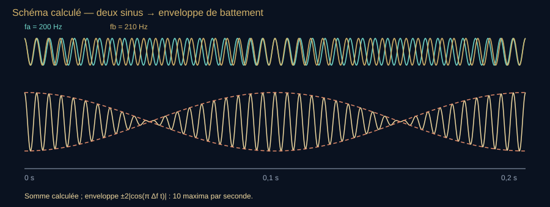

**Lecture du schéma.** Courbes calculées sur 0,2 seconde : cos(2π·200t), cos(2π·210t), puis leur somme. Les pointillés orange délimitent l’enveloppe ±2|cos(π·10t)| ; les maxima d’amplitude reviennent toutes les 0,1 seconde. Le graphique n’émet aucun son ; S14 décrit la démonstration audio.

[Fiche visuelle et transcription](banque-visuelle-son.md#v06) · [Ouvrir le SVG autonome](assets/schemas-son/v06-battements.svg)

Ce tracé est un calcul, pas une mesure enregistrée. Sur le plateau, comparer la somme de deux générateurs à l’oscilloscope ; ne pas confondre la vitesse d’une animation et la fréquence du signal.

<!-- atelier:S14 -->
> **Atelier S14 — Battements** · *★★★ · effort M · 🔊 (binaural : casque) · remplace le schéma V06*
>
> **Comment l’utiliser.** Choisir 440 et 441 Hz, écouter, compter les pouls ; laisser le compteur automatique les compter aussi. Passer à 448 Hz, puis aux présets quinte et tierce. En casque, séparer les oreilles pour le binaural, puis repasser en mono.
>
> **Ce que ça montre.** Forme d’onde et enveloppe, f_batt = |f_a − f_b|, la zone pouls / rugosité / deux sons (Plomp & Levelt) ; en 2ᵉ ordre, les partiels qui se ratent (3f_g contre 2f_a) ; en binaural, aucune enveloppe dans l’air.
>
> **Sens de lecture.** Compter à 1 Hz puis comparer à 8 Hz : la frontière entre pulsation et rugosité dépend de l’auditeur. Pour le binaural, couper un seul canal supprime l’interaction entre oreilles. Mélanger les deux canaux en mono produit au contraire un battement acoustique, visible sur leur somme ; ce ne sont pas les mêmes mécanismes.
<!-- /atelier -->

#### 2. Seuil : pouls / rugosité / deux sons

| $f_{\mathrm{batt}}$ | Percept typique (sons purs, milieu de registre) | Usage musical |
| --- | --- | --- |
| ~0,2–2 Hz | pouls lent, « wah » d’accord | accorder unisson, chœur, 12-cordes |
| ~3–8 Hz | tremolo / vibrato d’amplitude | orgue voix céleste, chorus analogique |
| ~10–20 Hz | rugosité, « scie » | cluster volontaire, quinte loup |
| $\gtrsim$ bande critique | deux hauteurs séparées | intervalle entendu comme intervalle |

Plomp & Levelt (1965) : le maximum de dissonance sensorielle tombe vers 25 % de la bande critique, pas à un rapport « laid » universel. Un ton mineur à 80 Hz rugueux ; le même à 800 Hz beaucoup moins.

#### 3. Battements du second ordre — consonances désaccordées

Deux notes qui « devraient » fusionner par leurs harmoniques. Quinte juste $3/2$ : le 3e partiel du grave coïncide avec le 2e de l’aigu. Si la quinte est large d’un comma :

**Lire la formule — le sens avant les symboles.** Pour une quinte, comparer le troisième partiel de la note grave au deuxième de la note aiguë. S’ils coïncident, leur battement disparaît dans ce modèle ; s’ils sont séparés de 1 Hz, ils battent une fois par seconde. Le calcul porte sur ces partiels, pas sur l’écart des fondamentales.

$$
3f_{\mathrm{grave}} \neq 2f_{\mathrm{aigu}} \quad\Rightarrow\quad f_{\mathrm{batt}}^{(2)}=\lvert 3f_g-2f_a\rvert
$$

 **À dire —** « f battement deux égale valeur absolue de trois f grave moins deux f aigu. »

On n’entend plus le pouls des fondamentaux (trop éloignés) : on entend le pouls des partiels qui se ratent. C’est ainsi qu’un organiste sait qu’une quinte « hurle », et qu’un accordeur de piano pose le tempérament en comptant des battements *ciblés* (la tierce majeure tempérée à ~440 Hz bat beaucoup plus vite que la quinte).

##### Ordres de grandeur d’accordeur (la3 = 440 Hz, notation française)

- Unisson désaccordé de 1 cent ≈ $440\times(2^{1/1200}-1)\approx 0{,}25\,\mathrm{Hz}$ — « f zéro fois deux puissance un sur mille deux cents, moins un ».
- Quinte tempérée au-dessus de 440 Hz : $440\times 2^{7/12}\approx 659{,}3\,\mathrm{Hz}$ au lieu de $660$. Battement du second ordre $\lvert 3\times440-2\times659{,}3\rvert\approx 1{,}5\,\mathrm{Hz}$.
- Tierce majeure tempérée : $440\times 2^{4/12}\approx 554{,}4$ au lieu de $550$. Battement $\lvert 5\times440-4\times554{,}4\rvert\approx 17{,}5\,\mathrm{Hz}$ — déjà de la rugosité, plus un pouls qu’on compte ; c’est pourquoi les accordeurs posent le tempérament sur les tierces du médium (fa3–la3 : ~14 Hz ; fa2–la2 : ~7 Hz), pas sur celles de l’aigu.

**À dire —** « quatre cent quarante fois deux puissance sept sur douze, environ six cent cinquante-neuf virgule trois. »

<!-- atelier:S22 -->
> **Atelier S22 — Accordeur (détection de hauteur)** · *★★★ · effort M · 🎙*
>
> **Comment l’utiliser.** Chanter ou jouer une note tenue, lire la note et l’écart en cents ; changer d’algorithme sur le même son ; changer la référence.
>
> **Ce que ça montre.** f₀ estimée, l’aiguille en cents, l’historique ; le fait que la hauteur n’est pas « le pic de la FFT ».
>
> **Sens de lecture.** Lire la fréquence mesurée et les cents relativement au diapason choisi. Passer la référence à 432 Hz conserve le signal entrant mais change son écart à la cible et peut changer la note affichée ; cela ne retend pas l’instrument.
<!-- /atelier -->

#### 4. Ce qui n’est pas un battement acoustique

- **Battement binaural** (Oster 1973, littérature ensuite très inégale) : $f_a$ à gauche, $f_b$ à droite, casque. Aucune enveloppe physique dans l’air. Le tronc cérébral fabrique une pulsation. Ne pas le vendre comme « onde cérébrale miracle ». Citer le fait, citer les revendications marketing comme revendications.
- **Vibrato** : modulation de $f$ (et souvent d’amplitude) produite par le musicien, pas par l’interférence de deux sources stables.
- **Chorus / désaccord d’unisson** d’un chœur ou d’un 12-cordes : nuage de battements du premier ordre. C’est le « grain ».
- **Quinte du loup** des tempéraments anciens : un intervalle où les partiels se ratent tellement que le battement devient une plaie. Le tempérament égal dilue le loup sur toutes les quintes.

#### 5. Observations / manips

1. Deux applications générateur, 440 et 441, enceinte unique : compter 1 pouls/s.
2. Même chose à 440 et 448 : 8 Hz, frontière pouls / rugosité selon les auditeurs.
3. Tierce juste $5/4$ contre tierce tempérée sur un « ouh » tenu : la juste fusionne, la tempérée gratte.
4. Deux flûtes ou deux cordes à l’unisson, puis l’une à peine haute : le live devient un laboratoire d’accordeur.
5. Casque : 200 Hz G / 207 Hz D — décrire le binaural sans promettre un état modifié.

Cohérence du fil : Mersenne donne $f$. Fourier donne les partiels. Helmholtz convertit leurs coïncidences en plaisir / douleur. L’accordeur compte. Le tempérament égal est un traité de paix entre ces pouls.

### Pause — avant de passer de deux sons à un accord

Nous avons distingué la hauteur des notes et la pulsation de leur somme. Demander : « Avec 440 et 442 Hz, le nombre 2 désigne-t-il une note ou des gonflements par seconde ? » Réponse : la cadence des battements. Garder cette distinction quand davantage de partiels vont se rencontrer.

### Des intervalles aux accords — harmonie, rugosité, temps

**Pour entrer dans le chapitre.** Un partiel est une composante fréquentielle d’un son ; un harmonique est un partiel situé à un multiple entier de la fondamentale. Un accord superpose plusieurs ensembles de partiels. Poser trois questions distinctes : est-ce rugueux, quelle note semble organiser l’accord, quelle émotion lui associe-t-on ? Le tableau des rapports et le modèle de Sethares approfondissent ces questions sans être des prérequis.

Le chapitre musique donne les intervalles ; le chapitre battements donne ce qui frotte entre deux notes. Un accord, c’est trois notes ou plus, donc trois spectres superposés — et une question que le public pose toujours : *pourquoi le mineur est-il « triste » ?* La réponse honnête tient en trois étages : physique (rugosité), auditif (fondamentale virtuelle), culturel (apprentissage). Aucun des trois ne suffit seul.

#### Triades — les rapports

| Accord | Rapports justes | Cents (juste) | Cents (12-TET) | Ce que l’oreille en fait |
| --- | --- | --- | --- | --- |
| Majeur (do–mi–sol) | 4 : 5 : 6 | 0 · 386 · 702 | 0 · 400 · 700 | les partiels des trois notes s’alignent sur une seule série harmonique (fondamentale commune à $f_{\mathrm{basse}}/4$) |
| Mineur (do–mi♭–sol) | 10 : 12 : 15 | 0 · 316 · 702 | 0 · 300 · 700 | même quinte, mais fondamentale mathématique commune à un dixième de la basse, mais partiels communs plus élevés que pour 4 : 5 : 6 |
| Diminué (deux tierces mineures justes) | 25 : 30 : 36 | 0 · 316 · 631 | 0 · 300 · 600 | deux rapports 6/5 successifs ; la quinte diminuée n’est pas la quinte juste 3/2 |
| Variante septimale | 5 : 6 : 7 | 0 · 316 · 583 | pas d’équivalent exact en 12-TET | seconde tierce 7/6 ≈ 267 cents ; ne pas la confondre avec 25 : 30 : 36 |
| Augmenté | 16 : 20 : 25 | 0 · 386 · 773 | 0 · 400 · 800 | deux tierces majeures ; en 12-TET, symétrique donc sans « racine » |
| Septième de dominante | 4 : 5 : 6 : 7 | 0 · 386 · 702 · 969 | 0 · 400 · 700 · 1000 | la septième « juste » $7/4$ est 31 cents sous la tempérée : celle des quatuors barbershop |

Le nombre à retenir : la triade majeure 4 : 5 : 6 correspond à **trois harmoniques consécutifs de rang faible**. La mineure 10 : 12 : 15 appartient elle aussi à une série harmonique, mais à des rangs plus élevés et non consécutifs. La fondamentale mathématique commune ne se confond pas avec la racine musicale perçue : le timbre, les doublures et le contexte interviennent. Cette structure aide à comprendre la fusion du majeur et que Rameau (1722) en fait la base de son *Traité de l’harmonie* — sans connaître encore Sauveur, qu’il lira ensuite et dont les harmoniques lui serviront de confirmation (*Génération harmonique*, 1737).

#### Étage 1 — la rugosité (Helmholtz → Plomp & Levelt → Sethares)

Chaque note apporte ses partiels. Chaque couple de partiels voisins (dans la même bande critique) produit un battement rapide, donc une rugosité. La rugosité d’un accord est la somme de celles de tous ses couples. Plomp & Levelt (1965) mesurent la courbe pour deux sons purs ; Sethares (1993 ; *Tuning, Timbre, Spectrum, Scale*, 1998, 2e éd. 2005) la paramètre et l’applique à des timbres entiers :

**Lire la formule — le sens avant les symboles.** Cette courbe est un modèle de rugosité pour deux composantes voisines, pas une formule de la beauté musicale. d dépend de leur séparation et du registre ; les coefficients ajustent la forme de la courbe. Pour suivre le récit, observer où elle monte et redescend suffit ; le calcul sert à reproduire la comparaison.

$$
d(f_1,f_2)=e^{-3{,}5\,s\,\lvert f_2-f_1\rvert}-e^{-5{,}75\,s\,\lvert f_2-f_1\rvert}\qquad s=\frac{0{,}24}{0{,}021\,f_{\min}+19}
$$

 **À dire —** « dé de f un f deux égale exponentielle de moins trois virgule cinq s valeur absolue de f deux moins f un, moins exponentielle de moins cinq virgule soixante-quinze s valeur absolue de f deux moins f un ; s égale zéro virgule vingt-quatre sur zéro virgule zéro vingt-et-un f min plus dix-neuf. »

Deux résultats qui se démontrent à l’oreille :

- **Les creux de dissonance tombent sur 3/2, 4/3, 5/4… seulement pour un timbre harmonique.** Avec un timbre inharmonique (cloche, gong, partiels étirés), les creux se déplacent — et une « gamme » adaptée à ce timbre devient consonante là où le piano serait faux. C’est la thèse de Sethares, et le gamelan l’a fait avant lui (pélog / slendro avec des lames métalliques inharmoniques).
- **Le registre compte autant que le rapport.** À intervalle identique, le recouvrement des partiels dans les filtres auditifs dépend du registre, du timbre et de l’intensité. Les orchestrateurs ouvrent souvent les accords graves pour éviter une texture confuse. Il n’existe pas ici de seuil universel du type « aucune tierce sous 100 Hz » : comparer la même disposition à plusieurs octaves et avec plusieurs instruments. Les anciens chiffres attribués à Adler ou Piston sans page précise sont consignés dans le [registre documentaire](#suivi-documentaire), sans servir de règle de plateau.

<!-- atelier:S30 -->
> **Atelier S30 — Accords et rugosité** · *★★★ · effort L · 🔊 · plein écran*
>
> **Comment l’utiliser.** Jouer une triade majeure puis mineure, lire le score de rugosité ; changer le timbre pour une cloche ; ouvrir la courbe de dissonance et déplacer la seconde note.
>
> **Ce que ça montre.** Le modèle de Sethares (somme des rugosités entre partiels), la courbe de dissonance avec ses creux sur 3/2, 4/3, 5/4 pour un timbre harmonique, la racine perçue (Terhardt).
>
> **Sens de lecture.** Les minima du modèle correspondent à une faible rugosité pour le spectre choisi ; ils ne résument pas toute la consonance. Comparer majeur et mineur selon le timbre et la disposition, puis distinguer rugosité, fondamentale virtuelle et contexte culturel.
<!-- /atelier -->

#### Étage 2 — la fondamentale virtuelle (Terhardt)

L’oreille cherche une fondamentale commune aux partiels qu’elle reçoit (chapitre psychoacoustique : fondamentale manquante). Terhardt (1974) puis Parncutt (1989) étendent l’idée aux accords : un accord a une « racine » perçue là où le plus de partiels s’alignent. Pour 4 : 5 : 6, la réponse est nette (la fondamentale mathématique à $f_{\mathrm{basse}}/4$, deux octaves sous la basse). Pour 10 : 12 : 15, elle est ambiguë : les modèles peuvent attribuer des poids différents à plusieurs candidats. Selon le timbre et la disposition, la rugosité du mineur peut être proche de celle du majeur ; ni cette mesure ni une fondamentale virtuelle ne suffisent à expliquer son caractère émotionnel.

#### Étage 3 — la culture

Le lien majeur = gai / mineur = triste est fort en Occident depuis le XVIIe, faible ailleurs. Fritz et al. (*Current Biology* 2009) : des Mafa du Cameroun, jamais exposés à la musique occidentale, reconnaissent au-dessus du hasard les émotions de morceaux occidentaux, mais bien moins nettement que des auditeurs occidentaux — un noyau perceptif (tempo, registre, rugosité) plus une couche apprise. Huron (2008) rappelle que la tierce mineure est aussi celle de la parole triste (intervalles plus petits, registre plus bas, tempo lent). Sur le plateau : « le mineur est triste » se dit avec « pour nous », jamais « par nature ».

#### Renversements, doublures, voicing

Même trois notes, ordre différent : do–mi–sol (état fondamental), mi–sol–do (1er renversement), sol–do–mi (2e). Les rapports changent (5 : 6 : 8, puis 3 : 4 : 5), la racine perçue reste do (Terhardt) mais la rugosité change avec l’espacement : plus l’accord est serré dans le grave, plus il gratte. Un arrangeur qui « ouvre » un accord fait de la bande critique sans le savoir.

#### Rythme et temps — quand le pouls devient une note

Le battement de deux notes proches (chapitre précédent) et le rythme sont une même grandeur à deux échelles :

- Sous ~10–15 Hz : on compte des pouls (battements, tremolo, rythme).
- De ~15 à ~300 Hz : rugosité (maximale vers 70 Hz), qui coexiste avec ce qui suit.
- À partir de ~30 Hz : une hauteur mélodique se dégage. Un rythme accéléré *devient* un son grave — Stockhausen (*Kontakte*, 1960) et Risset l’ont composé ; un quatre-cylindres à quatre temps à 1 200 tr/min fait 40 explosions/s, donc une périodicité proche du mi grave à 41,2 Hz, accompagnée d’harmoniques et de bruit mécanique.

Perception du tempo : la zone de pulsation préférée se situe autour de 85–120 battements par minute (Fraisse 1982 : 500–700 ms, ~2 Hz), avec des limites de ~30 à ~300 bpm au-delà desquelles on regroupe ou on subdivise. Ordre temporel : deux sons séparés de moins de ~2 ms fusionnent en un seul ; il faut ~20 ms pour dire lequel est venu en premier (Hirsh 1959). C’est la fenêtre qu’exploitent l’effet de précédence (chapitre psychoacoustique) et le délai des écrans de stade (chapitre société).

##### Manips

- Triade majeure juste (4 : 5 : 6) puis tempérée : la juste est un seul son épais ; la tempérée bat (tierce à ~14 cents).
- Même accord joué avec un timbre de cloche (partiels inharmoniques) : la « consonance » s’effondre, puis revient si l’on déplace la tierce. Sethares en trente secondes.
- Tierce mineure à 110 Hz puis à 880 Hz : même rapport, deux rugosités.
- Un clic répété à 4, 8, 16, 32 Hz : rythme → rugosité → note. Dire à quel moment ça bascule.
- Demander au public : « majeur ou mineur ? » sur des accords hors tonalité, puis les mêmes dans un contexte : la réponse change avec le contexte, pas avec la physique.

Phrase plateau : « Un accord, c’est trois spectres qui négocient. La physique dit ce qui frotte ; l’oreille dit où est la racine ; la culture dit si c’est triste. »

### Bilan — Séparer vibration, perception et culture

- Deux fréquences proches superposées peuvent produire des battements.
- La rugosité dépend des composantes des sons et de leur registre, pas seulement du nom de l’accord.
- La racine musicale et l’émotion ne se déduisent pas d’un seul rapport de fréquences.

**Question au public.** Le même accord doit-il produire la même impression avec une flûte et une cloche ?

**Réponse et relance.** Pas nécessairement : le contenu en partiels change. Le contexte et l’apprentissage comptent aussi. Décrire une différence est utile ; ne pas en percevoir une n’invalide pas la personne.

**Pour reprendre le fil.** Le signal explique une partie du résultat. L’oreille et le cerveau apportent la suite.

[Étape suivante](#acte-iv) · [Carte du parcours](#parcours-guide)

## IV. L’oreille fabrique le monde sonore

**Fil essentiel.** Le signal physique et l’expérience de l’auditeur ne sont pas identiques. L’oreille filtre, le cerveau organise, l’attention sélectionne. Une illusion auditive révèle ce traitement ; une réponse différente entre deux personnes n’est pas une faute.

**Choisir la suite.** [Comprendre avec les exemples](#psycho) ou [faire le point](#bilan-iv).

**Transition à dire.** « Le microphone nous dira ce qui arrive à l’oreille. Il ne nous dira pas, à lui seul, ce que l’oreille entend. La hauteur, le volume, la direction et même certains sons absents sont construits par un système vivant. »

**Geste de plateau.** Supprimer la fondamentale d’un timbre (S28) et demander si la note a disparu. Faire pivoter une source spatialisée au casque (S39) en annonçant le rôle du filtrage de tête.

### Psychoacoustique musicale — ce que l’oreille fabrique

**Pour entrer dans le chapitre.** Distinguer la fréquence mesurée de la hauteur perçue, et le niveau mesuré de la sonie — la force ressentie du son. Si deux personnes ne décrivent pas pareil une illusion, comparer leurs réponses plutôt que corriger leur audition. Le signal présenté est commun ; le percept n’est pas une mesure à lire directement sur sa courbe.

L’onde arrive. Le percept n’est pas l’onde. Cette section est le pont obligatoire entre Helmholtz et le mixage contemporain.

**À l’écran — V07.** Schéma 4 — De la pression au percept *→ schéma provisoire, à refaire en SVG codex au build : Schéma de chaîne (pression → cochlée → bandes critiques → hauteur · sonie · timbre) généré au build en SVG codex : Cinzel / Fraunces, jetons de couleur, flèches or, texte mesuré ; aucun atelier ne le remplace.*

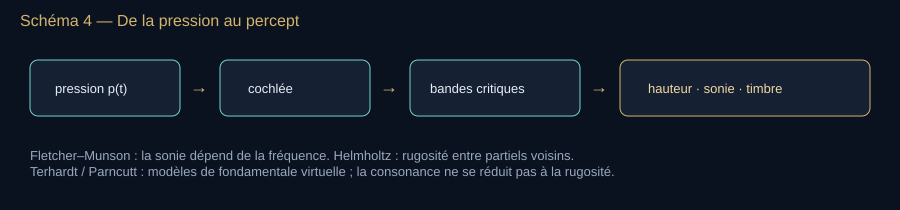

**Lecture du schéma.** Le trajet est une simplification pédagogique : les filtres cochléaires et le traitement neural contribuent ensemble au percept ; aucune flèche ne signifie une transformation indépendante du niveau ou du contexte.

[Fiche visuelle et transcription](banque-visuelle-son.md#v07) · [Ouvrir le SVG autonome](assets/schemas-son/v07-pression-percept.svg)

Quatre mots à ne plus confondre : fréquence (Hz), hauteur (note, mel ; Bark et ERB servent surtout aux filtres auditifs), intensité (W/m²), sonie (sone).

#### Hauteur

- Son pur : hauteur ≈ fréquence, mais le mel n’est pas linéaire (Stevens, Volkmann, Newman 1937).
- **Fondamentale manquante** (Seebeck, Schouten, Licklider) : un complexe 200+400+600+800 Hz sans 200 Hz est quand même entendu « à 200 ». Une hauteur correspondant à la périodicité commune peut subsister ; le PGCD des fréquences est une image utile pour cet exemple harmonique, pas un algorithme universel du cerveau. Expérience live : utiliser un son synthétique riche en harmoniques et supprimer sa fondamentale ; supprimer un sinus pur ne laisserait que le silence.
- **Ton de Shepard** (1964) : octave qui monte toujours. Illusion de hauteur circulaire, analogue visuel de l’escalier de Penrose. Jean-Claude Risset en fait un glissando continu.
- **Paradoxe du triton** (Deutsch) : deux tons Shepard à un triton — certains entendent monter, d’autres descendre. Effet de langue / registre vocal statistique, pas de magie.

<!-- atelier:S38 -->
> **Atelier S38 — Shepard, Risset, triton** · *★★ · effort M · 🔊*
>
> **Comment l’utiliser.** Lancer la gamme de Shepard et la laisser tourner trois cycles avant d’expliquer ; passer en glissando de Risset ; jouer les paires du triton et voter « monte / descend ».
>
> **Ce que ça montre.** Les dix octaves sous enveloppe (visibles au spectrogramme), le vote du public sur le triton.
>
> **Sens de lecture.** Regarder le spectrogramme pendant qu’on écoute : les composantes montent, s’éteignent en haut et renaissent en bas. L’oreille suit la montée, jamais la chute. La hauteur est une construction.
<!-- /atelier -->

#### Sonie et masquage

- Courbes isosoniques Fletcher–Munson 1933, révisées Robinson–Dadson (1956), puis ISO 226 (2003, réédition 2023). Un 40 Hz à 70 dB SPL n’a pas la sonie d’un 1 kHz à 70 dB.
- **Masquage fréquentiel** : un son fort cache ses voisins dans la même bande critique (Bark, Zwicker ; ERB, Moore). C’est le principe du MP3 / AAC : on jette ce que l’oreille ne signalerait pas.
- **Masquage temporel** : pré-masquage court, post-masquage plus long.

<!-- atelier:S36 -->
> **Atelier S36 — Courbes isosoniques** · *★★★ · effort M · 🔊*
>
> **Comment l’utiliser.** À faible niveau et sans chercher à compenser un grave inaudible par une forte augmentation de volume, comparer quelques fréquences à une référence à 1 kHz. Garder un plafond de gain et une commande d’arrêt.
>
> **Ce que ça montre.** Des égalisations subjectives en gain numérique relatif ; courbes ISO 226 montrées comme référence indépendante. Sans étalonnage du casque, on ne mesure ni des phones ni une courbe isosonique personnelle absolue.
>
> **Sens de lecture.** Une différence de sensation combine l’audition et la réponse du casque. Lire le repère ISO pour comprendre le principe, pas pour diagnostiquer ni déduire une pression sonore réelle de la position d’un curseur.
<!-- /atelier -->

<!-- atelier:S37 -->
> **Atelier S37 — Masquage** · *★★ · effort M · 🔊*
>
> **Comment l’utiliser.** Écouter le sinus faible, allumer le masqueur centré dessus et dire quand le sinus disparaît ; répéter avec un masqueur décalé en fréquence.
>
> **Ce que ça montre.** Le seuil masqué calculé (bande critique) et le seuil personnel obtenu par oui / non.
>
> **Sens de lecture.** Le masquage dépend de l’écart fréquentiel, du niveau et du temps. Il est particulièrement fort autour de la bande du masqueur ; il ne s’arrête pas à une frontière parfaitement nette.
<!-- /atelier -->

#### Consonance, dissonance, rugosité

Helmholtz : deux partiels proches mais non fusionnés → battements rapides → rugosité. Plomp & Levelt (1965) : courbe de dissonance sensorielle en fonction de l’écart en bande critique, pas seulement du rapport rationnel. Conséquence : un intervalle « juste » peut être rugueux dans un registre très grave (partiels serrés) et lisse à l’aigu. Les organistes le savent depuis des siècles sans le nommer.

#### Espace, temps, parole

- **Effet de précédence / Haas** (~1949) : deux sources identiques, délai 1–30 ms → une seule source du côté du premier front. Base de la stéréo et des réflexions utiles en salle.
- **Cocktail party** (Cherry 1953) : on suit une voix dans le brouhaha. Binaural + attention + prédiction linguistique.
- **McGurk** (1976) : une lèvre « ga » + un son « ba » → percept « da ». L’oreille n’est pas seule.
- ITD / ILD : différences interaurales de temps et de niveau. Duplex theory de Lord Rayleigh, encore.

#### Où est le son ? — localisation spatiale (ITD, ILD, HRTF)

Deux oreilles, une tête entre les deux : le cerveau compare. Lord Rayleigh (1907, « duplex theory ») pose les deux indices ; tout l’audio spatial en descend.

- **ITD** (différence de temps interaurale) : l’onde arrive plus tôt à l’oreille la plus proche. Modèle de Woodworth (1938) pour une tête sphérique de rayon $r$ et une source à l’azimut $\theta$ : $\Delta t \approx \frac{r}{c}(\theta+\sin\theta)$, soit au maximum ~0,65 ms pour $r$ = 8,75 cm. L’oreille détecte ~10 µs de différence. Utile sous ~1,5 kHz : au-dessus, $\lambda/2$ devient plus petit que la tête et la phase est ambiguë.
- **ILD** (différence de niveau) : la tête fait de l’ombre aux aigus (diffraction, chapitre phénomènes) — jusqu’à 15–20 dB à 8 kHz, presque rien à 200 Hz. Un caisson filtré très bas se localise souvent difficilement, mais son placement modifie fortement les modes de la pièce ; les harmoniques, la distorsion ou un raccord trop haut peuvent aussi trahir sa position.
- **Indices spectraux / HRTF** : le pavillon, la tête et les épaules filtrent le son selon sa direction (fonction de transfert liée à la tête, *head-related transfer function* ; mesures Wightman & Kistler 1989, bases KEMAR/MIT 1994). Ce sont eux qui donnent le haut / bas et l’avant / arrière, là où ITD et ILD sont muets (le **cône de confusion** : toutes les positions à même ITD). Les mouvements de tête lèvent l’ambiguïté — d’où le suivi de tête des casques récents.
- **Distance** : niveau, rapport son direct / réverbéré, aigus mangés par l’air. Sans réverbération, certains indices de distance manquent ; une source extérieure en chambre anéchoïque n’est pas pour autant nécessairement entendue « dans la tête », sensation fréquente avec certains rendus au casque.

**Lire la formule — le sens avant les symboles.** Le son atteint l’oreille proche avant l’autre. r représente le rayon de la tête dans un modèle sphérique, θ la direction en radians, c la célérité et Δt le retard. Agrandir le trajet à parcourir augmente le retard ; le chiffre ne décrit pas à lui seul toute la localisation.

$$
\Delta t \approx \frac{r}{c}\,(\theta+\sin\theta)
$$

 **À dire —** « delta té environ égale r sur cé, fois thêta plus sinus thêta » — $\theta$ en radians, $r$ le rayon de la tête.

Applications à nommer justement : enregistrement binaural à tête artificielle (Neumann KU 100 ; l’ASMR en vit), rendu par HRTF dans les casques (« audio spatial »), Ambisonics (Gerzon, années 1970), Dolby Atmos (2012, objets sonores). Et le « **8D audio** » des plateformes : un panoramique automatisé plus de la réverbération, qui promène la source autour de la tête en exploitant ITD et ILD — aucune « huitième dimension », c’est du Rayleigh 1907 avec un curseur. Blauert, *Spatial Hearing*, reste la somme.

<!-- atelier:S39 -->
> **Atelier S39 — Où est le son ? (ITD / ILD / HRTF)** · *★★ · effort L · 🔊 casque obligatoire · plein écran*
>
> **Comment l’utiliser.** Au casque, faire tourner la source ; activer ITD seul avec un grave, puis ILD seul avec un aigu ; passer en HRTF pour le haut / bas.
>
> **Ce que ça montre.** Δt ≈ (r/c)(θ + sin θ), l’ombre de la tête en dB, le cône de confusion, un filtrage par HRTF publique (KEMAR).
>
> **Sens de lecture.** Comparer les indices séparés : l’ITD de structure fine est surtout utile dans le grave, l’ILD augmente dans l’aigu. Les signaux complexes portent aussi des indices d’enveloppe ; ne pas conclure qu’aucune localisation des aigus n’est possible par le temps.
<!-- /atelier -->

<!-- atelier:S40 -->
> **Atelier S40 — Précédence (Haas)** · *★ · effort S · 🔊 casque*
>
> **Comment l’utiliser.** Envoyer deux clics, droite retardée d’abord de 1 à 3 ms ; explorer ensuite les délais avec de la parole ou du bruit. Inverser le côté retardé et ajuster les niveaux modérément.
>
> **Ce que ça montre.** Fusion et dominance de la source arrivée la première, puis éventuelle séparation en deux événements. Les résultats et seuils dépendent du signal, du délai, des niveaux et de l’auditeur.
>
> **Sens de lecture.** Identifier le canal arrivé en premier avant de juger la localisation. Ne pas donner 30 ms comme seuil universel : un clic peut se dédoubler bien avant un extrait de parole.
<!-- /atelier -->

#### Expériences musicales de psychoacoustique à ouvrir

**Battements d’accordeur** — deux applis à 440 et 443. Compter. Vérifier $|f_1-f_2|$.
**Fondamentale absente** — générateur d’harmoniques, couper $f_0$, demander la note à un musicien.
**Shepard** — jouer la boucle. Interdire l’explication avant le troisième cycle.
**Tierce tempérée vs juste** — 400 cents contre 386. Sur un « ouh » tenu, la juste fusionne.
**Masquage** — sinus faible puis bruit à bande étroite centré dessus. Le sinus disparaît.
**Haas** — deux enceintes à distance égale, même extrait de parole, droite retardée de 10 ms : la localisation tend vers la gauche, qui arrive la première. Inverser le retard pour inverser la tendance. Le seuil de séparation en deux événements dépend du signal, du niveau et de l’auditeur ; commencer les essais avec des clics à quelques millisecondes. [Étude sur fusion et dominance de localisation](https://pubmed.ncbi.nlm.nih.gov/11206163/).
**ITD au casque** — même clic aux deux oreilles, puis 0,3 ms de retard à droite : la source saute à gauche. Puis le même retard sur un 3 kHz pur : plus rien de net. Rayleigh en une minute.
**« 8D »** — prendre une voix mono, la promener au panoramique avec un peu de réverbération : le public reconnaît le « 8D ». Dire ce que c’est.

### Entendre — de Helmholtz à la neuroacoustique

**À l’écran — V12.** Schéma 7 — Chaîne de l’audition *→ schéma provisoire, remplacé dans le dossier par l’atelier S43 : L’atelier « La cochlée » est élargi à toute la chaîne : coupe de l’oreille avec survol de chaque organe, puis cochlée déroulée.*

**Lecture du schéma.** L’oreille moyenne améliore la transmission entre air et liquide ; la cochlée comprend un mécanisme actif. Le trajet neural réel comporte plusieurs relais avant le cortex.

[Fiche visuelle et transcription](banque-visuelle-son.md#v12) · [Ouvrir le SVG autonome](assets/schemas-son/v12-audition.svg)

- Oreille externe (pavillon, conduit) → tympan → osselets (marteau, enclume, étrier : le plus petit os du corps) → fenêtre ovale → cochlée en limaçon, organe de Corti, cellules ciliées.
- **Georg von Békésy** : onde progressive sur la membrane basilaire, tonotopie (base = aigus, apex = graves). Nobel 1961.
- Cellules ciliées externes : amplificateur actif cochléaire, découvert plus tard (Kemp, otoémissions, 1978) — l’oreille n’est pas un micro passif, elle *émet* aussi.
- **Harvey Fletcher & Wilden Munson** (1933) : courbes isosoniques. Un 30 Hz doit être beaucoup plus intense qu’un 3 kHz pour paraître aussi fort. Cela explique les filtres « loudness » des chaînes hi-fi ; la loudness war relève aussi des pratiques de production et de la recherche d’un niveau moyen élevé.
- **S. S. Stevens** : sone (1936), unité de sonie perçue.
- **Eberhard Zwicker** : échelles Bark, bandes critiques.
- Implants cochléaires (travaux de House, Simmons, Chouard, Clark… premiers essais 1961–1978, commercialisation à partir des années 1980, FDA 1984–85) : le son redevient électricité dans le nerf.

Pathologies à citer sans les banaliser : presbyacousie, traumatisme sonore (seuils réglementaires 80–85 dB(A) sur 8 h selon les codes du travail), acouphènes, hyperacousie. Le bruit n’est pas un confort, c’est un facteur de risque cardiovasculaire documenté par l’OMS.

##### Sécurité auditive — la dose, pas le mur

Le risque dépend **du niveau et de la durée d’exposition**. Dans le cadre du travail en France, [l’article R4431-2 du Code du travail](https://www.legifrance.gouv.fr/codes/article_lc/LEGIARTI000018530386/2026-02-14) fixe des valeurs d’action à 80 et 85 dB(A) sur huit heures et une valeur limite à 87 dB(A), ainsi que des valeurs de crête à 135, 137 et 140 dB(C). Ce sont des seuils réglementaires professionnels, **pas une promesse d’innocuité**. Dans le modèle de dose ci-dessous, chaque hausse de 3 dB divise par deux le temps correspondant à une même dose. Pour l’écoute personnelle, [l’OMS donne un autre repère](https://www.who.int/news-room/questions-and-answers/item/deafness-and-hearing-loss-safe-listening) : 80 dB pendant 40 heures par semaine pour un adulte.

**Lire la formule — le sens avant les symboles.** On additionne des fractions de dose : une exposition qui utilise la moitié du temps de référence apporte 50 % de cette dose. Dans ce modèle, +3 dB divise le temps de référence par deux. Le mot « admissible » dans la notation n’est pas une garantie individuelle d’absence de risque.

$$
T_{\text{adm}} = 8\ \mathrm{h} \times 2^{\,(85 - L_{A})/3}\qquad D = 100\,\%\times\sum_i \frac{C_i}{T_i}
$$

 **À dire —** « té admissible égale huit heures fois deux puissance quatre-vingt-cinq moins L A, sur trois » · « D égale cent pour cent fois la somme sur i de C i sur T i » — $C_i$ le temps passé au niveau $i$, $T_i$ le temps admissible à ce niveau.

| Niveau dB(A) | Durée pour la même dose dans le modèle 85 dB(A) / 8 h |
| --- | --- |
| 85 | 8 h |
| 91 | 2 h |
| 94 | 1 h |
| 100 | 15 min |
| 103 | 7,5 min |
| 110 | environ 1,5 min |

- **Concerts et festivals** (France, décret 2017-1244) : 102 dB(A) sur 15 minutes glissantes, 118 dB(C) pour les graves ; bouchons à disposition, zones de repos. Les bouchons « musicien » filtrés (−15 à −20 dB, réponse plate) gardent la musique intelligible ; les bouchons mousse (SNR 25–35 dB) coupent surtout les aigus.
- **Casque** : le pourcentage affiché par un téléphone ne mesure pas la pression sonore à l’oreille. Baisser le niveau, limiter la durée et utiliser, si besoin, la réduction de bruit pour ne pas monter le volume dans un lieu bruyant. Un micro de navigateur non étalonné ne donne pas de diagnostic d’exposition.
- **Signaux d’alerte** : acouphène, sensation d’oreille « cotonneuse » ou baisse d’audition après un son intense justifient d’arrêter l’exposition et de demander conseil. [Une perte brutale de l’audition nécessite un avis médical urgent](https://www.ameli.fr/assure/sante/themes/perte-acuite-auditive/bons-reflexes-cas-faut-consulter) ; ne pas attendre un délai arbitraire.
- **Environnement** (OMS, *Environmental Noise Guidelines* 2018) : trafic routier au-delà de 53 dB $L_{den}$ et 45 dB la nuit = effets sanitaires documentés (sommeil, cardiovasculaire). Le 53 dB est fixé sur la gêne forte (10 % de la population), le 45 dB de nuit sur le sommeil ; le risque cardiaque, documenté, monte d’environ 8 % par tranche de 10 dB au-delà.
- **Pour ce live** : jamais de sinus pur fort au casque ; battements, Shepard et tests de limite d’audition à niveau modéré ; annoncer avant chaque son ; prévoir un bouton « couper tout ».

Le corps n’est pas qu’un récepteur. Chapitre suivant : il est aussi une source, une salle, un émetteur d’échos.

<!-- atelier:S43 -->
> **Atelier S43 — L’oreille de bout en bout, puis la cochlée** · *★★ · effort L · 🔊 · remplace le schéma V12*
>
> **Comment l’utiliser.** Survoler chaque organe de la coupe pour lire son rôle et son gain, puis cliquer « dérouler la cochlée » ; envoyer un sinus, regarder où l’onde culmine sur la membrane basilaire ; monter la fréquence ; couper l’amplificateur actif.
>
> **Ce que ça montre.** La chaîne complète pavillon → tympan → osselets → cochlée → nerf (impédance air → liquide, ×20 environ), puis l’onde progressive de Békésy, la tonotopie base → apex, la sélectivité avec et sans cellules ciliées externes (Kemp 1978).
>
> **Sens de lecture.** Lire la coupe de gauche à droite comme un trajet ; puis, sur la cochlée déroulée, voir le maximum se déplacer vers la base quand f monte : la cochlée est un analyseur de Fourier mécanique. Sans l’ampli actif, le pic s’aplatit : l’oreille n’est pas un micro passif.
<!-- /atelier -->

<!-- atelier:S44 -->
> **Atelier S44 — Jusqu’où entendez-vous ?** · *★★ · effort S · 🔊 (niveau plafonné)*
>
> **Comment l’utiliser.** Lancer le balayage montant à volume modéré et cliquer dès que le son disparaît ; recommencer vers le grave.
>
> **Ce que ça montre.** La fréquence où le son n’est plus perçu sur cette chaîne de restitution, sans la présenter comme une limite auditive personnelle isolée. L’échantillonnage, le codec, le casque et l’audition peuvent tous limiter la restitution.
>
> **Sens de lecture.** Ne pas augmenter le volume pour retrouver un son disparu. Le test n’est ni un audiogramme ni un estimateur d’âge ; afficher seulement la fréquence du signal de test et les limites de l’expérience.
<!-- /atelier -->

<!-- atelier:S45 -->
> **Atelier S45 — Sécurité : la dose de bruit** · *★★ · effort S · 👁*
>
> **Comment l’utiliser.** Entrer une journée type (trajet, casque, concert), lire la dose cumulée et son équivalent sur 8 heures.
>
> **Ce que ça montre.** La règle des 3 dB, la dose en pourcentage, les seuils réglementaires (80 / 85 / 87 dB(A)).
>
> **Sens de lecture.** Dans le modèle à énergie égale choisi, 100 dB(A) pendant 15 minutes correspondent à la même dose que 85 dB(A) pendant huit heures. Cela ne garantit pas l’absence de risque ; niveaux d’action et limite réglementaire sont des notions distinctes.
<!-- /atelier -->

### Pause — de l’oreille à la voix

Jusqu’ici, nous suivions ce qui est reçu et perçu. Nous allons maintenant suivre ce qui est produit. Demander : « Peut-on garder la même note et changer de voyelle ? » Recueillir les réponses, puis suivre séparément la source glottique et le filtre du conduit vocal ; ne pas demander au public de réussir une mesure clinique.

### Bioacoustique humaine — le corps comme instrument et milieu

**Pour entrer dans le chapitre.** Tenir un [a], puis un [i], sur une note aussi stable que possible. La note peut rester semblable alors que la voyelle change : la source donne une vibration, les cavités la filtrent. Les formants sont les régions de fréquence renforcées par ce filtre. Cette différence entre source et filtre suffit pour commencer.

La bioacoustique n’est pas réservée aux chauves-souris. L’humain produit, filtre, entend, et parfois écholocalise. Fil : source-filtre (Fant) pour la voix, Laennec pour les bruits internes, Kemp pour l’oreille qui émet, clickers aveugles pour un sonar pauvre mais réel.

#### Voix — deux étages, pas un tuyau magique

**Source** : larynx. Les plis vocaux oscillent sous l’effet du flux d’air pulmonaire et des forces élastiques des tissus : mécanisme myoélastique et aérodynamique, sans frottement d’un archet. [Explication du NIDCD](https://www.nidcd.nih.gov/news/multimedia/how-does-human-body-produce-voice-and-speech-text-version). $f_0$ homme adulte typique ~90–155 Hz, femme ~165–255 Hz, enfant plus haut — distributions, pas des murs. Registres : modal, fry, falsetto. Pression sous-glottique, tension, masse adduite.

**Filtre** : conduit pharyngo-bucco-nasal. Résonances = **formants** F1, F2, F3… Un [a] et un [i] chantés sur la même note ont le même $f_0$ et des F1/F2 différents. Théorie source-filtre de Gunnar Fant. Les chanteurs d’opéra ajoutent un « formant du chanteur » ~2,5–3 kHz pour passer l’orchestre — pile la sensibilité max de l’oreille (Fletcher–Munson).

**À l’écran — V13.** Schéma — source / filtre *→ schéma provisoire, remplacé dans le dossier par l’atelier S41 : La source-filtre est l’atelier lui-même.*

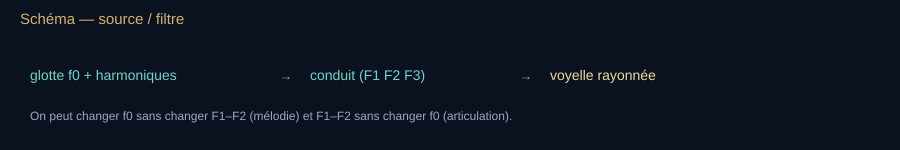

**Lecture du schéma.** À conduit maintenu fixe, déplacer f0 change la hauteur ; déplacer F1/F2 change la voyelle. Dans la voix réelle, les deux systèmes peuvent interagir, surtout dans certains registres chantés.

[Fiche visuelle et transcription](banque-visuelle-son.md#v13) · [Ouvrir le SVG autonome](assets/schemas-son/v13-voix-source-filtre.svg)

<!-- atelier:S41 -->
> **Atelier S41 — Source-filtre : la voix** · *★★★ · effort L · 🔊 · plein écran · remplace le schéma V13*
>
> **Comment l’utiliser.** Choisir une voyelle, faire varier f₀ sans toucher au conduit ; puis garder f₀ et changer de voyelle ; activer le formant du chanteur sur un accompagnement d’orchestre.
>
> **Ce que ça montre.** Une source glottique, des résonances de tube (F1, F2, F3), la carte F1/F2 des voyelles, la voyelle rayonnée.
>
> **Sens de lecture.** Sur la carte F1/F2, le point ne bouge pas quand f₀ change et bouge quand la voyelle change : deux étages indépendants. Le formant du chanteur est une bosse vers 3 kHz qui passe au-dessus de l’orchestre.
<!-- /atelier -->

<!-- atelier:S42 -->
> **Atelier S42 — Vos propres voyelles** · *★★★ · effort L · 🎙 · plein écran*
>
> **Comment l’utiliser.** Tenir un [a] dans le micro, regarder le point apparaître sur la carte des voyelles, puis passer à [i] et [u].
>
> **Ce que ça montre.** Les formants F1, F2 estimés par LPC en temps réel, f₀, le spectrogramme avec les formants surlignés ; jitter et shimmer affichés sans interprétation clinique.
>
> **Sens de lecture.** À voyelle et articulation approximativement fixes, f₀ peut varier sans déplacement comparable des formants. Dans la voix réelle, posture et registre peuvent aussi modifier les résonances ; la LPC devient moins fiable pour certaines voix aiguës. Aucune interprétation clinique.
<!-- /atelier -->

#### Parole, cri, chant, chuchotis

- Voyelles : quasi-périodiques. Consonnes : transitoires, bruits ([s] riche en aigu, 4–10 kHz), occlusives.
- Intelligibilité : bande 300–3400 Hz téléphone historique. STI déjà cité au chapitre salles.
- Prosodie : $f_0$, durée, intensité. Le « motherese » monte $f_0$ et élargit les excursions — fait reproductible, pas une légende.
- Cri de nouveau-né : $f_0$ haut, signature individuelle utilisée en clinique (analyse de douleur, neurodéveloppement) avec prudence statistique.

#### Otoémissions — l’oreille haut-parleur

David Kemp, 1978 : l’oreille émet de l’énergie. Otoémissions provoquées (TEOAE, DPOAE) = test de dépistage néonatal de masse. Preuve que les cellules ciliées externes sont un ampli actif. Un live qui dit « l’oreille est un micro » est faux depuis 1978.

#### Écholocation humaine

Certaines personnes aveugles (et des voyants entraînés) cliquent langue ou canne et lisent l’écho : taille d’une pièce, ouverture d’un couloir, présence d’un véhicule. Travaux de Thaler, Kish, et avant eux des récits cliniques. Résolution très inférieure au *Myotis* : clics surtout audibles, $\lambda$ trop grande pour une mite. C’est un sonar réel, pas une métaphore. Ne pas en faire un super-pouvoir.

#### Bruits du corps — Laennec continué

- Cœur : B1 B2, souffles. Phonocardiographie. Aujourd’hui souvent remplacé ou complété par l’écho-Doppler (voir le chapitre Doppler).
- Poumon : vésiculaire, sibilants, crépitants. Spectre utile plutôt grave-médium.
- Tube digestif, articulation, pas, mastication : sources réelles, rarement « diagnostiques » hors contexte.
- Conduction osseuse : le crâne court-circuite le pavillon. Diapason de Weber / Rinne = exo clinique du chapitre oreille.

#### Le corps comme milieu d’ultra

Convention $c\approx1540\,\mathrm{m\,s^{-1}}$ dans les tissus mous. Graisse un peu plus lente, muscle un peu plus vite, os beaucoup plus vite, air des poumons beaucoup plus lent et très réfléchissant. L’image échographique représente des échos traités, dont l’amplitude dépend notamment des variations d’impédance, de la diffusion, de l’atténuation et des réglages ; ce n’est pas une carte directe de toutes les impédances. Le fœtus du chapitre Langevin est ici le même corps, vu de l’intérieur par $d=c\Delta t/2$.

#### Voix chantée et santé

Nodules, forçage, VRP (voice range profile), analyse de jitter / shimmer : outils de phoniatrie. Le live n’est pas une consult. On peut montrer un spectrogramme de voyelle tenue et lire F1 F2 à voix haute.

Phrase plateau : « La chauve-souris utilise l’écho ; l’humain en a fait un instrument d’imagerie. Dans les deux cas, il faut une source, un milieu et un récepteur. »

### Bilan — L’oreille traite le signal

- Hauteur et sonie sont des perceptions ; fréquence et niveau sont des grandeurs physiques.
- Le traitement auditif peut masquer une composante ou faire percevoir une hauteur dont la fondamentale a été retirée.
- La voix combine une source vibrante et des cavités qui filtrent ; le risque auditif engage niveau et durée.

**Question au public.** Voir une composante sur un spectre prouve-t-il qu’on l’entend séparément ?

**Réponse et relance.** Non. D’autres composantes peuvent la masquer et la perception dépend du contexte. Le graphique décrit le signal ; la réponse de l’auditeur décrit une expérience distincte.

**Pour reprendre le fil.** Une machine peut enregistrer un signal sans enregistrer directement l’expérience vécue.

[Étape suivante](#acte-v) · [Carte du parcours](#parcours-guide)

## V. La trace et la machine

**Fil essentiel.** Enregistrer consiste à conserver une représentation du signal. Le numérique relève des valeurs à intervalles réguliers, les code, puis reconstruit une variation. Le nombre de mesures, leur précision et les traitements appliqués ont des rôles différents.

**Choisir la suite.** [Comprendre avec les exemples](#enregistrement) ou [faire le point](#bilan-v).

**Transition à dire.** « Jusqu’ici, la vibration disparaissait en passant. Voici le moment où l’on apprend à la garder : d’abord une trace matérielle, ensuite une tension électrique, puis une suite de nombres. »

**Geste de plateau.** Faire apparaître un sinus sur le spectrogramme (S18), puis échantillonner un 30 kHz à 44,1 kHz (S19) : le 14,1 kHz observé est un repliement, pas un son présent dans le signal initial.

### Capturer le son — XIXe–XXe

- **Édouard-Léon Scott de Martinville**, phonautographe (1857) : trace le son, ne le rejoue pas. En 2008, le Lawrence Berkeley National Lab reconstitue « Au clair de la lune » (1860) — plus ancienne voix humaine rejouée.
- **Charles Cros**, paléophone (dépôt 1877) : principe d’enregistrement-lecture, non construit à temps.
- **Thomas Edison**, phonographe à cylindre (1877, brevet 1878) : première machine grand public qui enregistre *et* restitue.
- **Alexander Graham Bell**, téléphone (brevet 1876, après une jungle de priorités : Meucci, Gray…). La voix devient signal électrique.
- **Émile Berliner**, gramophone à disque (1887).
- Microphones : Siemens (brevet de principe dynamiques, 1874), carbone (Hughes, 1878), puis ruban, condensateur (Wente, Western Electric, 1916), électret, MEMS.
- Radio : Hertz (ondes EM, 1887–88) n’est pas du son ; Marconi, Fessenden (première diffusion vocale souvent datée 1906) : le son voyage désormais sans fil *en modulant* une onde électromagnétique. Distinguer nettement onde sonore et onde radio.
- Bande magnétique (Pfleumer 1928, AEG Magnetophon), vinyle, compact disc (Sony/Philips, commercialisé 1982), MP3 (Fraunhofer, années 1990), streaming.

#### Transduction — comment un micro et un haut-parleur font le travail

Toute la chaîne de 1877 à aujourd’hui repose sur deux conversions : pression → grandeur électrique, puis l’inverse. Les principes, datés :

- **Électrodynamique** (Faraday 1831 ; Siemens 1874 ; haut-parleur à bobine mobile de Rice & Kellogg, 1925) : une bobine solidaire de la membrane bouge dans l’entrefer d’un aimant. Micro : la vitesse $v$ de la membrane induit une tension $e = B\ell v$. Haut-parleur : un courant $I$ subit la force $F = B I \ell$. *Même objet, sens inverse* — une enceinte est un micro médiocre, un micro dynamique un haut-parleur minuscule (c’est le principe de l’interphone).
- **Capacitif** (Wente, Western Electric, 1916) : membrane métallisée face à une électrode fixe, capacité $C = \varepsilon S/d$ qui varie avec $d$ ; avec une polarisation fournie par le circuit du microphone (l’alimentation fantôme de 48 V alimente ce circuit ; elle ne fixe pas à elle seule la tension de la capsule), la charge presque constante donne $\Delta V \propto \Delta d$. Sensible, fidèle, fragile. L’**électret** (Sessler & West, 1962) garde la charge dans le matériau : plus besoin d’une polarisation externe de la capsule, mais une électronique d’adaptation peut encore demander une alimentation ; d’où les micros de téléphone des années 1970–2000. Le **MEMS** (Knowles, 2003) grave le même condensateur dans le silicium : quelques millimètres, des milliards d’exemplaires, deux ou trois par smartphone.
- **Piézoélectrique** (Curie 1880) : micros de contact, hydrophones, échographes — chapitre Langevin. **Carbone** (Hughes 1878) : la résistance d’une poudre varie avec la pression ; le téléphone jusqu’aux années 1980.
- **Ruban** (Schottky & Gerlach 1924 ; RCA PB-31 en 1931, puis 44A) : un ruban d’aluminium dans un champ magnétique, sensible à la *vitesse* de l’air, bidirectionnel.

**Lire la formule — le sens avant les symboles.** Dans un micro dynamique, un mouvement de bobine produit une tension ; dans un haut-parleur, un courant produit une force. B est le champ magnétique, ℓ la longueur de fil concernée, v la vitesse et I le courant. Les deux relations décrivent les deux sens de la conversion.

$$
e = B\,\ell\,v \qquad F = B\,I\,\ell
$$

 **À dire —** « e égale B l vé » (tension induite) · « F égale B I l » (force de Laplace) — $B$ l’induction dans l’entrefer, $\ell$ la longueur de fil, $v$ la vitesse de la membrane, $I$ le courant.

**Ce que le matériel permet réellement au stream.** Pour une petite source rayonnant dans l’air libre, maintenir la pression sonore à distance quand la fréquence baisse demande un déplacement de membrane croissant approximativement comme $1/f^2$. Les petits haut-parleurs perdent généralement de l’efficacité dans le grave ; les écouteurs constituent un couplage différent avec l’oreille et peuvent reproduire des basses profondes selon leur étanchéité. Les limites exactes se mesurent sur le matériel utilisé. Dans l’aigu, membrane, électronique, fréquence d’échantillonnage et codec limitent ensemble la bande transmise. Un flux à 48 kHz ne peut représenter sans ambiguïté les fréquences au-delà de 24 kHz et sa bande utile peut être plus étroite. Consigne du live : **les infrasons et ultrasons étudiés sont montrés ou transposés avec un facteur annoncé** ; leur inaudibilité ne prouve ni absence de signal ni absence d’énergie. Le micro du téléphone donne des niveaux relatifs sans étalonnage. Un haut-parleur électrodynamique ordinaire à rayonnement direct a un rendement acoustique de l’ordre de 1 %, variable selon le modèle et la bande.

Phrase live : « Pendant 300 000 ans, un son mourait en naissant. Depuis 1877, on peut le ressusciter. »

**À l’écran — V08.** Schéma — la trace *→ schéma provisoire, à refaire en SVG codex au build : Schéma de chaîne (pression → sillon / champ / bit → copie → droit + mémoire) généré au build, même gabarit que V07.*

**Lecture du schéma.** La flèche relie plusieurs techniques, pas une seule machine. La copie et la mémoire conduisent à la question des droits, déjà présente avant le phonographe.

[Fiche visuelle et transcription](banque-visuelle-son.md#v08) · [Ouvrir le SVG autonome](assets/schemas-son/v08-trace-sonore.svg)

### Le son devient nombre — de Nyquist au MP3, et après (1928–2026)

**Pour entrer dans le chapitre.** Quatre opérations, quatre questions : **mesurer** à quelle cadence, **arrondir** avec quelle précision, **analyser** quelles fréquences, **coder** quelles informations. Hz et bits répondent donc à des questions différentes. Suivre d’abord un seul exemple d’échantillonnage ; les sommes, les algorithmes et les codecs viennent ensuite expliquer comment le traitement est réalisé.

1877 grave la trace dans la cire. Le XXe siècle la *compte* : une onde devient une suite de nombres, et l’oreille devient le critère de ce qu’on garde. Ce chapitre est le socle de tout spectrogramme, de tout accordeur, de tout enregistrement de ce live. Il faut le dire une fois sans le survoler : quatre idées, quatre dates, quatre formules.

#### 1. Échantillonner — Nyquist 1928, Shannon 1949

On ne mesure la pression que $f_s$ fois par seconde. Nyquist (1928, *Certain Topics in Telegraph Transmission Theory*) montre qu’un signal de bande $B$ se transmet avec $2B$ valeurs par seconde ; Whittaker (1915), Kotelnikov (1933) et Shannon (1949, *Communication in the Presence of Noise*) établissent la réciproque : si le signal ne contient rien au-dessus de $f_{\max}$, les échantillons pris à $f_s > 2 f_{\max}$ le déterminent *exactement* — pas approximativement : on le reconstruit par interpolation en sinus cardinal.

**Lire la formule — le sens avant les symboles.** On prélève des valeurs assez souvent pour distinguer les variations les plus rapides du signal. Le théorème suppose une bande limitée et une reconstruction idéale. Le sinus cardinal, noté sinc, est la fonction utilisée pour reconstruire cette courbe ; relier simplement les points par des segments n’est pas le théorème.

$$
f_s > 2 f_{\max}\qquad x(t)=\sum_n x[n]\,\operatorname{sinc}\!\bigl(f_s t - n\bigr)
$$

 **À dire —** « f s supérieur à deux f max » · « x de té égale somme sur n de x de n, fois sinus cardinal de f s té moins n. »

Le théorème suppose un signal **limité en bande** et une reconstruction idéale. D’où 44 100 Hz pour le CD (1980 : compatible avec les magnétoscopes U-matic qui servaient de stockage, et $>$ 2 × 20 kHz), 48 000 Hz courants en vidéo et en direct, 96 ou 192 kHz employés dans certains traitements de studio. Une fréquence d’échantillonnage élevée n’étend pas, à elle seule, l’audition humaine.

#### 2. Le repliement (aliasing) — ce que le filtre anti-repliement empêche

Une composante au-dessus de $f_s/2$ ne disparaît pas : elle se replie et réapparaît à une fausse fréquence. Un 30 kHz échantillonné à 44,1 kHz devient un 14,1 kHz parfaitement audible et parfaitement faux. C’est la roue de carrosse qui tourne à l’envers au cinéma (24 images/s), transposée au son. D’où le filtre passe-bas *avant* le convertisseur, et le suréchantillonnage des convertisseurs modernes qui rend ce filtre doux.

**Lire la formule — le sens avant les symboles.** Des fréquences différentes peuvent donner la même suite de mesures trop espacées. La formule retrouve la fréquence apparente dans la bande représentable. Exemple : 30 kHz moins 44,1 kHz donne −14,1 kHz ; sa valeur absolue est 14,1 kHz.

$$
f_{\text{alias}} = \lvert f - k\,f_s \rvert \quad (k \text{ entier tel que le résultat tombe sous } f_s/2)
$$

 **À dire —** « f alias égale valeur absolue de f moins k f s. »

<!-- atelier:S19 -->
> **Atelier S19 — Échantillonnage et Nyquist** · *★★★ · effort M · 🔊*
>
> **Comment l’utiliser.** Lancer un glissando montant, couper le filtre anti-repliement et écouter ; puis baisser le nombre de bits, avec et sans dither.
>
> **Ce que ça montre.** Les points d’échantillonnage sur la sinusoïde, la reconstruction en sinus cardinal, le repliement (30 kHz → 14,1 kHz à 44,1 kHz), le bruit de quantification (6,02 n + 1,76 dB).
>
> **Sens de lecture.** Écouter le glissando « redescendre » quand il dépasse f_s/2 : ce son n’existait pas dans le signal. Puis à 4 bits, entendre la distorsion devenir un souffle quand on ajoute le dither.
<!-- /atelier -->

#### 3. Quantifier — combien de bits, et pourquoi le dither

Chaque échantillon est arrondi sur $n$ bits : $2^n$ niveaux. L’erreur d’arrondi est un bruit, dont le rapport signal / bruit vaut, pour une sinusoïde à pleine échelle :

**Lire la formule — le sens avant les symboles.** Le nombre de bits règle la finesse des valeurs arrondies, pas le nombre de mesures par seconde. Dans le modèle indiqué, un bit supplémentaire améliore le rapport signal sur bruit d’environ 6 dB. SNR signifie ce rapport ; le matériel réel ajoute ses propres limites.

$$
\mathrm{SNR} \approx 6{,}02\,n + 1{,}76\ \mathrm{dB}
$$

 **À dire —** « signal sur bruit environ égale six virgule zéro deux n plus un virgule soixante-seize décibels » — 16 bits : ~98 dB ; 24 bits : ~146 dB en théorie, ~120 en pratique (le matériel plafonne avant).

À bas niveau, l’arrondi n’est plus un bruit mais une distorsion corrélée au signal, audible et laide : on ajoute volontairement un bruit minuscule (**dither**) avant d’arrondir, qui linéarise la conversion. Ajouter du bruit pour entendre mieux : contre-intuitif, exact, et pratiqué à chaque export de master. La modulation par impulsions codées (PCM) est brevetée par Alec Reeves en 1938 ; premiers enregistrements commerciaux numériques : Denon, janvier 1971, enregistreur DN-023R en 1972 ; CD : 1982 (chapitre précédent).

#### 4. Analyser — la transformée de Fourier discrète et la FFT (1965)

**Lire les représentations avant de lire le calcul.** Une forme d’onde montre une grandeur du signal au cours du temps. Un spectre répartit ses composantes selon la fréquence sur un intervalle choisi. Un spectrogramme suit cette répartition au cours du temps : lire les axes et l’échelle de couleur avant de commenter un motif. « Plus clair » ne signifie « plus intense » que si la légende le dit. FFT signifie *transformée de Fourier rapide* ; STFT désigne l’analyse de Fourier répétée sur de petites fenêtres temporelles.

Fourier (chapitre XVIIIe–XIXe) sur des nombres : pour $N$ échantillons,

**Lire la formule — le sens avant les symboles.** On compare le fragment enregistré à des oscillations candidates pour savoir lesquelles y contribuent. Xk désigne la composante calculée ; N est le nombre d’échantillons et i l’unité imaginaire, qui permet de coder aussi la phase. Δf donne l’espacement des cases du spectre ; la séparation réelle de deux raies dépend aussi de la fenêtre et du signal.

$$
X_k=\sum_{n=0}^{N-1} x_n\,e^{-2i\pi kn/N}\qquad \Delta f = \frac{f_s}{N}
$$

 **À dire —** « X k égale somme de n égale zéro à N moins un de x n, fois exponentielle de moins deux i pi k n sur N » · « delta f égale f s sur N ».

Calcul naïf : $N^2$ opérations. Cooley & Tukey (1965) redécouvrent un algorithme que Gauss avait noté en 1805 sans le publier : $N\log_2 N$. Pour $N$ = 4 096, c’est 340 fois moins — la différence entre un spectrogramme en direct et une nuit de calcul. Tout analyseur, tout accordeur, tout codec, la moitié de la physique numérique passent par là.

Le prix à payer est une **incertitude** : un bloc de durée $\Delta t = N/f_s$ ne résout pas mieux que $\Delta f = 1/\Delta t$. Gabor (1946) l’écrit comme Heisenberg : $\Delta t\,\Delta f \gtrsim 1$ (avec des écarts-types, la borne exacte est $1/4\pi$). Une fenêtre longue voit les hauteurs fines et brouille les attaques ; une fenêtre courte voit les attaques et étale les hauteurs. Le spectrogramme (Potter, Kopp & Green, *Visible Speech*, Bell Labs 1947 ; sonagraphe Kay 1951) est ce compromis rendu visible — et son apparence *dépend du réglage*, ce qu’il faut dire avant d’en projeter un.

**À dire —** « delta té fois delta f, supérieur ou de l’ordre de un. »

<!-- atelier:S18 -->
> **Atelier S18 — Le spectrogramme** · *★★★ · effort XL · 🎙🔊 · plein écran*
>
> **Comment l’utiliser.** Autoriser le micro, parler ou siffler, lire le spectrogramme qui défile. Changer la taille de fenêtre en gardant le même son ; survoler pour lire fréquence, temps et niveau.
>
> **Ce que ça montre.** Une FFT maison (fenêtre et recouvrement au choix), un spectrogramme, le spectre instantané et la forme d’onde ; le compromis temps / fréquence rendu visible.
>
> **Sens de lecture.** Siffler : une ligne fine. Claquer des doigts : une barre verticale. Puis agrandir la fenêtre : la ligne s’affine, la barre s’étale. C’est Gabor (Δt·Δf ≳ 1) en une manipulation.
<!-- /atelier -->

<!-- atelier:S20 -->
> **Atelier S20 — Filtres et égaliseur** · *★★ · effort M · 🎙🔊 · plein écran*
>
> **Comment l’utiliser.** Choisir un passe-bas, déplacer f_c en écoutant un bruit blanc ; monter le Q d’un filtre peak jusqu’à entendre une résonance.
>
> **Ce que ça montre.** La réponse en amplitude et en phase d’un biquad, le spectre avant / après.
>
> **Sens de lecture.** À chaque fréquence, lire le gain de la réponse : 0 dB conserve l’amplitude, une valeur négative l’atténue, une valeur positive l’amplifie. Ne pas confondre cette courbe de transfert avec un seuil de masquage.
<!-- /atelier -->

#### Pause — trois réglages que l’on ne doit plus confondre

Cadence des mesures, précision des valeurs, durée de la fenêtre d’analyse. Demander : « Pour mieux séparer deux fréquences proches sur le spectre, quel réglage vient-on de changer ? » La durée observée, avec les limites de fenêtre expliquées ci-dessus. Nous allons ensuite utiliser cette analyse pour représenter et coder les sons.

#### 5. Modéliser la voix — vocodeur (1939) et LPC (1971)

Dudley (Bell Labs, 1939) : le *vocoder* analyse la voix en bandes et la resynthétise — la première voix de machine, celle de Kraftwerk plus tard. Atal & Hanauer (1971), Itakura : la prédiction linéaire (LPC) estime directement le *filtre* du conduit vocal (les formants du chapitre bioacoustique humaine) à partir du signal. C’est la source-filtre de Fant faite algorithme : le GSM (1991) et de nombreux codecs de parole transmettent des paramètres de modèle et une description de l’excitation ; tous les codecs ne reposent pas sur cette architecture.

<!-- atelier:S25 -->
> **Atelier S25 — Vocodeur de phase** · *★ · effort L · 🎙🔊 · plein écran*
>
> **Comment l’utiliser.** Enregistrer une phrase, la ralentir sans changer sa hauteur, puis la transposer avec et sans préservation des formants.
>
> **Ce que ça montre.** La STFT modifiée puis resynthétisée et les spectrogrammes avant/après ; des opérations de durée et de hauteur, sans prétendre reproduire l’algorithme propriétaire d’Auto-Tune.
>
> **Sens de lecture.** En étirement, les événements durent plus longtemps sans transposition ; en transposition, les fréquences changent. Le maintien des phases et la reconstruction distinguent ce traitement d’une simple lecture accélérée.
<!-- /atelier -->

#### 6. Jeter ce que l’oreille ignorera — MP3 (1993), AAC (1997), Opus (2012)

Le masquage de Zwicker (chapitre psychoacoustique) devient un budget : on découpe le signal en bandes (transformée MDCT), on calcule pour chaque instant le seuil sous lequel un partiel est masqué par ses voisins, et on ne dépense des bits que pour ce qui dépasse le seuil. Fraunhofer (Brandenburg et al.), norme MPEG-1 couche III en 1993 — testée sur « Tom’s Diner » de Suzanne Vega, une voix nue étant le pire cas. Débit divisé par dix à douze avec une transparence presque totale. AAC (1997) affine ; Opus (RFC 6716, 2012, Xiph/Mozilla avec Skype) unifie parole et musique à faible latence : il est notamment utilisé pour la communication audio sur le Web. Le codec réel de ce live dépendra de la chaîne de diffusion retenue et de ses réglages ; il faut l’identifier avant de lui attribuer une limite précise. La différence entre original et signal décodé s’écoute après alignement temporel et de gain. Ce résidu n’est pas nécessairement inaudible isolément : il faut comparer les versions complètes à niveau égal.

<!-- atelier:S21 -->
> **Atelier S21 — Compression perceptive (MP3)** · *★★ · effort L · 🔊 · plein écran*
>
> **Comment l’utiliser.** Comparer original et version décodée à niveau égal, baisser le débit, puis écouter la différence après alignement temporel et de gain. Afficher le modèle de masquage et ses hypothèses.
>
> **Ce que ça montre.** Le spectre, la courbe de masquage calculée (bandes critiques), les partiels grisés sous le seuil, le résidu écoutable seul.
>
> **Sens de lecture.** Le modèle estime ce qui peut être masqué dans le signal complet. Un résidu écouté seul peut être audible et musical ; cela ne prouve ni la transparence ni son absence. Revenir à une comparaison aveugle des extraits complets.
<!-- /atelier -->

#### 7. Depuis 1990 — streaming, normalisation et synthèse

| Repère | Fait | Physique / chapitre |
| --- | --- | --- |
| 1996 | Premières aides auditives entièrement numériques (Widex Senso, Oticon DigiFocus). | filtrage par bandes, compression (oreille) |
| 1997 | **Auto-Tune** (Andy Hildebrand, Antares) : détection de hauteur par autocorrélation, venue de la prospection *sismique* pétrolière ; Cher, « Believe », 1998, premier usage assumé comme effet. | même algorithme que le sonar et l’infrason : trouver une période dans un signal |
| 1990s–2000s | **Loudness war** : compression de plus en plus dure des masters pour paraître plus fort à niveau crête égal. | sonie ≠ niveau crête (Fletcher–Munson) |
| 2006 / 2010 | ITU-R BS.1770 (mesure de sonie, LUFS) ; EBU R128 (−23 LUFS en diffusion). Divers services normalisent ensuite la lecture, avec des cibles et des options variables (−14 LUFS est un exemple, pas une règle universelle) : à sonie comparable, pousser le master ne procure plus le même avantage de niveau ; cela ne signifie pas que la loudness war a disparu. | psychoacoustique devenue norme |
| 2003 → | Micros MEMS (Knowles) ; 2012 : Dolby Atmos (objets sonores) ; casques à HRTF et suivi de tête. | transduction ; localisation |
| 2016 → | Synthèse neuronale (WaveNet 2016), séparation de sources (Demucs 2019–21), codecs neuronaux (SoundStream 2021, EnCodec 2022), **clonage vocal** à partir de quelques secondes (2023 →). | modèles statistiques du signal ; voir chapitre intox pour les usages malveillants |

##### Manips numériques

- Glissando montant de 1 à 30 kHz échantillonné à 44,1 kHz, filtre anti-repliement coupé : au-delà de 22,05 kHz, on l’entend *redescendre*.
- Même extrait à 16, 8, 4 bits sans dither, puis 4 bits avec dither : la distorsion devient un souffle, et le souffle est préférable.
- Un clic puis une note tenue, spectrogramme à fenêtre 256 puis 8 192 : le clic s’étale en temps, la note s’affine en fréquence. Dire Gabor.
- Écouter le résidu MP3 : soustraire le signal décodé à l’original après compensation de la latence et du gain. Le résidu peut contenir des éléments reconnaissables ; l’hypothèse de masquage concerne leur présence dans le signal complet, pas leur écoute isolée.

Phrase plateau : « 1877 grave la trace. 1928 la compte. 1965 la calcule. 1993 la trie selon ce que l’oreille ignorera. Et depuis 2023, une machine peut la fabriquer avec votre voix. »

<!-- atelier:S34 -->
> **Atelier S34 — Le studio (mini-DAW)** · *★★ · effort XL · 🎙🔊 · plein écran*
>
> **Comment l’utiliser.** Enregistrer une voix, ajouter une piste de générateur, poser un délai de 10 ms d’un côté (Haas), une réverbération de S24, puis exporter en WAV. Tout reste dans le navigateur.
>
> **Ce que ça montre.** Tout le dossier assemblé dans l’outil qui a remplacé le studio de Schaeffer ; le LUFS-mètre qui rend visible la loudness war.
>
> **Sens de lecture.** Regarder le master : le crête-mètre et le LUFS-mètre ne disent pas la même chose. Écraser une piste au compresseur fait monter le LUFS, pas la musique.
<!-- /atelier -->

<!-- atelier:S35 -->
> **Atelier S35 — Loudness war** · *★ · effort M · 🔊*
>
> **Comment l’utiliser.** Écraser progressivement l’extrait, puis activer la normalisation à −14 LUFS et réécouter les deux versions.
>
> **Ce que ça montre.** La forme d’onde « saucisse », la plage dynamique, le LUFS intégré, l’égalisation de niveau perçu après normalisation.
>
> **Sens de lecture.** Comparer les extraits avant puis après normalisation de la sonie : l’avantage de niveau se réduit, mais la dynamique et le timbre restent modifiés. Une cible de −14 LUFS est un réglage de démonstration, pas la norme de tous les services ni la fin historique de la loudness war.
<!-- /atelier -->

### Bilan — Quatre opérations différentes

- Échantillonner règle la cadence des mesures ; quantifier règle la précision des valeurs.
- Analyser un spectre cherche les composantes du signal et dépend de la fenêtre d’observation.
- Coder avec pertes cherche à économiser de l’information en tenant compte de ce que l’auditeur pourrait percevoir.

**Question au public.** Passer de 16 à 24 bits corrige-t-il un échantillonnage trop lent ?

**Réponse et relance.** Non : la précision des valeurs et la cadence des mesures sont deux paramètres différents. Une mesure très précise prise trop rarement peut encore confondre des fréquences.

**Pour reprendre le fil.** La machine sait conserver le son ; elle peut aussi utiliser son retour pour mesurer.

[Étape suivante](#acte-vi) · [Carte du parcours](#parcours-guide)

## VI. Voir avec le son

**Fil essentiel.** Envoyer une impulsion et attendre l’écho donne une distance : le temps mesuré comprend le trajet aller et le retour. Un mouvement peut aussi décaler la fréquence reçue. Le sonar et l’échographe exploitent ces deux informations dans des milieux différents.

**Choisir la suite.** [Comprendre avec les exemples](#sonar) ou [faire le point](#bilan-vi).

**Transition à dire.** « On peut écouter pour reconnaître. On peut aussi écouter pour mesurer une distance : on envoie une impulsion, on attend son retour et l’écho devient une règle. »

**Geste de plateau.** Émettre une impulsion vers une cible virtuelle (S16). À 2 ms d’aller-retour dans l’eau, calculer ensemble environ 1,5 m. L’échographe (S51) reprend cette règle en ajoutant l’impédance et l’atténuation.

### Voir avec le son — chauves-souris, icebergs, sous-marins, fœtus

| Date | Acteur | Fait |
| --- | --- | --- |
| 1793–1794 | Lazzaro Spallanzani ; Louis Jurine | Spallanzani observe le vol sans vision ; Jurine montre le rôle de l’audition en bouchant les oreilles ; Spallanzani confirme. Le mécanisme ultrasonore n’est établi qu’au XXe siècle. |
| 1826 | Jean-Daniel Colladon & Sturm | Vitesse du son dans l’eau, lac Léman. |
| 1876 | Francis Galton | Sifflet de Galton, ultrasons pour chiens / tests d’audition animale. |
| 1880–1881 | Jacques & Pierre Curie ; Lippmann | Piézoélectricité directe et inverse : le transducteur moderne devient possible. |
| 1912–1914 | Reginald Fessenden | Après le Titanic, sonar / echo-sounder pour icebergs (~2 miles). |
| 1915–1917 | Paul Langevin & Constantin Chilowsky | Émetteur capacitif à ultrasons (1915) ; puis quartz piézoélectrique en émission et réception (Langevin seul, 1917), détection de sous-marins (WWI) : le premier transducteur à quartz, base de toute la technique ultérieure. |
| 1929+ | Sokolov et autres | Contrôle non destructif des métaux. |
| 1942 | Karl Dussik | Premiers essais d’imagerie crânienne par ultrasons (« hyperphonographie ») — pionnier médical, images encore rudimentaires. |
| 1950s–1970s | Howry, Wild, Donald, etc. | Échographie obstétricale et diagnostique moderne. |

L’écho-Doppler relie Doppler 1842 et Langevin 1917 : voir le sang bouger. L’acoustique sous-marine structure la guerre froide (SOSUS, thermoclines, canal SOFAR découvert dans les années 1940 : le son peut voyager des milliers de kilomètres dans l’océan à une profondeur donnée).

### Portrait II — Paul Langevin (1872–1946)

**Ce que ce retour ajoute.** La frise donnait la succession des inventions. Le portrait suit un seul objet, le quartz, dans les deux sens : électricité vers vibration, puis vibration vers électricité. Garder cette chaîne visible avant d’ouvrir les détails de matériaux et de fréquence.

Élève de Pierre Curie, professeur au Collège de France, militant, physicien du réel. Il prend la piézoélectricité de 1880 et en fait, en pleine guerre, une oreille qui voit sous l’eau. Toute l’échographie obstétricale descend de cette décision.

#### La lignée qu’il referme

1. Spallanzani : l’animal entend ce que l’homme n’entend pas.
2. Colladon : l’eau porte le son plus vite et plus loin que l’air.
3. Curie frères + Lippmann : un cristal rend la contrainte en charge, et l’inverse.
4. Fessenden 1914 : on peut déjà écouter un iceberg au son grave.
5. **Langevin et Constantin Chilowsky, 1915** : émetteur capacitif ; **Langevin, 1917** : transducteur piézoélectrique à quartz, haute fréquence et écoute de l’écho. L’« hydrophone » de guerre n’est pas un micro de studio : c’est un transducteur de puissance.

#### Physique du geste

Un quartz entre deux armatures. Tension alternative → le cristal change d’épaisseur au rythme de $f$ (effet inverse). Dans l’eau, ça lance un paquet d’ultrasons. L’écho revient, le même cristal se comporte en micro (effet direct). Distance :

**Lire la formule — le sens avant les symboles.** L’écho parcourt deux fois la distance entre la source et la cible. On multiplie donc la célérité par le temps total, puis on divise par deux. Dans l’eau à 1 500 m/s, 0,002 seconde de trajet total correspond à 3 m parcourus, donc une cible à 1,5 m.

$$
d = \frac{c_{\mathrm{eau}}\,\Delta t}{2}
$$

 **À dire —** « dé égale cé eau fois delta té, sur deux. »

avec $c_{\mathrm{eau}}\approx 1500\,\mathrm{m\,s^{-1}}$. 2 ms d’aller-retour ≈ 1,5 m. C’est déjà l’algorithme de l’échographe, du sondeur de pêche et du contrôle d’une soudure.

**À l’écran — V09.** Schéma 5 — Écho pulsé (Langevin → sonar → échographe) *→ schéma provisoire, remplacé dans le dossier par l’atelier S16 : Le sonar à impulsion rejoue l’aller-retour avec Δt lu à l’écran.*

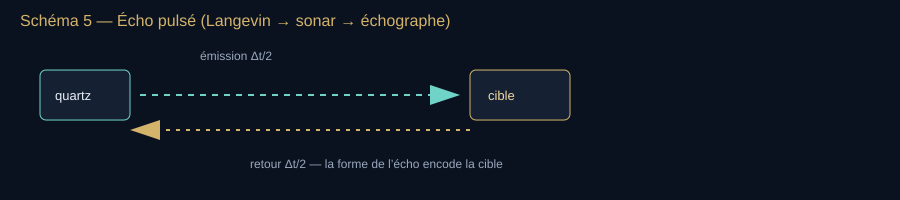

**Lecture du schéma.** Δt est le temps total aller-retour ; un trajet vaut Δt/2 si la cible et le milieu sont immobiles. La profondeur est cΔt/2.

[Fiche visuelle et transcription](banque-visuelle-son.md#v09) · [Ouvrir le SVG autonome](assets/schemas-son/v09-echo-pulse.svg)

Même dessin pour un sous-marin, un iceberg, un foie, un fœtus. Seuls changent $f$, la puissance et l’éthique.

<!-- atelier:S16 -->
> **Atelier S16 — Sonar à impulsion** · *★★★ · effort M · 🔊 (ping ralenti) · remplace le schéma V09*
>
> **Comment l’utiliser.** Placer la cible, émettre, lire Δt et la distance déduite. Rapprocher deux cibles jusqu’à ce que leurs échos fusionnent, puis raccourcir l’impulsion.
>
> **Ce que ça montre.** d = cΔt/2, la résolution axiale cτ/2, la portée qui s’effondre quand f monte dans l’air.
>
> **Sens de lecture.** Lire Δt sur l’oscillogramme, faire le calcul à voix haute (2 ms dans l’eau : 1,5 m). Puis voir les deux échos se séparer quand l’impulsion raccourcit : c’est le compromis de tout échographe.
<!-- /atelier -->

#### Après la guerre

- L’idée passe au contrôle des métaux, puis à la médecine (Dussik 1942 est un pionnier malhabile ; la clinique moderne vient plus tard : Howry, Wild, Ian Donald).
- Doppler médical = Langevin + Buys Ballot sur des globules rouges.
- Langevin est aussi l’homme des thèses, de l’école de physique française, d’un engagement public. Sur le plateau : ne pas en faire une statue lisse, ne pas non plus noyer le sonar dans la bio.

Phrase plateau : « Mersenne compte ce qui vibre. Langevin compte ce qui revient. »

### Ultrasons — physique, machines, corps

**Pour entrer dans le chapitre.** Le principe de l’écho est déjà connu. L’échographe ajoute une question : quelle partie du signal revient de chaque interface, et avec quel retard ? « Image » désigne ici une reconstruction à partir d’échos. Les sigles des matériaux et les modes cliniques détaillent la machine ; ils ne sont pas nécessaires pour comprendre le premier schéma.

L’ultra animal relève d’un vivant qui utilise des fréquences au-dessus de $20\,\mathrm{kHz}$. Ici c’est l’humain qui fabrique la même bande : quartz, céramique PZT, tête d’échographe, bac à ultrasons, soudure, contrôle d’aile d’avion. Même $d=c\Delta t/2$ que Langevin. Dans l’air, l’atténuation limite fortement la portée lorsque la fréquence monte.

#### Production

**Sigles utiles.** PZT : famille de céramiques piézoélectriques ; PVDF : polymère utilisé notamment pour ses propriétés piézoélectriques ; CMUT : transducteur ultrasonore capacitif microfabriqué. Pour suivre le mécanisme, retenir surtout la conversion **tension électrique ↔ mouvement ↔ onde**. Les noms des matériaux servent à comparer les réalisations.

- **Piézoélectricité** (Curie 1880, inverse Lippmann 1881) : quartz historique, aujourd’hui PZT, PVDF, composites. Une tension $V(t)$ à $f$ impose une épaisseur $e(t)$ à $f$.
- **Magnétostriction** : nickel, Terfenol-D, encore utile en basse ultra / haute puissance (nettoyage, soudure).
- **Capacitif / CMUT** : membranes de silicium, imagerie récente.
- Résonance d’épaisseur d’un disque : $f \approx c_{\mathrm{solide}}/(2e)$. Plus le disque est mince, plus $f$ monte.

**À dire —** « f environ égale cé solide sur deux e. »

#### Impédance et écho — pourquoi le gel

**Lire la formule — le sens avant les symboles.** L’impédance caractérise ici la relation entre pression et mouvement du milieu. Deux milieux très différents transmettent mal l’onde à leur interface et renvoient une part importante de l’énergie. R décrit l’amplitude réfléchie ; son carré donne la fraction d’intensité dans le cas précisé ci-dessous.

$$
Z = \rho c \qquad R = \frac{Z_2-Z_1}{Z_2+Z_1}
$$

 **À dire —** « zé égale rhô cé. R égale zé deux moins zé un, sur zé deux plus zé un. »

$Z_{\mathrm{air}}\approx 400\,\mathrm{rayl}$, $Z_{\mathrm{eau/tissu}}\approx 1{,}5\times10^6\,\mathrm{rayl}$. Ici $R$ est le coefficient de réflexion **en amplitude de pression**, à incidence normale ; la fraction d’intensité réfléchie vaut $R^2$ pour ces milieux non dissipatifs. À l’interface air/peau, elle approche 1 : une couche d’air empêche presque toute transmission utile. Le gel n’est pas un « conducteur magique », c’est un adaptateur d’impédance. Os / poumon / calcul réfléchissent fort ; foie / muscle beaucoup moins. C’est une composante majeure du contraste ; la diffusion, l’atténuation et le traitement des signaux comptent aussi.

<!-- atelier:S51 -->
> **Atelier S51 — Échographe** · *★★★ · effort L · 👁 · plein écran · remplace le schéma V10*
>
> **Comment l’utiliser.** Poser la sonde sur le fantôme sans gel : écran noir ; mettre le gel ; monter la fréquence ; passer en mode A pour lire une seule ligne.
>
> **Ce que ça montre.** Une image B reconstruite depuis une carte d’impédance : ombre acoustique derrière l’os, renforcement derrière le kyste, atténuation 0,5 dB/cm/MHz, R ≈ 1 à l’air.
>
> **Sens de lecture.** Lire l’image comme des échos traités : un pixel sombre peut correspondre à peu de diffusion, à de l’atténuation ou à une ombre. Le gain et les interfaces interviennent ; ce n’est pas une carte directe de l’impédance. Comparer le compromis résolution/portée à fréquence croissante.
<!-- /atelier -->

#### Bandes d’usage (ordres, pas des lois)

| Bande | Usage typique |
| --- | --- |
| 20–100 kHz | nettoyage, télémétrie air courte, certains soudeurs plastiques, détection animale de labo |
| ~1–5 MHz | abdomen, obstétrique, cœur (compromis portée / résolution) |
| ~7–18 MHz | thyroïde, sein, musculo-squelettique, pédiatrie superficielle |
| dizaines de MHz | œil, peau, recherche, microscopie acoustique |
| lithotritie extra-corporelle | chocs focalisés (pas un « sinus de 3 MHz » naïf) |
| HIFU | chauffage focalisé thérapeutique |
| CND / Soudure / débitmètres | défauts dans le métal, joints, clamp-on |

Résolution axiale $\approx c\tau/2$ (durée d’impulsion). Monter $f$ affine l’image et tue la portée : l’atténuation des tissus mous ~0,5 dB·cm⁻¹·MHz⁻¹ (ordre de grandeur clinique). D’où les 3 MHz du fœtus et les 12 MHz du tendon.

**À dire —** « résolution axiale environ cé tau sur deux. Atténuation tissus mous environ zéro virgule cinq décibel par centimètre par mégahertz. »

#### Modes cliniques à nommer juste

- **A** : amplitude des échos en fonction du temps de vol sur une ligne. Les essais de Dussik en transmission ne doivent pas être confondus avec tous les modes d’imagerie par écho.
- **B** : coupe, brillance = amplitude. L’image « bébé ».
- **M** : une ligne suivie dans le temps (valve, paroi).
- **Doppler** : voir [chapitre suivant](#doppler) — continu, pulsé, couleur, puissance.
- **Harmonique tissulaire** : on émet $f$, on écoute $2f$ (non-linéaire).

Sécurité : indices thermique et mécanique (TI, MI), principe ALARA. Ne pas improviser de « séance ultra » hors cadre soignant.

**À l’écran — V10.** Schéma — chaîne d’un échographe *→ schéma provisoire, remplacé dans le dossier par l’atelier S51 : L’échographe simulé remplace la chaîne PZT → gel → tissu → écho.*

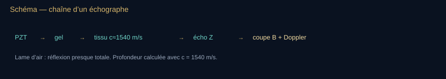

**Lecture du schéma.** R désigne ici un coefficient en amplitude à incidence normale. Le gel évite surtout une lame d’air. Une image B représente les échos traités ; elle ne lit pas directement une impédance absolue en chaque pixel.

[Fiche visuelle et transcription](banque-visuelle-son.md#v10) · [Ouvrir le SVG autonome](assets/schemas-son/v10-echographe.svg)

### Mécanisme Doppler — déplié

**Pour entrer dans le chapitre.** Regarder d’abord V11 : les fronts sont plus rapprochés devant la source qui avance. Séparer ensuite deux scènes, source mobile puis observateur mobile. Écrire les signes seulement après avoir dessiné qui bouge, dans quelle direction et par rapport à quel milieu. Le cas combiné et l’écho sur une cible mobile sont des approfondissements.

1842 : Christian Andreas Doppler, Prague, mémoire sur les étoiles binaires. 1845 : C. H. D. Buys Ballot fait monter des cornistes sur un train de la ligne Utrecht–Maarssen. Le son, contrairement à la lumière du mémoire, a un milieu au repos qu’on peut pointer du doigt. Tout le chapitre tient dans cette asymétrie : *source en mouvement ≠ observateur en mouvement*.

#### 1. Milieu immobile, observateur qui marche

La longueur d’onde dans l’air ne change pas. L’observateur rencontre plus (ou moins) de fronts par seconde.

**Lire la formule — le sens avant les symboles.** La source reste fixe : les fronts gardent leur espacement dans le milieu. L’observateur qui avance vers eux en rencontre davantage par seconde, comme une personne qui marche à la rencontre d’une file de vagues. Le signe + correspond à ce rapprochement.

$$
f' = f\,\frac{c \pm v_o}{c}
$$

 **À dire —** « f prime égale f fois cé plus ou moins vé o, sur cé. »

Signe + si l’observateur va vers la source. $v_o \ll c$ : $\Delta f / f \approx \pm v_o/c$. À 30 m/s (voiture) et 343 m/s : ~9 %, soit un demi-ton et demi — pas un comma. Et comme la voiture s’approche puis s’éloigne, la chute totale entendue va de ×1,09 à ×0,91, soit ~19 % : une tierce mineure.

#### 2. Source qui marche, observateur immobile

Ici $\lambda$ change. La source rattrape ses propres fronts vers l’avant : $\lambda_+ = (c-v_s)/f$. Derrière : $\lambda_- = (c+v_s)/f$. L’observateur au repos entend $c/\lambda$.

**Lire la formule — le sens avant les symboles.** Cette fois, la source avance entre deux émissions. Elle rapproche les fronts devant elle et les écarte derrière. Au repos dans le milieu, l’observateur reçoit donc une fréquence plus haute à l’avant : on choisit le signe moins au dénominateur.

$$
f' = f\,\frac{c}{c \mp v_s}
$$

 **À dire —** « f prime égale f fois cé sur cé moins ou plus vé s. »

Moins au dénominateur si la source s’approche. Quand $v_s \to c$, $f'$ part à l’infini vers l’avant : on n’a plus une sirène, on a un front de Mach. Le bang n’est pas « un Doppler très fort », c’est un régime différent (cône, N-wave).

#### 3. Les deux à la fois + vent

**Lire la formule — le sens avant les symboles.** Les deux effets précédents se combinent : déplacement du récepteur au numérateur, déplacement de la source au dénominateur. Définir d’abord les vitesses par rapport au milieu et le sens du trajet ; les signes ne se choisissent pas indépendamment de cette description.

$$
f' = f\,\frac{c \pm v_o}{c \mp v_s}
$$

 **À dire —** « f prime égale f fois cé plus ou moins vé o, sur cé moins ou plus vé s. »

Un vent uniforme $w$ se rajoute à $c$ (composante dans la direction de propagation). Un vent qui porte le son n’est pas un Doppler de source : c’est un changement de célérité effective. Les confondre sur le plateau, c’est refaire l’erreur inverse de Newton (milieu mal traité).

**À l’écran — V11.** Schéma — source en mouvement : λ se comprime vers l’avant *→ schéma provisoire, remplacé dans le dossier par l’atelier S13 : Les fronts nés là où la source était sont dessinés par l’atelier Doppler, en mouvement.*

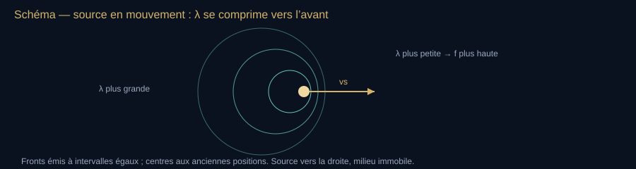

**Lecture du schéma.** Chaque cercle part de l’ancienne position de la source. Comparer les espacements devant et derrière ; le déplacement de l’observateur modifie le nombre de fronts reçus sans modifier ces espacements.

[Fiche visuelle et transcription](banque-visuelle-son.md#v11) · [Ouvrir le SVG autonome](assets/schemas-son/v11-doppler.svg)

Animation mentale : chaque cercle naît là où la sirène était. Vers l’avant les cercles s’empilent. C’est tout le mécanisme.

<!-- atelier:S13 -->
> **Atelier S13 — Doppler — qui bouge ?** · *★★★ · effort M · 🔊 · plein écran · remplace le schéma V11*
>
> **Comment l’utiliser.** Faire passer la source devant l’observateur, écouter ; échanger les rôles (observateur mobile) à vitesse égale ; ajouter du vent ; pousser la source vers c.
>
> **Ce que ça montre.** Les fronts circulaires nés là où la source était, f′ calculée avec les bons signes, la courbe f′(t) du passage ; le cône de Mach quand v → c. Le glissement de hauteur est produit par la géométrie (retard = distance/c), pas par un effet de pitch.
>
> **Sens de lecture.** Comparer les espacements des fronts devant et derrière la source, puis source mobile et observateur mobile. Les vitesses Doppler se définissent relativement au milieu ; avec du vent, préciser ce référentiel et les composantes le long du trajet.
<!-- /atelier -->

#### 4. Ce que Doppler n’est pas

- Le **redshift cosmologique** n’est pas un Doppler sonore dans l’éther. C’est l’expansion métrique. On peut en parler en analogie, on ne doit pas l’enseigner comme Buys Ballot.
- Le Doppler lumineux a une forme relativiste (transverse inclus). Pour le son dans l’air à 30 m/s, le relativiste est du bruit de fond théorique.
- Un battement musical $|f_a-f_b|$ n’a besoin d’aucun mouvement. Ne pas appeler « Doppler » un désaccord d’unisson.

#### 5. Double trajet — le sang, la pluie, la mite

Échographe : l’onde va vers le globule, le globule renvoie, le cristal réécoute. Deux Doppler. Pour un angle $\theta$ entre le faisceau et la vitesse du sang :

**Lire la formule — le sens avant les symboles.** La cible mobile rencontre une onde puis la renvoie : le déplacement intervient sur les deux trajets. Le cosinus retient seulement la part de la vitesse alignée avec le faisceau. Si le mouvement est perpendiculaire au faisceau, ce modèle donne un décalage nul.

$$
\Delta f = \frac{2 v f_0 \cos\theta}{c}
$$

 **À dire —** « delta f égale deux vé f zéro cosinus thêta, sur cé. »

Le facteur 2 vient de l’aller-retour, dans l’approximation des vitesses faibles devant la célérité. $\theta=90°$ : $\cos\theta=0$, pas de décalage — d’où les erreurs d’angle en clinique. $c$ ici ≈ 1540 m/s (tissu), $f_0$ quelques MHz, $v$ quelques dizaines de cm/s : $\Delta f$ tombe dans l’audible. Le « souffle » du Doppler couleur que le cardiologue entend est cette $\Delta f$ envoyée dans un haut-parleur. Même geste que Gurnett, autre onde.

Radar météo : même 2, $c=$ lumière, $v=$ vent radial des hydrométéores. Encore une autre onde (EM). Le mot Doppler voyage ; le milieu change.

Rhinolophe : le trajet comprend lui aussi émission vers la cible et retour de l’écho ; l’animal *règle* $f_0$ pour que $f'$ reste dans la fovéa ~83 kHz (Schnitzler). C’est un asservissement, pas une formule subie.

<!-- atelier:S52 -->
> **Atelier S52 — Doppler médical** · *★★ · effort M · 🔊 (la Δf est audible)*
>
> **Comment l’utiliser.** Régler l’angle à 45°, écouter le « souffle » ; tourner vers 90° ; changer f₀.
>
> **Ce que ça montre.** Δf = 2 v f₀ cos θ / c jouée telle quelle, le spectre Doppler défilant, l’erreur d’angle.
>
> **Sens de lecture.** Le son que l’on entend est la Δf elle-même, pas une transposition : quelques MHz émis, quelques kHz de décalage. À 90°, le silence : cos θ = 0, d’où les erreurs cliniques.
<!-- /atelier -->

#### 6. Observations plateau

1. Sirène de passage : monter puis descendre, dissymétrie source (formule 2), pas un « plus ou moins » vague.
2. Deux diapasons, un qu’on avance vers l’oreille : faible, mais le signe est le bon.
3. Doc cardiologie : le son du Doppler pulsé, dire le $2v\cos\theta/c$.
4. Interdire la phrase « le Doppler c’est quand ça va plus vite donc c’est plus aigu » sans dire *qui* bouge.

Fil : Doppler écrit le ciel. Buys Ballot le fait entendre. Langevin le branche sur le quartz. Le rhinolophe le sertit dans une fovéa. L’échographe le fait écouter au cardiologue.

### Bilan — L’écho comme règle

- Le temps de l’écho comprend un aller et un retour : la distance à la cible utilise la moitié du trajet total.
- Le Doppler dépend du mouvement décrit par rapport au milieu et à la direction de propagation.
- Une image échographique est reconstruite à partir d’échos traités ; elle n’est pas une photographie par ultrasons.

**Question au public.** Si le retour prend deux fois plus de temps dans le même milieu immobile, que déduit-on ?

**Réponse et relance.** Pour la même géométrie aller-retour, la cible est deux fois plus loin. Il faut conserver la célérité et distinguer ce temps de la durée propre de l’impulsion.

**Pour reprendre le fil.** Ces outils de mesure changent les salles, les usages et les arguments que l’on peut vérifier.

[Étape suivante](#acte-vii) · [Carte du parcours](#parcours-guide)

## VII. Les autres scènes et les intox

**Fil essentiel.** Un même signal peut devenir musique, gêne ou objet de recherche selon le contexte. Pour évaluer une promesse, séparer ce qui est observé de ce qui est affirmé. Une différence audible ne démontre pas, à elle seule, un effet médical ou une histoire de fréquence cosmique.

**Choisir la suite.** [Comprendre avec les exemples](#archi) ou [faire le point](#bilan-vii).

**Transition à dire.** « La même onde change de statut selon le lieu : dans une salle, elle gêne ou sublime une voix ; dans la ville, elle devient une question de santé ; dans une publicité, elle peut devenir un argument trompeur. À chaque fois, demandons ce qui est réellement mesuré. »

**Geste de plateau.** Faire passer un même clap d’une salle sèche à une salle réverbérante (S23 ou S24). Pour le 432/440 Hz, comparer à niveau égal et annoncer le décalage de hauteur, sans promettre d’effet médical.

### Faire taire la pierre — acoustique architecturale

**Wallace Clement Sabine** (1868–1919), Harvard, 1895. On lui colle le Fogg Art Museum, inaudible. Il mesure au tuyau d’orgue et au chronomètre la durée de réverbération, déménage les coussins du Sanders Theatre une nuit après l’autre, et trouve la relation :

**Lire la formule — le sens avant les symboles.** Nous retrouvons la relation annoncée dans l’ouverture, maintenant reliée à une salle concrète. Plus le volume est grand, plus la décroissance peut durer ; davantage d’absorption la raccourcit. T60 décrit une baisse de niveau de 60 dB, et se précise par bande de fréquence.

$$
T_{60} \approx \frac{0{,}161\,V}{A}
$$

 **À dire —** « té soixante environ égale zéro virgule cent soixante-et-un V sur A. »

$T_{60}$ : temps pour que le niveau baisse de 60 dB. $V$ volume en m³. $A$ absorption équivalente en m² sabine. L’unité *sabine* porte son nom. Il est ensuite le conseiller acoustique du **Boston Symphony Hall** (architectes McKim, Mead & White, ouvert 1900), encore cité parmi les meilleures salles du monde.

Suite : Eyring, Norris, Beranek, Barron, Hidaka ; chambres anéchoïques (murs en coins de mousse / laine) et réverbérantes ; simulation numérique (rayons, sources image, FDTD). Le live peut opposer Épidaure (filtre de pierre au grand air) et une régie ou une cabine de studio (T60 de 0,2 à 0,3 s).

**À l’écran — V14.** Schéma — réverbération *→ schéma provisoire, remplacé dans le dossier par l’atelier S23 : La décroissance de réverbération est mesurée (clap) ou calculée (Sabine, S24), plus dessinée.*

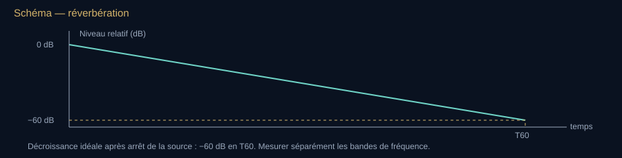

**Lecture du schéma.** T60 est le temps d’une décroissance de niveau de 60 dB. Il dépend de la bande de fréquence ; la loi de Sabine suppose un champ suffisamment diffus et une absorption modérée.

[Fiche visuelle et transcription](banque-visuelle-son.md#v14) · [Ouvrir le SVG autonome](assets/schemas-son/v14-reverberation.svg)

<!-- atelier:S23 -->
> **Atelier S23 — Convolution et réverbération (T60 au clap)** · *★★★ · effort L · 🎙🔊 · plein écran · remplace le schéma V14*
>
> **Comment l’utiliser.** Enregistrer un clap dans la pièce où l’on se trouve, lire le T60 mesuré, puis convoluer sa voix avec cette réponse ou avec une réponse synthétique de cathédrale.
>
> **Ce que ça montre.** La réponse impulsionnelle, la courbe de décroissance de Schroeder, le T60 par régression, la comparaison avec le calcul de Sabine.
>
> **Sens de lecture.** Lire la décroissance par bande ; estimer T20 ou T30 puis extrapoler T60 seulement si la dynamique utile et la linéarité le permettent. Un clap et un micro ordinaire donnent une estimation dépendante de la source, du bruit, du placement et des traitements automatiques.
<!-- /atelier -->

<!-- atelier:S24 -->
> **Atelier S24 — Calculateur de Sabine** · *★★★ · effort M · 🔊 · plein écran*
>
> **Comment l’utiliser.** Entrer une salle, choisir ses matériaux, lire T60 par bande ; ajouter le public ; comparer aux présets Boston Symphony Hall / studio / cathédrale.
>
> **Ce que ça montre.** A = Σ αᵢSᵢ et T60 ≈ 0,161 V/A pour Sabine ; comparaison avec Eyring T60 ≈ 0,161 V/[−S ln(1−α moyen)] dans le modèle diffus sans absorption de l’air, et réponse impulsionnelle synthétique annoncée.
>
> **Sens de lecture.** Regarder T60 par bande avant de regarder la moyenne : une salle « sèche » dans l’aigu peut « boomer » dans le grave. Puis ajouter le public : la salle sèche, comme chez Sabine.
<!-- /atelier -->

### Le son hors du laboratoire — mêmes lois, autres scènes

Cohérence : on ne change pas de physique. On change d’enjeu. Chaque secteur ci-dessous doit pouvoir se raccrocher à une grandeur déjà nommée (réverbération, spectre, masquage, célérité, seuil).

#### Rite, religion, silence organisé

- Cloche d’église : partiels inharmoniques d’un bronze, accord des partiels (prime, tierce, quinte, nommée autrement par les fondeurs). Le bourdon n’est pas un sinus.
- Orgue : tuyaux = les formules ouverts / fermés du chapitre maths. Le tremblant est une modulation.
- Adhan, shofar, conque, om, mantra : la voix comme architecture spirituelle. Ne pas psychologiser : décrire le lieu (cour, dôme, grotte) et le $T_{60}$.
- John Cage, *4′33″* (1952) : le silence n’existe pas dans une salle habitée. Sabine l’aurait signé.

#### Langage et voix publique

- Phonétique acoustique : voyelles = formants F1–F2 ; consonnes = transitoires et bruits. Un « s » culmine entre 4 et 8 kHz : le plus aigu des sons de la parole, loin encore de l’ultrason.
- Intelligibilité : STI, STIPA, %ALcons (RASTI, retiré de la norme en 2011) — pont direct avec Sabine et le bruit de fond.
- Rhétorique antique déjà consciente d’Épidaure : la voix projetée n’est pas un cri, c’est un spectre dirigé.

#### Ville, droit, santé publique

- Cartes de bruit européennes (directive 2002/49/CE), Lden, Lnight.
- OMS : le bruit de trafic n’est pas un confort. Lien documenté avec sommeil, cardiovasculaire, apprentissages.
- Codes du travail : seuils d’action ~80 dB(A) / 85 dB(A) sur 8 h selon les versions nationales — toujours citer le texte en vigueur du jour, pas un souvenir.
- Voisinage : transmission des basses par les parois et les structures (masse, raideur, résonances, systèmes masse-ressort-masse), à distinguer du contournement par diffraction. La plainte « on entend la basse » est de la physique des basses fréquences, pas de la morale.

#### Guerre, souveraineté, mer

Déjà Langevin. Ajouter : canal SOFAR (Ewing & Worzel, WWII) — un animal ou une bombe s’entend à l’échelle d’un océan. SOSUS. Traités sur les essais. Ne pas donner d’architecture d’arme : rester au principe de l’écho et du milieu stratifié.

<!-- atelier:S48 -->
> **Atelier S48 — Le canal SOFAR** · *★★ · effort M · 👁 · plein écran*
>
> **Comment l’utiliser.** Placer la source à 1 000 m, lancer des rayons à plusieurs angles ; remonter la source en surface et recommencer.
>
> **Ce que ça montre.** Le tracé de rayons dans le profil de célérité, l’axe du canal, les rayons piégés sur des milliers de kilomètres, les zones d’ombre.
>
> **Sens de lecture.** Regarder les rayons se recourber vers la zone lente : c’est la même réfraction que le son qui « porte » le soir. Une baleine sur l’axe s’entend à l’échelle d’un océan.
<!-- /atelier -->

#### Cinéma, jeu, radio

- Microphone d’un plan n’est pas l’oreille : on fabrique une perspective (on-axis, hors-champ, Foley).
- Dolby, 5.1, Atmos : le Haas et le masquage comme outils d’industrie.
- Radio : le son sans image oblige le spectre de voix et le silence monté.

#### Travail, sport, design

- Signature sonore d’un moteur, d’une porte de voiture (ingénieurs NVH). Un « clac » de luxe est un spectre décidé en comité.
- Stades : délai des écrans géants vs son live = écho artificiel si mal calé.
- ASMR, lo-fi, open space : économies de l’attention, pas une nouvelle physique.

#### Droit de la copie

L’enregistrement rend le son reproductible à grande échelle. Le droit d’auteur et la SACEM précèdent le phonographe ; les droits voisins encadrent ensuite notamment interprétations et enregistrements. Pour le plateau, conserver pour chaque extrait sa source, son auteur, sa licence et ses conditions de réutilisation. Une durée de trois secondes ne crée pas à elle seule une autorisation ; une ressource scientifique n’est pas automatiquement libre pour tous les usages.

### Bruit, guerre, industrie, art

- Aéroacoustique : **James Lighthill**, 1952, analogie de Lighthill — le jet d’avion comme source quadrupolaire. Le bang supersonique (Mach, N-wave).
- Contrôle du bruit : silencieux (Hiram Percy Maxim, brevet du silencieux d’arme 1909, adapté aux échappements) et silencieux d’aviation, parois doubles, anti-bruit actif (Lueg, brevet 1933–1936, puis Bose, grand public années 2000).
- Armes sonores / LRAD : rester factuel, ne pas donner de mode d’emploi. Mentionner l’existence de dispositifs d’évacuation de foule et les débats éthiques.
- Musique concrète (Pierre Schaeffer, 1948, Club d’essai RTF), synthèse (RCA Mark II, Moog, IRCAM, Chowning et la FM chez Yamaha), spatialisation (Acousmonium, Ambisonics, Dolby Atmos).
- Cymatique au sens de **Hans Jenny** (1960s) : belles figures, parfois récupérées par un discours qui attribue au son un pouvoir créationniste. Sur le plateau : montrer la figure, refuser le mythe.

### Les intox du son — onze mythes, et la démonstration à l’oreille

**Pour entrer dans le chapitre.** Lire chaque fiche avec trois colonnes mentales : **observation**, **interprétation**, **preuve nécessaire**. Entendre une différence entre 432 et 440 Hz teste une différence sonore ; cela ne teste ni l’ADN ni un bénéfice thérapeutique. Une expérience courte peut illustrer un mécanisme sans trancher une question médicale ou historique.

Le son permet de mettre certaines affirmations *à l’épreuve en direct* : jouer, compter, mesurer. Chaque fiche donne la revendication, ce qu’elle contient de vrai, ce qu’elle contient de faux, et la manip de trente secondes. Règle : on cite les affirmations comme des affirmations, on ne prête pas d’intention, on ne se moque pas du public qui les a lues.

##### 1. « 432 Hz, la fréquence de l’univers »

**Ce qui est vrai :** le la de référence a beaucoup bougé — ~415 Hz dans le baroque, 435 Hz par décret français (« diapason normal », 1859), 440 Hz recommandé par la conférence de Londres de 1939 puis normalisé (recommandation ISO R 16 en 1955, norme ISO 16 en 1975). L’Italie a bien retenu 432 Hz par décret en 1884, avec le soutien de Verdi (la lettre et son motif, souvent dit vocal, sont à citer au conditionnel) ; le « diapason de Verdi » est surtout, depuis 1988, une bannière du Schiller Institute. **Ce qui est faux :** qu’un nombre de cycles *par seconde* soit « cosmique » alors que la seconde est une convention humaine (définie par le césium en 1967) ; que 440 ait été « imposé par Goebbels » (la conférence de 1939 est britannique, l’American Standards Association recommandait 440 dès 1936) ; qu’un accordage à 432 « résonne avec l’ADN » ou « structure l’eau » (aucun mécanisme, aucune étude répliquée ; l’étude la plus citée, Calamassi & Pomponi 2019, porte sur 33 personnes et des effets à la limite du bruit). **Manip :** jouer 440 puis 432 : 8 Hz d’écart, 32 cents, un tiers de demi-ton — puis transposer *n’importe quel* morceau de −32 cents : l’« effet 432 » est celui d’une transposition légère vers le grave, reproductible avec 431 ou 433.

##### 2. « 528 Hz répare l’ADN » et le « solfège sacré »

**Origine :** une numérologie des années 1990 (Puleo, Horowitz 1999) appliquée aux syllabes de l’hymne *Ut queant laxis* — pas une source médiévale, pas une mesure. 528 Hz est approximativement un do4 en notation française (C5 internationale) dans une gamme tempérée accordée à 444 Hz (523,25 Hz à 440). **Faux :** tout effet biologique spécifique ; les rares études in vitro citées n’isolent pas la fréquence des conditions de l’expérience et n’ont pas été répliquées. **Manip :** 528 puis 523,25 Hz : 15 cents, moins que le vibrato d’un violoniste. Demander au public lequel « répare ».

##### 3. « Les battements binauraux synchronisent le cerveau »

**Vrai :** le battement binaural existe (Oster 1973, chapitre battements) : deux fréquences proches, une par oreille, et le tronc cérébral fabrique une pulsation qui n’est dans aucune onde. Le cerveau « suit » effectivement la fréquence de modulation (réponse auditive en régime permanent, mesurable à l’EEG). **Faux :** qu’il en résulte un « état » (sommeil, concentration, méditation) commandé par la fréquence choisie : la méta-analyse de Garcia-Argibay et al. (2019) trouve un effet moyen (g ≈ 0,45) mais très dépendant de la fréquence, de la durée et du protocole, et une revue systématique des études EEG (Ingendoh et al. 2023) juge l’« entraînement » des ondes cérébrales non démontré ; rien qui justifie « ondes delta = sommeil profond garanti ». **Manip :** 200 Hz à gauche, 210 à droite au casque : on entend la pulsation. Écouter ensuite un seul canal : la pulsation binaurale disparaît. **Mélanger les deux canaux en mono ne la fait pas simplement disparaître** : cela crée un battement acoustique à 10 Hz, visible sur le signal sommé. Comparer les deux mécanismes, à volume modéré. [Dérivation des battements acoustiques, UNSW](https://www.animations.physics.unsw.edu.au/jw/beats.htm).

##### 4. La cymatique « créatrice » et le « son qui crée la matière »

**Vrai :** les figures existent (Hooke 1680, Chladni 1787, Faraday 1831 pour les ondes à la surface d’un liquide, Jenny 1967). **Faux :** qu’elles soient un « code » du son : une figure de Chladni est un *mode propre de la plaque* — elle dépend de la plaque (taille, épaisseur, matériau, appui) autant que de la fréquence. La même fréquence sur deux plaques donne deux figures ; deux fréquences différentes sur deux plaques peuvent donner la même. Le son ne « crée » rien : il excite ce qui est déjà là. **Manip :** deux plaques, une fréquence.

##### 5. Emoto et « l’eau qui écoute »

**La revendication** (Masaru Emoto, 1999–2004) : des cristaux de glace plus « beaux » quand l’eau a été exposée à des mots gentils ou à Mozart. **Ce qu’il manque :** l’aveugle (le photographe savait), le comptage (on choisissait le cristal à photographier parmi des dizaines), la réplication (l’étude de Radin et al. 2006, cosignée par Emoto, ne suffit pas à établir un effet robuste et répliqué indépendamment). **La physique :** une voix à 60 dB, c’est 0,02 Pa de pression acoustique — deux dix-millionièmes de la pression atmosphérique (2 × 10⁻⁷) ; la forme d’un cristal de glace dépend de la température et de la sursaturation (Nakaya, 1954), pas de la sémantique. Ne pas confondre avec les effets *réels* et mesurables du son sur les liquides : lévitation acoustique, cavitation (bacs à ultrasons, chapitre ultrasons), ondes de Faraday.

##### 6. « 7,83 Hz, la fréquence de la Terre — et elle augmente »

**Vrai :** la résonance de Schumann (prédite 1952, mesurée par Balser & Wagner 1960) : la cavité entre le sol et l’ionosphère résonne vers 7,83 Hz et ses modes supérieurs (environ 14, 20, 26, 33 Hz…), qui ne sont pas des multiples entiers exacts de 7,83 Hz, excitée par les éclairs. **Faux :** que ce soit un son (c’est un champ électromagnétique, chapitre infrasons : Boyle et Maxwell, deux familles) ; que son amplitude (quelques picoteslas) ait un effet biologique démontré ; que « la fréquence augmente » (les graphiques qui circulent montrent des harmoniques qui ont toujours été là, ou des variations d’amplitude journalières et saisonnières) ; que la coïncidence numérique avec les ondes alpha (8–12 Hz) signifie quoi que ce soit — une voiture à 90 km/h et un cœur à 90 pulsations par minute ne sont pas « en résonance ».

##### 7. « La NASA a enregistré le son d’un trou noir / le OM du Soleil »

**Renvoi au chapitre astronomie et à ses trois familles.** Persée : une vraie onde de pression, transposée de 57 octaves pour l’oreille (famille A puis C). Voyager : des ondes de plasma, déjà dans la bande audio, mais pas de la pression d’air (famille B). Le « OM du Soleil » qui circule est une sonification de modes p à quelques mHz, accélérée 42 000 fois, soit une quinzaine d’octaves, parfois mêlée à des chœurs — la NASA l’étiquette, les reprises ne l’étiquettent plus. **Manip :** avant chaque extrait, dire la famille et le facteur de transposition. Sans ces deux mots, on fabrique soi-même l’intox.

##### 8. Armes infrasonores, « syndrome de La Havane », « sons qui liquéfient »

**Ce qu’on sait :** des dispositifs acoustiques à fort niveau existent dans l’audible (LRAD : niveaux élevés selon le modèle et les conditions de mesure, avec risque auditif ; cela ne démontre pas une « liquéfaction » des organes) ; l’infrason à haut niveau donne nausée et pression thoracique en chambre d’essai, avec des machines de plusieurs mètres, à courte distance. **Ce qui ne tient pas :** une arme infrasonore *portable et dirigée* (un 7 Hz a 50 m de longueur d’onde : impossible à focaliser avec un objet de taille humaine) ; les récits d’effets ultrasonores puissants à grande distance dans l’air sans bilan de propagation, de puissance et de mesure ; l’absorption seule ne définit pas une frontière absolue de portée. Pour les incidents de La Havane (2016 →), l’Académie nationale des sciences américaine (2020) jugeait « plausible » une énergie radiofréquence pulsée, et le renseignement américain (ODNI, mars 2023) « très improbable » l’implication d’un adversaire étranger ; l’identification d’un grillon dans certains enregistrements ne permet pas, à elle seule, d’expliquer tous les symptômes ni tous les cas. Depuis : études NIH 2024 sans lésion cérébrale mesurable, avis de deux agences nuancé en janvier 2025, les annonces ultérieures exigent leurs propres sources — dater ce que l’on dit, sans présenter le dossier comme définitivement résolu. Sur le plateau : dire l’état des rapports, ne rien affirmer de plus, ne décrire aucun dispositif.

##### 9. Répulsifs à ultrasons (rongeurs, insectes, moustiques)

**Vrai :** les rongeurs entendent les ultrasons. **Non établi :** qu’un boîtier domestique les chasse durablement. Les avertissements de la [FTC en 2001](https://www.ftc.gov/news-events/news/press-releases/2001/05/ftc-warns-manufacturers-retailers-ultrasonic-pest-control-devices) portent sur des promesses d’efficacité non étayées ; ils évoquent notamment une habituation susceptible de rendre la réaction temporaire. Ils ne donnent pas une durée universelle de « quelques jours ». La propagation et les obstacles limitent aussi la couverture. Pour les moustiques, la revue Cochrane (Enayati, Hemingway & Garner 2007, dix essais de terrain) n’observe pas d’effet répulsif des appareils étudiés : cela ne fournit aucune base aux promesses des applications anti-moustiques. [Revue Cochrane](https://doi.org/10.1002/14651858.CD005434.pub2).

##### 10. « Effet Mozart », « 8D », « 40 Hz contre Alzheimer », « 3-6-9 de Tesla »

- **Effet Mozart** : Rauscher et al. (1993) mesurent un gain temporaire (10 à 15 minutes) à une tâche spatiale après dix minutes de Mozart. Les méta-analyses (Pietschnig et al. 2010, « Mozart effect – Shmozart effect ») montrent que n’importe quel stimulus agréable et éveillant fait pareil ; rien de spécifique, rien de durable, rien sur le QI des bébés.
- **8D audio** : chapitre psychoacoustique, localisation — un panoramique automatisé avec réverbération. Agréable, pas nouveau, pas « huit dimensions ».
- **Stimulation à 40 Hz** : un vrai programme de recherche (Iaccarino et al. 2016 chez la souris : lumière clignotante à 40 Hz, effets sur les plaques amyloïdes ; Martorell et al. 2019 : son et audio-visuel ; chez l’humain, le promoteur décrit l’essai pivot [HOPE](https://www.cognitotx.com/clinical-studies), avec 673 participants recrutés ; son statut et ses résultats doivent être lus dans le [registre NCT05637801](https://clinicaltrials.gov/study/NCT05637801). La page du promoteur consultée ne suffit pas à confirmer l’ancienne formulation « achevé à l’été 2026 »). À citer comme *recherche en cours*, pas comme traitement ; les vidéos « guérissez Alzheimer à 40 Hz » vendent une hypothèse.
- **« Si vous connaissiez la magnificence du 3, du 6 et du 9… »** : citation attribuée à Tesla, sans aucune source primaire ; diffusée sur internet sans qu’on sache d’où elle vient. Aucune physique derrière.

##### 11. Voix clonées, « enregistrements » fabriqués (2023 →)

L’intox la plus récente n’est plus une croyance sur le son : c’est un son *fabriqué*. Quelques secondes de voix suffisent (chapitre numérique) pour faire dire n’importe quoi à n’importe qui — appels à un proche « en détresse », faux extraits politiques, fausses interviews. **Indices, sans garantie :** respirations absentes ou régulières, ruptures au spectrogramme aux jonctions, réverbération incohérente avec le lieu annoncé, prosodie plate sur les noms propres ; mais les modèles s’améliorent plus vite que ces indices. **La règle robuste n’est pas acoustique :** rappeler la personne sur un numéro connu, exiger la source primaire d’un enregistrement, se méfier d’un extrait sans contexte. Sur le plateau : la démonstration est produite en direct par l’animateur pendant le live (le dossier n’embarque aucun clone de voix) ; montrer qu’on ne l’a pas distingué, puis dire la règle.

#### Table récapitulative — à projeter

| Mythe | Le vrai dedans | Le faux | Manip 30 s |
| --- | --- | --- | --- |
| 432 Hz | le diapason a varié | « cosmique », « nazi », « ADN » | successivement : hauteur différente ; superposés : 8 battements/s |
| 528 Hz | c’est un do à 444 | « répare l’ADN » | 528 / 523 : 15 cents |
| Binaural | interaction entre les deux oreilles | « état garanti » | stéréo séparée, un canal seul, puis mélange mono : deux mécanismes |
| Cymatique | modes de plaque | « le son crée la matière » | deux plaques, une fréquence |
| Emoto | des effets acoustiques physiques sur les liquides existent | effet sémantique non établi ; sélection des images et réplication insuffisante | distinguer observation contrôlée et sélection esthétique |
| Schumann | résonance EM à 7,83 Hz | « son », « augmente », « alpha » | Boyle + Maxwell |
| Sons de l’espace | ondes réelles (A, B) | « enregistré au micro » | dire famille + facteur |
| Armes infra | LRAD audible existe | « liquéfie », portable, dirigé | λ = 50 m à 7 Hz |
| Répulsifs ultra | ils entendent | ils partent | Cochrane 2007 |
| Mozart / 8D / 40 Hz / 3-6-9 | éveil ; panoramique ; recherche en cours ; — | QI ; dimension ; traitement ; citation | même gain avec un autre stimulus |
| Voix clonées | l’outil existe | « on reconnaît toujours » | clone de l’animateur |

Phrase plateau : « On joue, on compte, on mesure : certaines affirmations se testent à l’oreille. Pour les effets sur la santé ou l’histoire, il faut aussi des protocoles et des sources. »

### Bilan — Demander quelle preuve répond à quelle promesse

- Le lieu, l’usage et l’exposition changent les enjeux du même phénomène acoustique.
- Une manipulation montre un mécanisme dans des conditions données ; elle ne démontre pas toute promesse associée.
- Pour un enregistrement suspect, la source et le contexte comptent autant que ses indices sonores.

**Question au public.** Un son jugé agréable démontre-t-il une action spécifique sur une maladie ?

**Réponse et relance.** Non. L’agrément rapporté et l’efficacité clinique sont deux affirmations qui demandent des preuves différentes. Le live peut faire éprouver une différence, pas remplacer l’étude adaptée.

**Pour reprendre le fil.** Notre oreille n’est qu’un cas : changeons d’espèce et parfois de milieu.

[Étape suivante](#acte-viii) · [Carte du parcours](#parcours-guide)

## VIII. Les autres auditeurs

**Fil essentiel.** Notre bande d’audition n’est pas la frontière du monde sonore. Chaque espèce possède des organes et des usages particuliers. Il faut distinguer produire un son, le détecter, communiquer avec lui et se repérer grâce à son écho.

**Choisir la suite.** [Comprendre avec les exemples](#bio) ou [faire le point](#bilan-viii).

**Transition à dire.** « Vingt hertz et vingt kilohertz délimitent à peu près notre fenêtre, pas celle du vivant. Pour une baleine, une chauve-souris ou un grillon, le monde sonore n’a ni la même échelle ni les mêmes obstacles. »

**Geste de plateau.** Montrer le cri d’une chauve-souris au spectrogramme (S46) ; si on l’écoute ralenti, dire le facteur de transposition. Ne jamais présenter le rendu comme une écoute directe à 80 kHz.

### Les autres auditeurs — bioacoustique

**Pour entrer dans le chapitre.** Le tableau compare des fenêtres d’audition, pas un classement du « meilleur animal ». Pour chaque exemple, demander : qu’émet-il, avec quel organe, qu’entend-il, et à quoi cela lui sert-il ? Les bornes dépendent du protocole : elles ne sont pas des interrupteurs universels.

Chaque espèce a une fenêtre, un milieu, une portée — et un organe qui n’est pas le nôtre. Ce chapitre est le portail : les extrêmes (sous 20 Hz, au-dessus de 20 kHz) ont leurs chapitres propres, [les infrasons](#infrasons) et [les ultrasons animaux](#ultra-animaux). Ici, ce que le vivant fait *dans* la bande humaine, et avec quels instruments.

#### Fenêtres comparées — les audiogrammes (Heffner & Heffner)

| Espèce | Bande de sensibilité indicative (protocoles variables) | Remarque |
| --- | --- | --- |
| Humain (jeune) | ~20 Hz – 20 kHz | maximum de sensibilité 2–5 kHz |
| Chien | ~65 Hz – 45 kHz | d’où le sifflet de Galton (1876) |
| Chat | ~55 Hz – 79 kHz | entend les rongeurs sans écholocaliser |
| Souris | ~2 – 85 kHz | quasi sourde aux graves humains |
| Éléphant | ~16 Hz – 12 kHz | sensible aux graves ; voir les infrasons plus bas |
| Grand dauphin (sous l’eau, hors Heffner) | ~75–150 Hz – 150 kHz | biosonar ; voir les ultrasons animaux plus bas |
| Pigeon | ~0,05 Hz – 6 kHz | infrason détecté en laboratoire (Kreithen & Quine 1979) ; usage en navigation débattu |
| Grillon (tympan sur les tibias) | accordé sur ~4–5 kHz (le chant) et ~20 kHz et au-delà, jusqu’à ~100 kHz (les chauves-souris) | deux bandes, deux fonctions |

Ces bandes proviennent de protocoles différents, comportementaux ou physiologiques ; elles ne sont pas toutes mesurées au même seuil ni dans le même milieu. Ce ne sont pas des « murs » : elles se lisent comme les 20 Hz–20 kHz humains, statistiquement.

#### Oiseaux — la syrinx, deux sources dans une gorge

Pas de larynx chanteur : la **syrinx**, à la bifurcation de la trachée, avec une paire de membranes par bronche. Un oiseau chanteur peut faire vibrer les deux côtés *indépendamment*, donc chanter deux notes à la fois ou enchaîner sans respirer (Suthers, années 1990). Registre typique 1–8 kHz : la bande où la forêt transmet le mieux et où la petite taille permet un rayonnement efficace. Apprentissage vocal (oscines, perroquets, colibris) : un phénomène rare, partagé avec l’humain, les cétacés, certaines chauves-souris, les phoques, les éléphants — avec des capacités et des degrés d’apprentissage différents ; chez les primates non humains, la distinction entre apprentissage de production et souplesse d’usage reste importante. Le chant se mesure au spectrogramme (chapitre numérique) : c’est ainsi que Thorpe (1954) prouve que le pinson apprend son chant.

#### Insectes — stridulation, tymbale, antennes

- **Stridulation** (grillons, sauterelles) : une râpe frottée sur un grattoir ; le chant du grillon est presque un sinus vers 4–5 kHz, et sa cadence suit la température (loi de Dolbear, 1897 : compter les stridulations en 15 s et ajouter ~40 donne des °F, approximativement).
- **Tymbale** (cigales) : une membrane à nervures qui claque en flambant, jusqu’à ~106 dB SPL à 50 cm pour les espèces les plus bruyantes ; le mâle protège ses propres tympans en les repliant.
- **Tympans** sur les tibias (sauterelles, grillons), l’abdomen (criquets, cigales), le thorax (papillons de nuit : chapitre sur les ultrasons animaux). Le **moustique** n’a pas de tympan : ses antennes plumeuses (organe de Johnston) vibrent au son de vol de la femelle, ~400–500 Hz (le mâle vole vers 600 Hz).
- Un insecte n’entend pas « moins bien » : il entend ce que sa taille permet, avec un $\lambda$ de référence millimétrique à centimétrique (chapitre phénomènes).

#### Poissons et amphibiens — entendre sans oreille externe

- **Ligne latérale** : rangée de cellules ciliées (des cellules mécanoréceptrices apparentées à celles de l’oreille interne) qui sentent la *vitesse* de l’eau à courte distance — le champ proche, pas l’onde de pression lointaine.
- **Oreille interne** sans tympan : l’otolithe, plus dense que l’eau, reste en retard sur le corps qui bouge avec l’onde. Chez les otophyses (carpes, poissons-chats, ~65 % des poissons d’eau douce), les **osselets de Weber** relient la vessie natatoire à l’oreille : la vessie devient un tympan interne, et l’audition monte jusqu’à quelques kHz au lieu de quelques centaines de Hz.
- Sons de poissons : tambours (muscles sur la vessie natatoire, 100–300 Hz), poissons-crapauds, ronflements ; un récif est bruyant, et les larves s’en servent pour le retrouver.
- **Amphibiens** : tympan à fleur de peau, sac vocal résonateur, coassements 0,5–5 kHz ; la grenouille à oreilles concaves qui monte dans l’ultra est au chapitre sur les ultrasons animaux.

#### Mammifères marins non écholocalisants — les fanons et le grave

Les baleines à fanons ne possèdent pas le biosonar à clics établi chez les odontocètes ; leurs répertoires comprennent notamment des appels graves et des chants. Baleine bleue et rorqual commun : 10–40 Hz, niveaux de source ~180–190 dB re 1 µPa à 1 m, portée de centaines à milliers de kilomètres par le canal SOFAR (chapitre société / mer). Baleine à bosse : chants structurés de 20 Hz à quelques kHz, transmis culturellement et changeant d’année en année (Payne & McVay, *Science* 1971 ; Noad et al. 2000 pour la « révolution culturelle » d’une population à l’autre). Unité : dB re 1 µPa, jamais à comparer aux dB SPL d’air.

#### Le bruit humain dans leur fenêtre

Trafic maritime : dans le Pacifique nord-est, le bruit ambiant basse fréquence a augmenté d’environ 3 dB par décennie entre les années 1960 et 2000 (Andrew et al. 2002), soit un doublement de puissance par décennie, dans la bande même des baleines à fanons. Réponse observée : augmenter l’amplitude (effet Lombard, décrit chez l’humain en 1911), modifier certaines caractéristiques des appels, décaler leur émission ou se taire, selon l’espèce et le contexte. Sonars militaires et prospection sismique (canons à air, 220–230 dB re 1 µPa crête à 1 m par canon) sont liés à des échouages de baleines à bec ; le mécanisme (fuite, embolie) reste étudié. Ville : les mésanges chantent plus aigu près des routes (Slabbekoorn & Peet 2003). Ce n’est pas une liste militante, c’est du masquage (chapitre psychoacoustique) mesuré sur d’autres oreilles.

Discipline structurée au XXe siècle (Griffin, R. et K. Payne, Tyack, Au, Simmons, Bradbury & Vehrencamp pour la somme). Phrase plateau : « Nous avons appelé “le son” ce qui passe dans notre fenêtre. La forêt, le récif et l’océan ont chacun la leur, et un instrument que nous n’avons pas. »

### Infrasons — sous le seuil, pas hors du monde

**Pour entrer dans le chapitre.** Une basse fréquence signifie des cycles lents et, dans un même milieu, de grandes longueurs d’onde. On peut suivre toute cette section sur des courbes et des distances. L’absence de son audible dans la démonstration n’est ni un échec ni une invitation à monter le volume.

Sous 20 Hz, la plupart des humains cessent d’*entendre* une hauteur. Ils n’ont pas cessé d’être traversés. L’infrason est une onde de pression comme les autres : même $c$, même $c=\lambda f$, longueurs d’onde démesurées, atténuation faible, guides d’ondes atmosphériques. Le chapitre tient le fil : Boyle exige un milieu ; ici le milieu est l’air, l’eau, le sol — jamais le vide.

#### Échelle

**Lire la formule — le sens avant les symboles.** À célérité constante, moins il y a de cycles par seconde, plus chacun occupe de place dans l’espace. Diviser la fréquence par dix multiplie la longueur d’onde par dix. À 1 Hz dans l’air à 343 m/s, deux compressions sont séparées de 343 m.

$$
\lambda = \frac{c}{f}
$$

 **À dire —** « lambda égale cé sur f. »

| $f$ | $\lambda$ dans l’air à 20 °C (343 m/s) | Comparaison |
| --- | --- | --- |
| 20 Hz (seuil) | ≈ 17 m | largeur d’une route |
| 8 Hz | ≈ 43 m | immeuble |
| 1 Hz | ≈ 343 m | trois terrains de football |
| 0,1 Hz | ≈ 3,4 km | un village |
| 0,01 Hz | ≈ 34 km | une ville |

**À dire —** « à un hertz, lambda environ trois cent quarante-trois mètres. »

Conséquence : un mur, une fenêtre, une pièce ne font pas écran comme pour un 1 kHz. L’infrason contourne (diffraction : obstacle $\ll \lambda$), traverse, et se guide entre sol et couches chaudes de l’atmosphère.

**À l’écran — V15.** Schéma animé — une seule λ à 1 Hz dans l’air *→ schéma provisoire, remplacé dans le dossier par l’atelier S49 : L’échelle de l’infrason est l’atelier lui-même.*

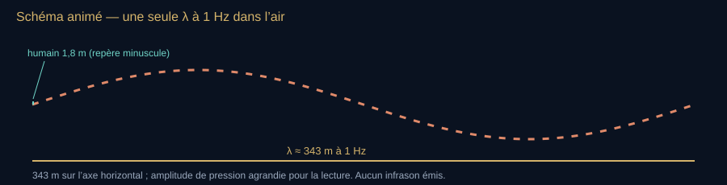

**Lecture du schéma.** À 1 Hz et 343 m/s, λ = 343 m. La courbe montre un cycle spatial de pression ; l’amplitude verticale est arbitraire. Le repère humain de 1,8 m fait environ 4,3 pixels pour 820 pixels de longueur d’onde. Ce n’est ni la taille d’une source ni une corde accordée ; le mouvement des tirets n’est pas étalonné.

[Fiche visuelle et transcription](banque-visuelle-son.md#v15) · [Ouvrir le SVG autonome](assets/schemas-son/v15-infrason-echelle.svg)

Le trait orange n’est pas un infrason « vu ». C’est la géométrie. Pour « voir » un 1 Hz, il faut un réseau de microbaromètres, pas une oreille.

<!-- atelier:S49 -->
> **Atelier S49 — Infrasons : l’échelle** · *★★ · effort M · 👁 (option 🔊 30–60 Hz) · remplace le schéma V15*
>
> **Comment l’utiliser.** Baisser la fréquence et regarder la longueur d’onde grandir à côté de l’obstacle choisi ; ouvrir la courbe de seuil d’audition sous 20 Hz.
>
> **Ce que ça montre.** λ comparée à l’obstacle, diffraction marquée quand l’obstacle est petit devant λ, sans prétendre que tout matériau devient transparent ; seuils infrasonores de référence et distinction Schumann/pression.
>
> **Sens de lecture.** À 1 Hz, l’onde fait 343 m : une maison est un point pour elle. Le trait n’est pas un infrason « vu », c’est sa géométrie ; l’enceinte ne rejouera pas ceci, et l’écran le dit.
<!-- /atelier -->

#### Sources naturelles — catalogue à tenir propre

- **Microbaroms** (~0,2 Hz) : agitation permanente des océans, fond infrasonore de la planète.
- **Séismes, glissements, avalanches, volcans** : le Krakatoa 1883 a fait le tour de la Terre comme onde de pression ; les réseaux modernes (IMS) suivent l’Etna, le Hunga Tonga 2022, etc.
- **Météores / bolides** : explosion dans l’air = source quasi ponctuelle. Chelyabinsk 2013 largement enregistré en infrason.
- **Orages, tornades, surf**.
- **Aurores** : couplage plus ténu, littérature spécialisée.
- **Ponts, immeubles, pales** : sources humaines qui rentrent dans le même bandeau fréquentiel, pas dans la même éthique.

<!-- atelier:S50 -->
> **Atelier S50 — Hunga Tonga fait le tour du monde** · *★ · effort M · 👁*
>
> **Comment l’utiliser.** Lancer l’horloge du 15 janvier 2022 et regarder l’onde de pression traverser la carte ; choisir une station et lire son barogramme.
>
> **Ce que ça montre.** Les fronts circulaires à ~310 m/s, les passages successifs, le signal d’une station (données publiques ou reconstruction annoncée comme telle).
>
> **Sens de lecture.** Compter les passages : l’onde repasse plusieurs fois, comme celle du Krakatoa en 1883. L’infrason est une oreille diplomatique avant d’être un mystère.
<!-- /atelier -->

#### Vivant

- Éléphants : ~14–35 Hz pour l’appel longue distance, sol + air. O’Connell-Rodwell et al. : le sol porte aussi.
- Baleines : chants qui descendent dans l’infra ; le canal SOFAR est leur autoroute (lien chapitre mer).
- Alligators et hippopotames : productions basse fréquence publiées ; tigres : annonces de congrès ; girafes : supposées, mais 947 heures d’enregistrement (Baotic et al. 2015) ne descendent pas sous 20 Hz. À citer étude par étude, pas en bloc « les animaux parlent infra ».
- Humain : seuils d’audition qui montent très vite sous 20 Hz (il faut des dizaines de dB SPL de plus). Perception souvent décrite comme pression thoracique, tremblement, malaise — **non spécifique**. Ne pas diagnostiquer un « syndrome éolien » à la place d’une mesure.

#### Surveillance et État

Le Système de surveillance international du TICE (CTBTO) déploie des stations infrason *IS* (dizaines dans le monde) : détecter une explosion atmosphérique, pas seulement un essai. Même réseau : volcan, bolide, accident industriel. L’infrason est devenu une oreille diplomatique.

#### Propagation atmosphérique

L’atmosphère n’est pas l’air du labo. Vent, gradient thermique, stratosphère créent des **guides** : une source peut réapparaître à des centaines de kilomètres après une zone d’ombre. C’est l’analogue aérien du SOFAR, moins stable. Les modèles (ncpaprop, infraGA, etc.) sont des outils de recherche, pas un gimmick live.

#### Ce qu’il faut refuser sur le plateau

- Les « armes infrasonores qui liquéfient les organes » sans source primaire militaire vérifiable : rumeur. Des dispositifs à très fort niveau existent dans d’autres bandes (LRAD = dispositif principalement audible). Ne pas donner d’architecture.
- Confondre **résonances de Schumann** (~7,8 Hz et modes supérieurs) — c’est du *champ électromagnétique* dans la cavité Terre–ionosphère — avec un infrason. Même ordre de fréquence, *pas la même onde*. Boyle + Maxwell, deux familles.
- Affirmer qu’une éolienne « rend fou » sans spectre, sans dB(G) ou dB(Z), sans distance, sans contrôle. La bande G (pondération infrasonore) existe précisément pour mesurer, pas pour mythologiser.

#### Mesure

Microbaromètre, pas micro de chant. Pondération G (ISO 7196). Un smartphone n’est pas un instrument sous 20 Hz. En live : montrer une courbe IMS publique (Hunga Tonga) plutôt qu’un « test de cave ».

#### Pont avec le reste du script

- Physique : même $c=\lambda f$, λ énorme.
- Sabine : une salle n’absorbe presque rien à 8 Hz ; $T_{60}$ n’a plus le même sens dans une pièce petite devant λ.
- Langevin : l’eau porte aussi l’infra (meilleure portée encore).
- Gurnett : autre famille d’ondes. Ne pas coller un 300 Hz plasma sur un 0,2 Hz microbarom.
- Musique : orgue, bourdon, synthé sub, « drop » — typiquement dans le sub-bass, 20–70 Hz (grave audible), rarement de l’infra vrai en concert (des jeux d’orgue de 32 pieds descendent vers 16 Hz et de rares jeux de 64 pieds vers 8 Hz) sans système dédié et risque auditif / structurel.

Phrase plateau : « À un hertz dans l’air, deux compressions sont séparées d’environ trois cent quarante-trois mètres. C’est une longueur d’onde, pas la longueur d’une corde ni une note de do. »

### Pause — changer de bande, conserver les questions

L’infrason et l’ultrason sont définis autour de notre audition. Ni l’un ni l’autre n’a une propriété magique commune à toutes ses fréquences. Avant le bestiaire, rappeler les trois questions : dans quel milieu, pour quel usage, avec quelle mesure ? Le spectrogramme permettra de suivre même les signaux que nous n’écoutons pas directement.

### Ultrasons animaux — l’autre côté de la fenêtre humaine

**Pour entrer dans le chapitre.** Le cri est le signal émis ; l’écho est son retour ; la cadence dit combien de cris sont envoyés par seconde. FM signifie fréquence modulée, CF fréquence presque constante ; ICI est l’intervalle entre deux émissions, PRR leur taux de répétition. On peut comprendre la chasse à l’écho avant de mémoriser ces abréviations.

Au-dessus de 20 kHz, l’humain type n’entend plus. Le vivant n’a pas signé cette limite. Même physique que Langevin : $d=c\Delta t/2$, même Doppler que Buys Ballot, même atténuation qui explose avec $f$ dans l’air et reste tenable dans l’eau. Fil du live : Spallanzani pose la question (1794) → Pierce + Griffin + Galambos l’entendent (1938–41) → Griffin baptise *echolocation* (1944) → aujourd’hui on filme une membrane vocale de *Myotis* à 250 000 images/s.

#### Pourquoi l’ultra — physique avant bestiaire

Résolution spatiale d’un écho court : plus $f$ est haut, plus $\lambda$ est petit, plus une proie millimétrique renvoie un écho utile (sortie de la zone de Rayleigh trop faible). Contrepartie dans l’air : le terme classique de l’absorption croît comme $f^{2}$ ; l’absorption totale inclut la relaxation moléculaire et dépend des conditions de température, d’humidité et de pression (voir physique de base). Un 40 kHz s’éteint en quelques mètres à dizaines de mètres ; un 120 kHz encore plus vite. D’où :

- chauve-souris : sonar *proche*, très fin ;
- dauphin / cachalot : même $f$ dans l’eau, portée de dizaines à centaines de mètres (atténuation bien plus faible) ;
- rongeur : appel social à courte portée, pas un sonar de chasse aérienne.

**Lire la formule — le sens avant les symboles.** Deux règles différentes se complètent : le délai de retour sert à estimer une distance ; la longueur d’onde intervient dans l’interaction avec la cible. Une fréquence élevée n’est donc pas une distance courte : il faut connaître le milieu et mesurer le temps de l’écho.

$$
d = \frac{c\,\Delta t}{2}\qquad \lambda = \frac{c}{f}
$$

 **À dire —** « dé égale cé delta té sur deux » · « lambda égale cé sur f »

Air, 40 kHz : $\lambda \approx 343/40000 \approx 8{,}6\,\mathrm{mm}$. Eau, 40 kHz : $\lambda \approx 1480/40000 \approx 37\,\mathrm{mm}$. Même fréquence, deux mondes.

**À dire —** « lambda air à quarante kilohertz environ huit virgule six millimètres. Lambda eau environ trente-sept millimètres. »

**À l’écran — V16.** Schéma animé — pulse / écho / buzz (même dessin que Langevin) *→ schéma provisoire, remplacé dans le dossier par l’atelier S46 : Pulse / écho / buzz sont produits par l’atelier chauve-souris.*

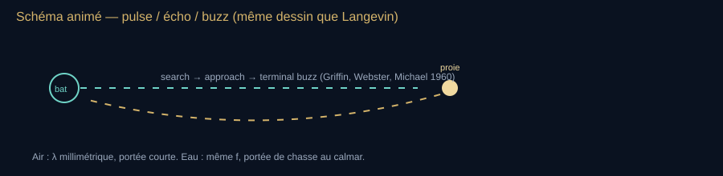

**Lecture du schéma.** Distinguer fréquence du cri et cadence des émissions. Le buzz terminal augmente la cadence, pas nécessairement la fréquence porteuse. Les signaux écoutés sont transposés avec un facteur explicite.

[Fiche visuelle et transcription](banque-visuelle-son.md#v16) · [Ouvrir le SVG autonome](assets/schemas-son/v16-biosonar.svg)

Le buzz terminal n’est pas de l’excitation : c’est une montée du taux de clics quand $\Delta t$ devient minuscule. Dauphin : même trois phases.

#### Chronologie vérifiée — de Spallanzani à la membrane vocale

| Date | Fait |
| --- | --- |
| 1793–94 | Spallanzani (1793) : chauve-souris aveuglée, elle vole. Louis Jurine (1794) : oreilles bouchées, elle s’écrase ; Spallanzani confirme avec de meilleurs bouchons. |
| 1938 | Pierce & Griffin : détecteur piézo, premières écoutes d’ultra de chauves-souris en cage (des dizaines de kilohertz). |
| 1941–42 | Griffin & Galambos : bouche bouchée ou oreilles bouchées → collision. Preuve expérimentale. |
| 1944 | Griffin forge *echolocation*. |
| 1958–60 | Griffin, Webster, Michael : phases search / approach / terminal buzz sur insecte. |
| 1968+ | Schnitzler : compensation Doppler des rhinolophes à fréquence constante. |
| années 1970– | Au, Madsen, Møhl, Tyack : biosonar des odontocètes, niveaux, diagrammes de rayonnement. |
| 2022 | Håkansson, Mikkelsen, Jakobsen & Elemans (*PLOS Biology*) : membranes vocales de *Myotis daubentonii* filmées jusqu’à 250 000 i/s, 10–95 kHz. |

#### Chauves-souris — environ 1 500 espèces, ~20 % des mammifères

Deux grandes familles de signaux (simplifié, Fenton, Neuweiler, Schnitzler) :

- **FM, low duty cycle** (beaucoup de vespertilionidés, ex. *Myotis lucifugus*) : balayage descendant d’environ une octave en recherche chez *M. lucifugus* : 100 → 50 kHz selon Griffin, Webster & Michael (1960), ~80 → 40 kHz dans la plupart des enregistrements ultérieurs. Taux faible en search (intervalles 50–100 ms), puis approach, puis buzz (~0,5 ms de pulse, 5–6 ms d’intervalle, parfois descente à 25–30 kHz). Bon pour dater l’écho (distance) et pour un spectre large (texture).
- **CF / high duty cycle** (rhinolophes, hipposideridés, quelques mormoopidés) : longue porteuse quasi constante. *Rhinolophus ferrumequinum* : porteuse ~83 kHz, fovéa acoustique accordée à quelques hertz près (Neuweiler). En vol, la chauve-souris **baisse** sa $f$ émise pour que l’écho Doppler-décalé retombe dans la fovéa (compensation Doppler, Schnitzler 1968). Elle lit alors les modulations d’aile de la mite.

Niveaux : cris de chasse souvent très forts — 120–140 dB SPL ramenés à 10 cm chez les chasseurs d’espace ouvert (Holderied & von Helversen 2003 ; Surlykke & Kalko 2008 ; revue Jones & Holderied 2007) ; toujours préciser la distance et la pondération, les protocoles varient.

Production : pas un sifflet de Galton. Larynx + membranes vocales au-dessus des plis : 10–95 kHz pour l’écho et une partie du social ; plis ventriculaires pour du grave social 1–5 kHz chez *M. daubentonii* (Håkansson et al. 2022). Étendue vocale jusqu’à ~7 octaves — hors norme mammifère (humain ~3).

Grand rhinolophe (*Rhinolophus ferrumequinum*), le modèle du sonar à fréquence constante : porteuse ~83 kHz, compensation Doppler. Photo Charles J. Sharp, Wikimedia Commons, CC BY-SA 4.0 — licence différente de celle du site, à créditer à part.

<!-- atelier:S46 -->
> **Atelier S46 — La chauve-souris** · *★★★ · effort L · 🔊 time-expansion ×10, annoncé · plein écran · remplace le schéma V16*
>
> **Comment l’utiliser.** Choisir Myotis, approcher la proie et écouter les cris s’accélérer jusqu’au buzz ; passer en rhinolophe, lancer le vol et couper la compensation Doppler.
>
> **Ce que ça montre.** Cri, écho, Δt, portée limitée par l’absorption de l’air, les trois phases search / approach / buzz, le spectrogramme du cri ; en CF, l’écho qui sort de la fovéa à 83 kHz sans compensation.
>
> **Sens de lecture.** Suivre l’intervalle entre les cris, distinct de leur fréquence porteuse. Observer la compensation Doppler du rhinolophe. La lecture audio est ralentie dix fois : temps ×10 et fréquences ÷10 ; l’écran l’annonce.
<!-- /atelier -->

#### Course aux armements chauve-souris / insectes

L’écho de la chauve-souris est aussi un phare pour la proie. Oreilles sensibles à l’ultra apparues dans **au moins six ou sept ordres** d’insectes (Yack & Dawson 2008 ; ter Hofstede & Ratcliffe, JEB 2016) : lépidoptères, orthoptères, mantoptères, névroptères, certains coléoptères, certaines mouches tachinaires.

- Oreilles de mites souvent accordées 20–50 kHz — pile la bosse de diversité des chauves-souris insectivores (hypothèse allotonique : d’autres mites « sortent » de cette fenêtre, <20 ou >60 kHz).
- Écailles du thorax : revêtement absorbant, 67 ± 9 % de l’énergie en moyenne sur 20–160 kHz (Neil et al., *J. R. Soc. Interface* 2020) ; les écailles des ailes forment un métamatériau acoustique (Neil et al., *PNAS* 2020).
- Réponse : plongée, looping, ou **clics de tymbal** (arctiidés, Blest, Collett & Pye 1963, clics ultrasonores de *Melese*) : surprise, aposématisme, ou brouillage du sonar.
- Sphinx : ~57/124 espèces testées produisent de l’ultra (souvent genitalia) ; une partie brouille réellement le sonar d’*Eptesicus fuscus* (PNAS 2015).

Ce n’est pas une fable. C’est de la théorie des jeux évolutive avec des kHz.

#### Odontocètes — le même algorithme dans l’eau

Lèvres phoniques sous le melon, qui sert de lentille — pas un larynx de chauve-souris. Clics très directionnels (faisceau ~10° à −3 dB chez le grand dauphin, 8° chez le dauphin à bec blanc ; un peu plus large chez le marsouin).

| Espèce / signal | Ordre de grandeur sourcé |
| --- | --- |
| Grand dauphin, clic | clics directionnels intenses ; la valeur historique de 228 dB p-p citée dans les notes est **non confirmée dans cet audit** et ne sert pas de chiffre de plateau (Au et al. 1974 ; voir registre) |
| Cachalot, usual click on-axis | jusqu’à ~236 dB re 1 µPa rms ; ~240 dB re 1 µPa p-p cités (Møhl et al. 2003 ; synthèses Jensen et al.) |
| Cachalot, centroïde | souvent 10–20 kHz pour le usual click de chasse au large |
| Dauphin à bec blanc | spectre ultrasonore ; les pics de 115 / 250 kHz des notes sont **à confirmer avec leur étude et leur protocole**, pas à présenter comme constantes de l’espèce |
| Phases de chasse | search (ICI < 0,1 s mais lent), approach (ICI diminue avec la distance), buzz / creak jusqu’à ~500 clics/s |
| Cachalot, slow clicks (mâles) | ~0,1–0,3 Hz, communication longue distance, espace actif estimé **par modélisation** jusqu’à ~70 km (Videsen et al. 2026 ; pas une portée mesurée universelle) |

Toujours coller l’unité : dB re 1 µPa à 1 m n’est pas un dB SPL d’air. Comparer un cachalot à une discothèque sans conversion d’impédance, c’est une faute de plateau.

Codas : clics stéréotypés sociaux, pas du sonar de chasse. Squeals / victory squeals après capture : encore autre chose (Ridgway, Wisniewska).

<!-- atelier:S47 -->
> **Atelier S47 — Le cachalot** · *★★ · effort M · 🔊 transposé ou enregistrement NOAA*
>
> **Comment l’utiliser.** Choisir un mode, éloigner l’hydrophone, lire le niveau reçu ; sortir de l’axe du faisceau.
>
> **Ce que ça montre.** Un niveau de source référé à 1 m et un niveau reçu à la distance choisie, calculés avec divergence et absorption. Afficher séparément distance, axe, bande et métrique RMS ou crête-à-crête ; ne pas écrire « à 1 m » pour le niveau reçu ailleurs.
>
> **Sens de lecture.** Lire le niveau en même temps que l’unité : 236 dB re 1 µPa n’est pas « plus fort qu’un avion ». Hors axe, le clic devient multiple et faible : c’est ce que l’on enregistre le plus souvent.
<!-- /atelier -->

#### Oiseaux cavernicoles — l’écho audible, pas l’ultra pur

Steatornis (guacharo) et salanganes : clics surtout 0,5–3 kHz chez le guacharo (Konishi & Knudsen 1979 ; Suthers & Hector 1985), 1–10 kHz chez les salanganes (Griffin & Suthers 1970 ; Griffin & Thompson 1982). Ce n’est **pas** de l’ultrason au sens >20 kHz. Acuité : obstacles de 3,2 cm détectés par le guacharo, tiges de 6 mm par les salanganes, mieux que les 20 cm des premières études. Les citer ici pour empêcher le mythe « tous les écholocalisateurs sont ultra ». Griffin a aussi travaillé les salanganes.

#### Musaraignes

Gazouillis tonals surtout audibles (premier harmonique 4–8 kHz, énergie sous 20 kHz, harmoniques parfois plus hautes ; Siemers et al. 2009), dont le rythme suit l’encombrement du milieu : orientation par échos à courte portée, pas un sonar d’ultrasons. Beaucoup moins étudié et moins performant que celui des chiroptères. Ne pas en faire un dauphin de taupinière.

#### Rongeurs — communication, pas chasse aérienne

- Pups muridés / cricétidés : vocalisations ultrasonores dépendant de l’espèce, de l’âge et du contexte ; les bornes 30–150 kHz des notes restent à rattacher à une étude précise. Aucun niveau absolu non vérifié n’est utilisé pour la démonstration.
- Souris adultes : chants ~30–110 kHz vers la femelle ; isolation des petits ~50–80 kHz. Audition de la souris d’environ 1–2 kHz à plus de 80 kHz (Heffner).
- Rat : alarme ~22 kHz ; social / positif ~50 kHz (Portfors, Wright).
- Portée faible : atténuation air + sol + diffusion. Ce n’est pas le canal SOFAR.

#### Grenouille à oreilles concaves — *Odorrana tormota* (anciennement *Amolops tormotus*)

Feng, Narins et al., *Nature* 2006 : les mâles produisent des appels modulés dont l’énergie monte dans l’ultra, et répondent au playback de la composante ultra ; Shen et al., *Nature* 2008 : les femelles gravides émettent un appel de cour, et ce sont les mâles qui le localisent, avec une précision inédite chez un amphibien (erreur < 1°). Hypothèse : sortir du masque du torrent. Premier cas amphibien solide d’usage communicatif de l’ultra. Ne pas généraliser à « les grenouilles ».

#### Chats, chiens, autres mammifères

Audition, pas nécessairement émission sonar. Chat : entend largement dans l’ultra (Heffner). Chien aussi, d’où le sifflet de Galton 1876. Entendre ≠ écholocaliser.

#### Ce qu’il faut refuser

- Répulsifs à ultrasons grand public : entendre une fréquence ne prouve pas qu’un animal quitte durablement le lieu. Les revendications d’efficacité exigent des essais contrôlés ; ne pas annoncer de délai universel d’habituation ni extrapoler un résultat de laboratoire à un appareil domestique. Voir [la fiche intox](#intox).
- Confondre clic de cachalot (eau, µPa) et dB(A) de boîte de nuit.
- Dire que le guacharo « parle ultra ».
- Armes / brouilleurs : rester au fait observé chez la mite, pas au mode d’emploi.

#### Ponts avec le reste du script

- Spallanzani → Langevin : même question « qui voit sans lumière ».
- Doppler des rhinolophes = Doppler 1842 + fovéa.
- Buzz = hausse du taux de répétition des émissions (PRR), avec un intervalle entre émissions ICI qui diminue. La fréquence porteuse du cri, le taux de répétition et la fréquence d’un battement musical sont trois grandeurs distinctes.
- SOFAR / baleines à bosse (Payne) : chants évolutifs dans l’audible / grave, autre chapitre, même océan.
- Atténuation air : pourquoi l’ultra médical de Langevin a choisi l’eau et les tissus, pas dix mètres d’air.

Phrase plateau : « L’humain s’est tracé une fenêtre 20 Hz–20 kHz et l’a appelée “le son”. La nuit, la mer et le nid n’ont pas signé. »

### Bilan — Changer de fenêtre sans changer de rigueur

- Entendre une fréquence, l’émettre et utiliser son écho sont trois capacités distinctes.
- La fréquence du cri et le nombre de cris par seconde décrivent deux choses différentes.
- Comparer les niveaux exige de préciser milieu, référence, distance et méthode ; un son transposé doit être annoncé.

**Question au public.** Une chauve-souris qui double la cadence de ses cris monte-t-elle forcément leur fréquence ?

**Réponse et relance.** Non. Elle peut envoyer plus souvent des cris de même contenu fréquentiel. Sur un spectrogramme, rapprocher les traits dans le temps ne signifie pas les déplacer vers des fréquences plus hautes.

**Pour reprendre le fil.** Gardons cette méthode lorsque le capteur devient une antenne et le milieu un plasma.

[Étape suivante](#acte-ix) · [Carte du parcours](#parcours-guide)

## IX. Hors de l’air

**Fil essentiel.** Une étoile peut porter de véritables ondes de pression. Une antenne peut mesurer une oscillation de plasma. Des données peuvent enfin être transformées en audio. Avant d’écouter, identifier la nature du phénomène et la transformation appliquée.

**Choisir la suite.** [Comprendre avec les exemples](#espace) ou [faire le point](#bilan-ix). Pour une première lecture, passer directement aux exemples spatiaux ; les phonons constituent un détour conservé pour approfondir.

**Transition à dire.** « Sortons enfin de l’air. Si l’on dit “son de l’espace”, trois possibilités se présentent : une vraie onde de pression dans un milieu, une autre oscillation que l’on peut convertir en audio, ou des données transformées volontairement en musique. Écoutons-les sans les confondre. »

**Geste de plateau.** Classer avant lecture trois exemples (S54) : oscillation acoustique du Soleil, onde de plasma de Voyager, sonification de Persée. Afficher chaque fréquence native et chaque facteur de transposition.

### Le son devient particule — phonons et acoustique quantique

**Détour pour approfondir.** Ce passage peut être lu après le récit spatial : [rejoindre directement l’espace](#espace).

**Pour entrer dans le chapitre.** Repartir d’un mode de corde : une façon particulière de vibrer. Un cristal possède aussi des modes collectifs. Les quantifier revient à décrire leurs échanges d’énergie par unités appelées phonons. Ce n’est pas une petite bille sonore qui se promène d’atome en atome. L’idée essentielle est l’échange d’énergie par quanta ; les applications qui suivent ouvrent des domaines de recherche.

Dans un cristal, la vibration n’est plus seulement une onde classique : on la quantifie en **phonons** (concept introduit par Tamm en 1930, mot popularisé par Frenkel en 1932, après Einstein 1907 et Debye 1912 sur la chaleur spécifique). Un phonon est le quantum d’un mode vibratoire. Il explique :

- la conduction thermique dans les isolants ;
- la supra-conductivité BCS (interaction électron-phonon) ;
- l’effet Raman, Brillouin ;
- aujourd’hui : **acoustique quantique**, résonateurs nanomécaniques, couplage phonon–qubit (circuit QED mécanique), téléportation d’états phoniques en labo.

Ce n’est plus le live « sable sur une plaque ». C’est le live « un mode de vibration du réseau échange son énergie par quanta ». À garder pour un chapitre nuit profonde.

**Aller plus loin — les mots du passage suivant.**

| Terme | Sens utile ici |
| --- | --- |
| Mode | Une façon collective de vibrer, avec une forme et une fréquence. |
| Dispersion, relation ω(k) | Comment la fréquence angulaire ω dépend de la variation spatiale décrite par k ; le milieu ne fait pas voyager toutes les structures de la même façon. |
| Branches acoustiques et optiques | Familles de modes d’un cristal ; dans un cristal à plusieurs atomes par motif, certains mouvements relatifs créent des branches supplémentaires. « Optique » est un nom de famille de modes, pas la couleur d’un son. |
| Zone de Brillouin | Domaine de nombres d’onde utilisé pour décrire les modes sans répéter les équivalences dues au réseau périodique. |
| Température de Debye | Échelle de température liée au spectre vibratoire dans le modèle de Debye. |
| Optomécanique | Étude du couplage entre lumière et mouvement mécanique. |
| Qubit et circuit QED | Le qubit est une unité d’information quantique ; la QED de circuit étudie notamment son couplage à des champs électromagnétiques dans des circuits. Le couplage mécanique ajoute un autre système avec lequel échanger des excitations. |

**Limite de l’image.** Une chaîne de masses et de ressorts aide à voir les modes et leur dispersion. Elle ne démontre pas, à elle seule, que leurs échanges d’énergie sont quantifiés.

Compléments à ouvrir si la nuit dure : température de Debye ; branches acoustiques vs optiques dans la zone de Brillouin ; phonons acoustiques de grande longueur d’onde = limite classique de l’onde que Mersenne mesurait ; expériences d’optomécanique (Aspelmeyer, Painter, Kippenberg) où un phonon unique est créé ou lu par un photon. Le pont avec Gurnett s’arrête ici : le plasma de Voyager n’est pas un phonon de cristal, même si les deux se jouent dans un haut-parleur.

<!-- atelier:S53 -->
> **Atelier S53 — La chaîne d’atomes (phonons)** · *★★ · effort M · 👁 (+🔊 branche acoustique transposée)*
>
> **Comment l’utiliser.** Lancer la chaîne monoatomique, faire varier k et lire ω ; passer à deux masses pour faire apparaître la branche optique.
>
> **Ce que ça montre.** La relation de dispersion ω(k) calculée, la branche acoustique dont la pente à l’origine est la vitesse du son, la branche optique, la zone de Brillouin.
>
> **Sens de lecture.** Près de k = 0, la pente de la branche acoustique donne une célérité. Une chaîne classique possède déjà une dispersion à k élevé ; les phonons apparaissent lorsque les modes sont quantifiés, à toute valeur de k. Ne pas placer une frontière classique/quantique à un point arbitraire de la courbe.
<!-- /atelier -->

### Le son et l’espace — ce qu’on peut dire sans mentir

**Phrase à graver.** Dans le vide interplanétaire, une onde de pression audible humaine ne se propage pas : densité trop faible, libre parcours moyen des molécules trop grand. « Dans l’espace, personne ne vous entend crier » est physiquement correct pour un cri. En revanche l’espace n’est pas un silence ontologique : il est plein d’ondes qui ne sont pas du son d’air.
 
#### Ce qui voyage vraiment

- Ondes électromagnétiques (lumière, radio).
- Ondes de plasma / ondes cyclotron / whistlers.
- Ondes de choc (vent solaire, héliopause).
- Ondes gravitationnelles (LIGO, 14 septembre 2015, GW150914).
- Dans un amas de galaxies, le gaz intra-amas est un milieu : de vraies ondes de pression peuvent y exister, à des périodes de millions d’années.

#### Voyager et Don Gurnett

Instrument PWS (Plasma Wave Subsystem), Université de l’Iowa, PI Frederick Scarf puis, dès 1988, **Donald Gurnett**. Voyager 1 croise l’héliopause en août 2012 (confirmé par les oscillations de plasma). À l’intérieur de l’héliosphère : tons de quelques centaines de hertz (~300–400 Hz). Dehors : 2–3 kHz, plasma interstellaire plus dense. Ce ne sont *pas* des micros. Ce sont des antennes qui mesurent des oscillations d’électrons à des fréquences déjà audio : on peut envoyer le signal dans un haut-parleur sans le transposer. [La NASA décrit le signal et sa conversion](https://www.jpl.nasa.gov/images/pia17045-voyager-captures-sounds-of-interstellar-space/) ; archives : space-audio.org (UIowa).

Voyager 1 & 2 avaient déjà « écouté » Jupiter et Saturne (whistlers d’éclairs joviens, mars 1979 — l’une des deux premières preuves d’éclairs sur Jupiter, avec les images de nuit du même survol). Cassini : foudre de Saturne et radiation kilométrique saturnienne. La formule imagée « grêle des anneaux », non rattachée ici à une mesure instrumentale précise, reste dans le registre documentaire.

#### Golden Record

Voyager Golden Record (1977, comité Sagan) : salutations, musique (Bach, Chuck Berry, chant de baleine…), diagramme de la platine. Le son humain quitte le Système solaire comme artefact, pas comme onde qui traverse le vide.

#### Persée — le si bémol le plus grave de l’univers observé

2003, Chandra X-ray Observatory : ondulations dans le gaz chaud de l’amas de Persée, à environ 250 millions d’années-lumière, autour du trou noir supermassif central. Ce sont de **vraies ondes de pression** dans un gaz. La fondamentale traduite en note : **si bémol, 57 octaves sous le do médian** ([Chandra, 2003](https://www.chandra.harvard.edu/photo/2003/perseus/)). Inaudible. En 2022, la NASA publie une sonification : on remonte le signal de 57 et 58 octaves (facteurs 144×10¹⁵ et 288×10¹⁵) pour le rendre audible. Distinguer : 2003 = découverte d’une onde réelle ; 2022 = arrangement pour l’oreille.

#### LIGO — le « chirp »

GW150914 : coalescence de deux trous noirs ~29 et ~36 masses solaires, 1,3 milliard d’années-lumière. L’onde gravitationnelle n’est pas un son. Sa fréquence monte dans la bande audio pendant une fraction de seconde : on peut la jouer telle quelle, puis transposée. C’est le *chirp*. Ce n’est pas de la vulgarisation facultative : la forme d’onde encode les masses.

#### Héliosismologie et « musique » stellaire

Le Soleil vibre (modes p, missions SOHO, SDO, BiSON, GONG). Astérosismologie : CoRoT, Kepler, TESS. Encore une fois : modes de pression dans un fluide stellaire, puis sonification optionnelle.

### Portrait III — Donald Gurnett (1940–2022) et l’écoute hors de l’air

**Ce que ce retour ajoute.** Voyager a déjà introduit le signal. Le portrait montre comment une variation de fréquence devient un indice sur le milieu traversé. Suivre la chaîne **antenne → oscillation mesurée → fréquence → densité déduite**, puis revenir seulement aux détails de mission.

James Van Allen Professor, Université de l’Iowa. Pas un compositeur. Un physicien des plasmas qui a décidé d’envoyer les données dans un haut-parleur parce que l’oreille est un détecteur de motifs plus rapide qu’un écran de 1979.

#### Pourquoi l’Iowa

L’école Van Allen construit des instruments de champs et de particules. Gurnett hérite de cette culture : une antenne longue, un récepteur, une bande qui tombe — hasard fécond — dans l’audio. Les whistlers terrestres (éclairs dont l’onde EM se disperse dans la magnétosphère et descend en sifflement) étaient déjà écoutés depuis les années 1950. Gurnett emporte l’oreille plus loin.

#### 1979 — Jupiter

Voyager 1 passe Io. Au casque : sifflements. Gurnett y reconnaît des whistlers. Conclusion : il y a des éclairs dans l’atmosphère de Jupiter. Les whistlers apportent une preuve complémentaire aux images d’éclairs du même survol ; ne pas fabriquer une priorité entre les deux observations. C’est le même geste que Laennec, déplacé sur une géante gazeuse.

#### 2012–2013 — milieu interstellaire

Instrument PWS. Oscillations d’électrons. À l’intérieur de l’héliosphère : ~300 Hz. Dehors : 2–3 kHz. La densité du plasma commande la fréquence propre. Deux orages de plasma, oct–nov 2012 et avr–mai 2013, excitent le milieu et rendent la transition lisible. On extrapole : la traversée date d’août 2012.

**Lire la formule — le sens avant les symboles.** Une fréquence de plasma plus élevée indique ici une densité électronique plus grande. Le symbole ∝ signifie « proportionnel à ». Avec cette relation, multiplier la fréquence par deux correspond à multiplier la densité par quatre.

$$
f_{pe} \propto \sqrt{n_e}
$$

 **À dire —** « f pé e proportionnel à racine de n e. »

Hausse de hauteur = hausse de densité électronique. Ce n’est pas une métaphore. C’est une mesure.

**À l’écran — V17.** Schéma 6 — Ce que Gurnett n’écoute pas / ce qu’il écoute *→ schéma provisoire, remplacé dans le dossier par l’atelier S54 : Le contraste « pas un micro / une antenne à plasma » est le premier écran de l’atelier des trois familles.*

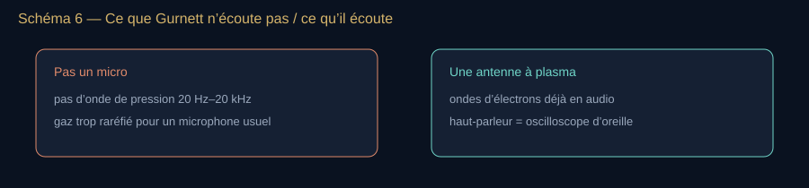

**Lecture du schéma.** Voyager mesure des champs électriques associés à des ondes de plasma avec des antennes, pas la pression d’air avec un microphone. La bande audio du signal permet sa conversion en son de haut-parleur.

[Fiche visuelle et transcription](banque-visuelle-son.md#v17) · [Ouvrir le SVG autonome](assets/schemas-son/v17-gurnett-plasma.svg)

Répéter ce schéma chaque fois qu’un commentaire parle des « sons de l’espace » sans complément.

#### Méthode, héritage

- Écouter pour diagnostiquer un instrument (il l’a fait aussi quand Voyager 2 avait un souci).
- Archives ouvertes : space-audio.org — Jupiter, Saturne, choc terminal, milieu interstellaire.
- Lignée : Cassini (foudre de Saturne, SKR), puis sonifications Chandra / Persée, puis LIGO. Gurnett n’a pas inventé Persée ni LIGO. Il a rendu légitime le haut-parleur comme instrument d’astrophysique.

Phrase plateau : « Mersenne compte. Langevin interroge l’écho. Gurnett interroge une frontière où l’écho n’existe plus, et change d’onde. »

### Astronomie — y a-t-il des « ultrasons » hors Terre ?

**Pour entrer dans le chapitre.** Poser deux questions dans cet ordre : **quel phénomène est mesuré ?**, puis **comment le rend-on audible ?** Les lettres A, B et C sont les repères hérités du dossier : A et B décrivent des phénomènes, C une opération qui peut s’appliquer à plusieurs phénomènes. Elles ne sont pas trois cases exclusives.

| Exemple | Ce qui est mesuré ou reconstruit | Ce qu’il faut annoncer avant l’écoute |
| --- | --- | --- |
| Soleil ou gaz de Persée | Oscillations acoustiques d’un milieu matériel | Si les fréquences ont été déplacées dans la bande audible. |
| Voyager | Champs associés à des oscillations de plasma | Le capteur est une antenne ; sa sortie devient un son par un haut-parleur. |
| LIGO | Variation associée à une onde gravitationnelle | Ce n’est pas une onde de pression ; préciser la mise en audio. |

**Aller plus loin.** Les modes stellaires, le fluide primordial et les mécanismes de plasma détaillent ensuite ces distinctions. Pour conserver seulement le fil, rejoindre le [tableau de cohérence](#tableau-espace) puis le [bilan](#bilan-ix).

Réponse courte, à dire avant toute image NASA : **pas d’ultrason d’air dans le vide**. Boyle tient. Ce que l’astronomie appelle parfois un son est l’une de trois familles. Les mélanger, c’est le seul mensonge interdit de ce chapitre. Dans les exemples de ce chapitre, les valeurs kHz–MHz concernent les ondes de plasma ; les oscillations acoustiques globales des étoiles et du fluide primordial étudiées ici sont beaucoup plus lentes. Ce choix d’exemples n’interdit pas d’autres ondes acoustiques à d’autres échelles.

**À l’écran — V18.** Infographie — trois familles, un seul mot « son » *→ schéma provisoire, remplacé dans le dossier par l’atelier S54 : Les trois familles sont l’atelier lui-même.*

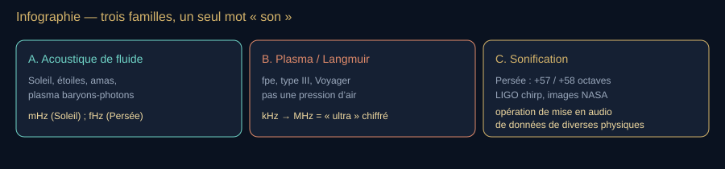

**Lecture du schéma.** A et B décrivent la physique des exemples ; C décrit une opération de mise en audio. Persée relève de A puis de C ; LIGO mesure une onde gravitationnelle, autre physique, que l’on peut aussi rendre audible.

[Fiche visuelle et transcription](banque-visuelle-son.md#v18) · [Ouvrir le SVG autonome](assets/schemas-son/v18-familles-espace.svg)

Le chapitre sur les ultrasons animaux (chauve-souris) est de la famille A dans l’air. Le chapitre sur les ultrasons techniques (échographe) aussi, dans le tissu. Ici A est dans l’étoile ou l’univers primordial. B est Gurnett généralisé. C est une opération de représentation : une donnée de A, de B ou d’une autre physique peut être sonifiée.

#### Famille A1 — héliosismologie : le Soleil comme salle de Mersenne

**Le mécanisme en trois étapes.** On observe des variations à la surface ; on repère leurs fréquences ; on cherche quel intérieur peut produire cet ensemble de modes. Cette dernière opération est une **inversion** : remonter des effets mesurés vers un modèle de leur cause. Les indices n et ℓ servent à distinguer les motifs de vibration, notamment leur structure radiale et angulaire. Aucun besoin de les mémoriser pour comprendre pourquoi les vibrations renseignent sur l’intérieur.

Les modes **p** (pression, comme une onde sonore) : restauration par le gradient de pression. Modes **g** (gravité, intérieur profond, encore débattus en détection). Modes **f** (gravité de surface). Spectre observé des p : environ **1–5 mHz**, puissance maximale vers **3 mHz** soit une période d’environ cinq minutes — les « oscillations de cinq minutes » (Leighton, Noyes, Simon 1962 ; nature globale : Deubner 1975 ; Claverie / Isaak / BiSON).

**Lire la formule — le sens avant les symboles.** La relation de Newton–Laplace réapparaît dans un gaz stellaire : rigidité à la compression et masse volumique déterminent une célérité locale. Le sous-indice s rappelle qu’il s’agit du son ; ce n’est pas la vitesse de la lumière.

$$
c_s = \sqrt{\frac{\gamma P}{\rho}}
$$

 **À dire —** « cé s égale racine de gamma pé sur rhô. »

C’est Newton–Laplace dans le gaz stellaire. Inversion des fréquences → profil $c_s(r)$ à l’intérieur du Soleil (Gough, Christensen-Dalsgaard, Kosovichev). Missions / réseaux : BiSON, GONG, SOHO/MDI, SDO/HMI (Scherrer). Précision de certaines fréquences : quelques millionièmes ($\approx 3\times10^{-6}$).

Grande séparation (Vandakurov) : écart entre certaines fréquences de modes, approximativement égal à l’inverse du temps d’un aller-retour acoustique surface–centre–surface :

**Lire la formule — le sens avant les symboles.** L’intégrale additionne les petits temps de trajet à travers les couches de l’étoile. Le facteur deux compte le retour ; la puissance −1 prend l’inverse de ce temps. Le résultat est donc une fréquence : un aller-retour plus long donne une séparation plus petite entre les fréquences des modes.

$$
\Delta\nu \approx \left(2\int_0^R\frac{dr}{c_s}\right)^{-1}
$$

 **À dire —** « delta nu environ égale un sur deux intégrale de zéro à R de d r sur cé s. »

Soleil : $\Delta\nu \approx 135\,\mu\mathrm{Hz}$ (ordre 136 µHz selon les campagnes). CoRoT, Kepler, TESS étendent la même mesure à des milliers d’étoiles (Chaplin, Miglio) : astérosismologie = âge, masse, rayon par le son interne.

<!-- atelier:S55 -->
> **Atelier S55 — Le Soleil comme salle de Mersenne** · *★ · effort L · 🔊 transposé de 15–16 octaves, facteur dit · plein écran*
>
> **Comment l’utiliser.** Lancer un rayon depuis la surface, regarder sa remontée ; changer ℓ ; lire Δν sur le spectre.
>
> **Ce que ça montre.** Les rayons acoustiques réfractés dans le Soleil (c croît avec la profondeur), le spectre ℓ–ν, la grande séparation Δν ≈ 135 µHz calculée par (2∫dr/c_s)⁻¹.
>
> **Sens de lecture.** Comparer la réfraction à celle du canal SOFAR, puis lire Δν en hertz : c’est approximativement l’inverse du temps d’un aller-retour acoustique, pas ce temps lui-même.
<!-- /atelier -->

#### Sunquakes — Kosovichev 1998

Une éruption dépose une impulsion. Une onde circulaire court à la photosphère, comme un caillou dans une mare — mais la « mare » a $c_s$ qui croît avec la profondeur, d’où réfraction et ripples. Spectre autour de la fréquence de coupure acoustique ~5 mHz. Les modes globaux $\ell=0,1,2$ excités par la flare restent $\ll$ modes stochastiques de convection (Kosovichev : amplitudes de l’ordre de mm/s à cm/s pour les bas $\ell$). HMI a montré que les sunquakes ne sont pas rares sur des flares moyennes.

#### Famille A2 — le fluide primordial (CMB)

**Le vocabulaire avant la formule.** CMB signifie *cosmic microwave background*, ou fond diffus cosmologique : le rayonnement qui nous renseigne sur cet état ancien. Les photons sont les quanta de lumière ; les baryons désignent ici surtout la matière des noyaux, protons et neutrons. Les interactions entre photons et électrons couplaient rayonnement et matière. Les fluctuations ont laissé une empreinte statistique : on ne dispose pas d’un enregistrement sonore au microphone.

**L’image utile.** La pression s’oppose à une compression, tandis que la matière apporte de l’inertie. Ajouter des baryons modifie la réponse des oscillations et les hauteurs relatives des pics : c’est le *baryon loading*, ou charge en matière baryonique. [Explication de Wayne Hu, Université de Chicago](https://background.uchicago.edu/~whu/intermediate/baryons.html).

Avant la recombinaison (~380 000 ans), photons et baryons sont collés par Thomson. Peebles & Yu (1970) : ce fluide supporte des **ondes acoustiques**. Vitesse (limite photonique) :

**Lire la formule — le sens avant les symboles.** La lumière contribue à la pression tandis que la matière ajoute de l’inertie au fluide primordial. R mesure le poids relatif de cette matière dans le modèle. Attention au symbole c : dans cette formule, c désigne la vitesse de la lumière, et cs la célérité acoustique du fluide.

$$
c_s = \frac{c}{\sqrt{3(1+R)}}\qquad R = \frac{3\rho_b}{4\rho_\gamma}
$$

 **À dire —** « cé s égale cé sur racine de trois fois un plus R. R égale trois rhô b sur quatre rhô gamma. »

Sans baryons, $c_s = c/\sqrt{3}$. Les pics du spectre de puissance CMB (WMAP, Planck) sont les harmoniques de cette cavité qui s’est figée à la surface de dernière diffusion. Silk (1968) : l’amortissement par diffusion des photons (marche aléatoire) tue les petits $\lambda$ — analogue d’un Kundt visqueux à l’échelle du Mpc. Hu, Dodelson, Weinberg : approfondissements sur les pics pairs/impairs, la charge baryonique et les mécanismes d’amortissement. Le nom de Landau, présent dans les notes, renvoie à un échange d’énergie entre une onde et des particules en résonance avec elle ; il ne faut pas le confondre avec l’amortissement de Silk par diffusion des photons. [Repère sur Landau, Richard Fitzpatrick, Université du Texas](https://farside.ph.utexas.edu/teaching/plasma/Plasma/node110.html).

Convertir ces modes en hertz d’horloge humaine n’a aucun sens opérationnel : l’« ultra » n’est pas là. C’est de l’acoustique vraie dans un fluide qui n’existe plus.

#### Famille A3 — amas, déjà vu

Persée (Fabian, Sanders et al., 2003, Chandra) : onde de pression dans le gaz X, si bémol 57 octaves sous le do. Famille A, fréquence dérisoire. Sonification 2022 = famille C.

#### Pause — nous changeons de phénomène

Dans les exemples A, une pression varie dans un milieu matériel. Dans les exemples B qui suivent, nous allons parler d’oscillations de plasma mesurées par des champs. Un son produit par notre haut-parleur ne rend pas les phénomènes d’origine identiques. Pour le fil essentiel, cette distinction suffit ; le détail des instabilités est un approfondissement.

#### Famille B — le seul « ultra » chiffré de l’espace proche

Fréquence plasma électronique :

**Lire la formule — le sens avant les symboles.** La densité ne est le nombre d’électrons par volume ; e leur charge en valeur absolue, me leur masse et ε0 la constante électrique du vide. Ces constantes fixent l’échelle. La dépendance à retenir reste la racine de la densité : densité multipliée par quatre, fréquence multipliée par deux.

$$
f_{pe} = \frac{1}{2\pi}\sqrt{\frac{n_e e^2}{\varepsilon_0 m_e}} \propto \sqrt{n_e}
$$

 **À dire —** « f pé e égale un sur deux pi, racine de n e e deux sur epsilon zéro m e, proportionnel à racine de n e. »

HELIOS (Gurnett et l’école Iowa) : $f_{pe}$ ~20 kHz à 1 UA, jusqu’à des centaines de MHz dans la basse couronne. La fréquence plasma ionique est une autre échelle caractéristique, distincte de la fréquence d’une onde ion-acoustique donnée, qui dépend notamment de sa longueur d’onde et de la dispersion ; ne pas leur attribuer indistinctement un nombre unique. Ces nombres *tombent* dans l’ultra et le radio. Ce ne sont pas des fronts de pression d’air : ce sont des oscillations collectives d’un plasma.

- **Ginzburg & Zheleznyakov 1958** : sursaut radio de type III = faisceau d’électrons → ondes de Langmuir → conversion non linéaire en radio.
- **Gurnett & Anderson 1976** (*Science* 194) puis **1977** (*JGR* 82), HELIOS vers 0,5 UA : confirmation in situ, Langmuir + électrons énergétiques + type III ensemble.
- STEREO/WAVES (Bougeret), Thejappa, paquets Langmuir, solitons, OTSI.

**Traduction des termes.** Langmuir désigne ici une oscillation collective principalement électrostatique des électrons. Un paquet regroupe des oscillations localisées ; un soliton désigne une structure localisée soutenue par un équilibre entre effets dispersifs et non linéaires. OTSI signifie *oscillating two-stream instability* : une instabilité impliquant des interactions entre ondes, étudiée pour comprendre leur évolution. Ces mécanismes détaillent la production du signal ; ils ne sont pas nécessaires pour distinguer antenne et microphone. [Thejappa et al., 2020, étude des paquets de Langmuir](https://doi.org/10.1029/2019JA027714).
- LOFAR : Reid & Kontar 2021, structure fine des type III = paquets de Langmuir dans une turbulence.
- Solar Orbiter / RPW : décroissance Langmuir → mode Z, $f_p$ mesurée ~47–58 kHz sur un événement de septembre 2022 (préprint de janvier 2026).

**Traduction des termes.** RPW est l’instrument *Radio and Plasma Waves*. Le mode Z est une branche d’ondes du plasma magnétisé ; l’étude citée examine une conversion vers un rayonnement électromagnétique de ce mode. Le mot « décroissance » désigne ici un processus de transfert entre ondes, pas simplement le volume qui baisse dans un haut-parleur. [Prépublication de l’étude](https://arxiv.org/abs/2601.18495).
- Voyager PWS : 300 Hz → 2–3 kHz à l’héliopause (déjà au portrait Gurnett).

Donc : si un commentateur dit « la NASA a enregistré des ultrasons du Soleil », la phrase juste est : « une antenne a vu des Langmuir vers 20 kHz près de la Terre, ou des MHz plus près de l’astre, puis on a parfois envoyé ça dans un haut-parleur. »

**À l’écran — V19.** Schéma — type III (Ginzburg → Gurnett → LOFAR) *→ schéma provisoire, remplacé dans le dossier par l’atelier S54 : Objet « type III » de l’atelier : spectre dynamique qui dérive vers le bas avec f_pe.*

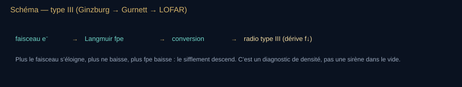

**Lecture du schéma.** La dérive d’un sursaut de type III renseigne sur le faisceau et le plasma traversé. Les oscillations de Langmuir ne sont pas elles-mêmes l’onde radio qui atteint une antenne distante.

[Fiche visuelle et transcription](banque-visuelle-son.md#v19) · [Ouvrir le SVG autonome](assets/schemas-son/v19-type-iii-langmuir.svg)

#### Famille C — rappel

Persée : fréquence multipliée par $2^{57}$ ou $2^{58}$, soit transposition de +57 ou +58 octaves. LIGO chirp (onde gravitationnelle, encore une quatrième famille). Images Chandra/Hubble sonifiées. Utile pour l’accessibilité et l’intuition. Interdit de le coller sur A ou B sans le dire.

#### Tableau de cohérence — où ranger chaque « son de l’espace »

| Objet | Famille | Ordre de f | Noms |
| --- | --- | --- | --- |
| Modes p du Soleil | A | mHz | Leighton, Deubner, Isaak, Gough, Christensen-Dalsgaard, Kosovichev |
| Sunquake | A | ~5 mHz | Kosovichev, HMI/SDO |
| Astérosismologie | A | µHz–mHz | Vandakurov, Chaplin, Miglio, CoRoT/Kepler/TESS |
| Pics CMB | A | cosmologique | Peebles & Yu, Silk, Hu, Planck |
| Persée | A (+ C si écouté) | ordre de 10⁻¹⁵ Hz, soit des fHz | Fabian, Chandra, NASA 2022 |
| Type III / Langmuir | B | kHz–MHz | Ginzburg, Gurnett, Bougeret, Reid & Kontar |
| Héliopause Voyager | B | 0,3–3 kHz | Gurnett |
| LIGO | gravitationnel (+ C) | 10–10³ Hz natif | Weiss, Thorne, Barish |

Fil fermé : Mersenne mesure $f$ d’une corde. Laplace met $\gamma$ dans $c_s$. Le Soleil est une corde sphérique de 696 000 km. Ginzburg transforme un faisceau en Langmuir. Gurnett met l’antenne dans le vent. L’humain dit « ultra » seulement quand le nombre dépasse 20 kHz — c’est le cas de certains signaux plasma présentés ici, pas des modes p solaires globaux de cet exemple.

<!-- atelier:S54 -->
> **Atelier S54 — Les trois familles** · *★★★ · effort L · 🔊 natif (Voyager, LIGO) / transposé (Persée), facteur affiché · plein écran · remplace le schéma V17, V18, V19*
>
> **Comment l’utiliser.** Choisir un objet, lire sa famille et sa fréquence native, régler la transposition et écouter. Pour Voyager, faire varier n_e et écouter f_pe.
>
> **Ce que ça montre.** La nature physique (pression, plasma, gravitation) et l’opération de mise en audio, sur deux lignes distinctes ; fréquences natives, facteurs 2⁵⁷/2⁵⁸ pour Persée, f_pe selon la densité et chirp LIGO explicitement simulé.
>
> **Sens de lecture.** Avant lecture, annoncer ce qui oscille, le capteur ou le modèle et la transformation audio. Certains signaux Voyager et LIGO sont dans la bande audible sans transposition ; la sonification de Persée est une reconstruction accélérée de données spatiales, pas une prise de son au microphone.
<!-- /atelier -->

### Bilan — Nommer le phénomène et sa mise en audio

- Une onde acoustique exige un milieu ; l’espace contient aussi d’autres familles d’ondes.
- Le signal d’une antenne ou d’un autre capteur peut être rendu audible sans devenir une onde de pression à sa source.
- La sonification est une transformation : annoncer ce qui est mesuré et ce qui a été modifié.

**Question au public.** Entendre un fichier de Voyager prouve-t-il qu’un microphone capterait ce son à côté de la sonde ?

**Réponse et relance.** Non. L’antenne mesure un champ lié au plasma ; le haut-parleur produit ici l’onde de pression que nous écoutons. Le trajet de la donnée doit accompagner l’extrait.

**Pour reprendre le fil.** Revenons à la question de départ : qu’est-ce qui vibre, et comment le savons-nous ?

[Étape suivante](#cloture) · [Carte du parcours](#parcours-guide)

## Clôture

**À dire.** « On a commencé avec un coup frappé dans un corps. Il est devenu une onde, une proportion, une machine, une perception, un langage et parfois une preuve. La leçon n’est pas que tout dans l’univers serait musique. Elle est plus précise : si l’on sait nommer ce qui vibre, le milieu qui le porte et la transformation qui le rend audible, on peut entendre beaucoup plus loin sans se raconter d’histoires. »

**Variante courte.** « Le son commence dans une grotte qui répond. Il devient rapport de cordes, puis fréquence, puis équation d’onde, puis sillon, puis quartz, puis phonon, puis oscillation d’un plasma à 23 milliards de kilomètres. Il n’a jamais été un luxe : c’est une façon de percevoir le monde même les yeux fermés ; les vibrations peuvent aussi être ressenties par le toucher. Le live, lui, n’a pas de fin imposée. »

**Rappel de sortie.** Distinguer toujours onde de pression, onde de plasma, onde gravitationnelle et sonification.

## Annexes de plateau

Les annexes servent à préparer et à naviguer pendant le live ; elles ne sont pas à lire en continu.

### Mode d’emploi du maître — édition et préparation

Ces conventions organisent la préparation et l’entretien du dossier. Elles restent accessibles depuis le début, sans être un préalable à la découverte du son.

**Convention de lecture.** Ce document est le **maître du récit, des explications, des formules et des consignes de plateau**. Les paragraphes portent la matière à raconter ; **À dire** donne la lecture orale ; **À l’écran** introduit un schéma SVG autonome, affiché dans ce Markdown et accompagné de son explication. La [banque visuelle](banque-visuelle-son.md) rassemble les 26 prompts extraits, les références iconographiques et les fiches des 19 schémas. Les 56 blocs **Atelier Sxx** sont des **fiches de conception**, pas des logiciels déjà réalisés : ils donnent *comment l’utiliser*, *ce que ça montre* et le *sens de lecture*. Leur source structurée est [ateliers.py](ateliers.py), synchronisée avec ce maître et le [catalogue complet](01-experiences-interactives.md). Le catalogue conserve les contraintes de réalisation au §8. Modifier le texte du maître pour le récit ; pour un bloc généré, reporter la correction dans `ateliers.py`, puis régénérer. Les démonstrations sont des possibilités de plateau, sans durée imposée. Le HTML est une archive de présentation : aucune explication ni ressource de production n’en dépend désormais.

**Règles de plateau.**

- Toujours distinguer onde de pression dans un milieu (son au sens physique) et sonification (traduction de données non sonores en audio).
- Toujours dire quand une « expérience virale » est réelle (Chladni, Kundt, Rubens, Boyle) et quand un discours sur la « cymatique créatrice de matière » dépasse la physique.
- Chaque savant est daté. Chaque chiffre a une unité et une condition (température, milieu, distance de référence : dB SPL dans l’air, dB re 1 µPa à 1 m dans l’eau).
- Le parcours du maître suit l’ouverture physique, puis lieu et nombre → mesure → musique → oreille → machine → écho → société → vivant → espace. Les retours historiques sont annoncés comme des portraits ou des approfondissements.
- Dans le fil essentiel, dire d’abord le sens de la relation. Si le calcul est ouvert, lire ensuite la formule avec sa ligne **À dire**, sans avaler un $2^{k/12}$. Les lectures symboliques restent disponibles, sans être imposées à chaque passage.
- Chaque chapitre est une coupe profonde, pas un teaser. Si un chiffre change selon les protocoles (dB d’un cri, hertz d’un buzz), on cite l’unité, la distance et l’équipe.
- Pas de voix-off préenregistrée imposée : le live porte la voix.

**Conventions de calcul et d’écoute.** Les notes utilisent la notation française : la3 = 440 Hz, équivalent de A4 dans la notation internationale. Un cent vaut un centième de demi-ton tempéré. Une fréquence porteuse (Hz), un taux de répétition (événements/s) et un tempo (battements/min) sont distincts. Le dB SPL utilise une pression de référence de 20 µPa dans l’air ; sous l’eau, préciser « re 1 µPa », RMS ou crête/crête-à-crête, distance et axe de mesure. Pour un son ralenti d’un facteur dix, la durée est multipliée par dix et toutes les fréquences sont divisées par dix. Un gain numérique ou un dBFS n’est pas un dB SPL étalonné.

### Frise compacte à garder sous les yeux

| Repère | Fait |
| --- | --- |
| ~−40 000 | Flûtes en os (Hohle Fels, etc.) ; grottes résonantes. |
| VIe s. av. n. è. | Pythagore / monocorde / rapports 2:1, 3:2, 4:3. |
| IVe–IIIe s. av. n. è. | Épidaure ; Aristote et le milieu. |
| 1636–1638 | Mersenne, *Harmonie universelle* ; Galilée, fréquence. |
| 1660 | Boyle, son dans le vide. |
| 1680–1681 | Hooke : farine sur verre ; roue dentée. |
| 1687 | Newton, célérité (isotherme, trop basse). |
| 1696–1701 | Sauveur baptise l’acoustique. |
| 1747 | D’Alembert, équation d’onde. |
| 1787 | Chladni, figures. |
| 1794 | Spallanzani, chauves-souris. |
| 1816 | Laennec, stéthoscope ; Laplace, correction adiabatique. |
| 1826 | Colladon, son dans l’eau. |
| 1842–1845 | Doppler / Buys Ballot. |
| 1863 | Helmholtz, *Tonempfindungen*. |
| 1866 | Kundt, tube. |
| 1877–1878 | Edison, phonographe ; Rayleigh, *Theory of Sound*. |
| 1880 | Frères Curie, piézoélectricité. |
| 1895–1900 | Sabine ; Boston Symphony Hall. |
| 1905 | Rubens, tube à flammes. |
| 1907 | Rayleigh, duplex theory (ITD / ILD). |
| 1917 | Langevin, sonar à quartz. |
| 1925 | Rice & Kellogg, haut-parleur à bobine mobile. |
| 1928 / 1949 | Nyquist ; Shannon — théorème d’échantillonnage. |
| 1933 | Fletcher–Munson. |
| 1947 | Potter, Kopp & Green, *Visible Speech* — le spectrogramme. |
| 1952 | Lighthill, aéroacoustique ; Schumann, résonance EM Terre–ionosphère. |
| 1961 | Békésy, Nobel. |
| 1965 | Cooley & Tukey, FFT. |
| 1965 / 1974 | Plomp & Levelt, rugosité ; Terhardt, fondamentale virtuelle. |
| 1977 / 2012 | Voyager ; entrée dans le milieu interstellaire + audio plasma. |
| 1993 / 2012 | MP3 (MPEG-1 couche III) ; Opus (RFC 6716). |
| 1997 | Auto-Tune (Hildebrand), venu de la sismique. |
| 2010 | EBU R128 : normalisation de la sonie en diffusion ; réduction de l’intérêt d’une surcompression pour gagner du niveau. |
| 2003 / 2022 | Onde de Persée ; sonification NASA. |
| 2015 | LIGO, GW150914, chirp. |
| 2023 → | Clonage vocal grand public : l’intox devient un signal fabriqué. |

### Glossaire alphabétique

**$\Delta\nu$** — grande séparation : écart de fréquences entre certains modes stellaires, approximativement égal à l’inverse du temps d’aller-retour acoustique dans l’étoile.

**$f_{pe}$** — fréquence plasma électronique $\propto\sqrt{n_e}$.

**Absorption** — fraction d’énergie sonore transformée en chaleur par un matériau. Coefficient de 0 à 1. Base de la formule de Sabine.

**Acoustique** — mot de Sauveur (~1701) : science du son en général, pas seulement de la musique.

**Adiabatique** — transformation sans échange de chaleur. Hypothèse de Laplace pour une onde sonore dans l’air.

**Aliasing / repliement** — fausse fréquence créée par un échantillonnage trop lent : $|f - k f_s|$. Le filtre anti-repliement l’empêche.

**Amplitude** — ampleur d’une variation par rapport à un état de référence. Pour une pression acoustique, préciser la mesure choisie : crête ou valeur efficace, notamment. Elle ne se confond pas avec la sonie.

**Angle Doppler** — $\theta$ faisceau / vitesse. À 90°, $\Delta f=0$.

**Antinœud / ventre** — lieu d’amplitude maximale d’une onde stationnaire.

**Bande critique / Bark / ERB** — filtre auditif de base. Deux partiels dans la même bande se gênent.

**Battement binaural** — pouls créé par le cerveau entre deux oreilles, sans enveloppe dans l’air.

**Battement du 1er ordre** — pouls $|f_a-f_b|$ entre deux sons proches.

**Battement du 2e ordre** — pouls entre partiels qui devraient coïncider (quinte, tierce désaccordées).

**Célérité** — vitesse de phase de l’onde. Pas la vitesse du vent ni celle de la source.

**Cent** — $1200\log_2(f_2/f_1)$. Un demi-ton tempéré = 100 cents.

**Chirp** — signal dont la fréquence glisse ; signature audio des coalescences LIGO.

**Clic on-axis** — mesure dans l’axe du faisceau. Hors axe, le cachalot paraît multi-pulsé et plus faible.

**Cochlée** — limaçon de l’oreille interne, analyseur fréquentiel vivant.

**Compensation Doppler** — baisser $f$ émise pour garder l’écho dans la fovéa.

**dB re 1 µPa @ 1 m** — niveau de source dans l’eau. Ne pas le lire comme un dB SPL d’air.

**dBFS** — niveau numérique rapporté à la pleine échelle du système. Il ne donne pas directement la pression à l’oreille.

**Décibel** — échelle log. 0 dB SPL ≈ seuil d’audition à 1 kHz. +10 dB ≈ sensation « deux fois plus fort » (ordre de grandeur, pas une loi stricte).

**Diffraction** — l’onde contourne un obstacle comparable à $\lambda$. Les graves « tournent les coins » ; les aigus moins.

**Dither** — bruit minuscule ajouté avant l’arrondi numérique pour transformer une distorsion en souffle.

**Doppler** — $f' = f\cdot (c\pm v_o)/(c\pm v_s)$ selon les signes de mouvement.

**Duty cycle** — fraction du temps occupée par l’émission. CF bats : élevé. FM bats : faible.

**Écholocation** — se situer par l’écho de ses propres cris. Griffin, chauves-souris ; dauphins ; sonars.

**FFT** — transformée de Fourier rapide (Cooley & Tukey 1965, Gauss 1805) : $N\log N$ au lieu de $N^2$.

**Figure de Chladni** — sable sur les lignes nodales d’une plaque.

**Fondamentale virtuelle** — hauteur calculée par l’audition à partir d’harmoniques, même si $f_0$ est absent.

**Formant** — bosse du filtre vocal. Fait le [a] ou le [i], presque indépendamment de la note chantée.

**Fourier** — décomposition d’un timbre en partiels. Base du MP3 comme de Helmholtz.

**Fovéa acoustique** — sur-représentation neurale d’une bande étroite (rhinolophe ~83 kHz).

**Fréquence de Schroeder** — $f_S \approx 2000\sqrt{T_{60}/V}$ : au-dessus, les modes de la salle se recouvrent et l’acoustique devient statistique.

**Gel** — adaptateur $Z$ air/peau, pas un lubrifiant décoratif.

**Harmonique** — partiel de fréquence $n f_0$. Le timbre naît de leur dosage.

**HRTF** — fonction de transfert liée à la tête : filtrage par pavillon, tête et épaules qui code la direction (haut / bas, avant / arrière).

**Impédance acoustique** — $Z = p/v$. Désadaptation = réflexion (écho, malentendant / oreille moyenne).

**Infrason / ultrason** — sous 20 Hz / au-dessus de 20 kHz pour l’humain standard.

**Inharmonicité** — partiels qui s’écartent de $n f_0$ (cordes raides, cloches, gongs).

**Isosonique** — courbe d’égale sonie (Fletcher–Munson, puis ISO 226).

**ITD / ILD** — différences interaurales de temps (graves, ≤ 0,65 ms) et de niveau (aigus, ombre de la tête). Rayleigh 1907.

**LUFS** — mesure normalisée de la sonie (ITU-R BS.1770, EBU R128). La normalisation des plateformes réduit l’intérêt d’un master poussé simplement plus fort.

**Microbarom** — fond infrasonore océanique ~0,2 Hz.

**Microbaromètre** — capteur d’infrason. Pas un SM58.

**Mode** — façon particulière de vibrer collectivement, caractérisée notamment par une forme spatiale et une fréquence.

**Mode p / g / f** — oscillation stellaire : pression, gravité interne, gravité de surface.

**Mode propre (salle)** — onde stationnaire entre parois : $f = \frac{c}{2}\sqrt{\sum (n_i/L_i)^2}$. Le « boom » d’une chambre.

**Nyquist–Shannon** — si le signal est limité en bande et la reconstruction idéale, $f_s > 2 f_{\max}$ permet de le reconstruire à partir des échantillons.

**Nœud** — amplitude nulle d’une stationnaire. Dans le modèle simple de Kundt, la poudre s’amasse aux nœuds de déplacement, qui sont des ventres de pression.

**Onde longitudinale** — déplacement parallèle à la propagation (air, eau). Les solides admettent aussi du transverse.

**Otoémission** — son émis par la cochlée (Kemp 1978).

**Phonon** — quantum de vibration de réseau.

**Pics acoustiques CMB** — harmoniques du fluide photons-baryons figé à la recombinaison.

**Piézoélectricité** — contrainte ↔ charge. Quartz des Curie, cœur du sonar et de l’échographe.

**Plasma wave** — oscillation collective d’un gaz ionisé. Voyager « entend » ça, pas de l’air.

**Pondération G** — filtre de mesure normalisé pour l’infrason (ISO 7196).

**Quantification** — arrondi de chaque échantillon sur $n$ bits ; SNR ≈ 6,02 n + 1,76 dB.

**Racine (d’un accord)** — note qui organise l’identité harmonique de l’accord, distincte de sa note la plus grave lorsqu’il est renversé. La fondamentale virtuelle contribue à des modèles de perception (Terhardt 1974), mais ne suffit pas à définir cette racine : timbre, disposition et contexte interviennent.

**Rayl** — unité d’impédance acoustique $Z=\rho c$ (de Rayleigh).

**Réflexion / réverbération** — un écho est une réflexion distincte ; la réverbération est un nuage d’échos fusionnés. $T_{60}$ la mesure.

**Règle des 3 dB** — dans un modèle de dose à énergie égale, chaque +3 dB(A) divise par deux la durée correspondant à la même dose (référence professionnelle : 85 dB → 8 h ; 100 dB → 15 min).

**Résonance** — excitation à la fréquence propre. Verre qui chante, salle qui hurle, pont, atome, phonon.

**Résonance de Schumann** — modes EM Terre–ionosphère. Pas un son.

**RMS / valeur efficace** — mesure obtenue en prenant la racine de la moyenne du carré du signal. Elle permet de caractériser son niveau sur une durée, sans confondre celui-ci avec sa crête maximale.

**Rugosité** — percept de scie quand $f_{\mathrm{batt}}$ est trop rapide pour être compté, trop lent pour séparer deux notes.

**Sabine** — unité d’absorption ; aussi le nom de l’homme qui a rendu les salles calculables.

**Sethares (courbe de)** — dissonance sensorielle calculée sur tous les couples de partiels : la consonance dépend du timbre, pas seulement du rapport.

**Silk damping** — amortissement par diffusion des photons (1968).

**Sonie** — force perçue d’un son. Elle dépend du signal et de l’auditeur ; ce n’est pas un autre nom de l’intensité physique.

**Sonification** — mapping volontaire de données vers l’audio. Toujours le dire.

**Source-filtre** — Fant : source glottique × filtre du conduit.

**Spectre** — répartition de l’énergie selon la fréquence. Le visage du timbre.

**STI / intelligibilité** — indice qui relie réverbération, bruit et parole utile.

**Sunquake** — réponse héliosismique à une éruption (Kosovichev).

**Syrinx** — organe vocal des oiseaux à la bifurcation de la trachée, deux sources indépendantes.

**Tempérament** — compromis d’accord. L’égal à 12 n’est pas la nature, c’est une politique du clavier.

**Terminal buzz / creak** — rafale de clics à l’approche finale (air ou eau).

**TI / MI** — indices thermique et mécanique d’un échographe.

**Timbre** — ensemble de qualités qui distinguent notamment deux sons de même hauteur et de sonie comparable ; le spectre et l’évolution temporelle y contribuent.

**Tonotopie** — carte des fréquences le long de la cochlée, puis du cortex.

**Transduction** — conversion pression ↔ électricité : bobine mobile ($e = B\ell v$, $F = BI\ell$), condensateur, électret, MEMS, piézo.

**Triade** — accord de trois sons ; majeure 4 : 5 : 6 (un morceau de série harmonique), mineure 10 : 12 : 15.

**Type III** — sursaut radio solaire à dérive de $f$, Langmuir → radio.

**USV** — ultrasonic vocalization, surtout rongeurs (22 kHz alarme / 50 kHz social chez le rat).

### Suivre les démonstrations — avec ou sans écoute

**Une même question, plusieurs façons de répondre.** Avant de lancer un son, annoncer ce qui va changer et demander une prédiction. On peut répondre par une phrase, un geste, un vote ou en montrant une courbe. Prévoir « je ne perçois pas de différence » et « je préfère ne pas écouter » parmi les réponses recevables. La visualisation donne accès au mécanisme physique ; elle ne remplace pas une mesure de perception.

**Décrire avant de conclure.** Nommer les axes, les unités et les conditions. Dire d’abord « les bosses de l’enveloppe se rapprochent », puis relier ce changement à la cadence. Ne pas demander de reconnaître une note ou un timbre pour avoir le droit de comprendre la suite. Les mots « plus aigu », « plus fort » et « plus rapide » doivent toujours préciser ce qui varie.

| Démonstration | Support pour suivre sans entendre l’effet | Question et limite de conclusion |
| --- | --- | --- |
| Onde longitudinale, S01 / V01 | Suivre un point matériel et une zone de compression ; décrire les deux mouvements. | Qu’est-ce qui voyage ? La courbe de pression n’est pas le chemin d’une molécule. |
| Monocorde et intervalles, S27 | Montrer les longueurs puis les fréquences mesurées ; afficher le rapport. | Qu’est-ce qui double ? Le calcul de l’octave ne démontre pas une émotion universelle. |
| Battements, S14 / V06 | Afficher les deux fréquences et les bosses de l’enveloppe sur une durée connue. | Combien de bosses par seconde ? Cette lecture porte sur le signal sommé, pas sur un battement binaural. |
| Fondamentale manquante, S28 | Montrer le spectre avant/après ; rapporter séparément les réponses des auditeurs volontaires. | Quelle composante a été retirée ? Le spectre seul ne démontre pas que chacun perçoit une hauteur donnée. |
| Shepard / triton, S38 | Donner la structure des sons et un résultat de vote, y compris les réponses différentes ou absentes. | Que décrivent les personnes ? Une illusion n’est pas un test de réussite auditive. |
| Localisation, S39–S40 | Montrer le canal retardé, le délai et le côté qui arrive d’abord ; recueillir le percept séparément. | Quelle oreille reçoit en premier ? Cela ne garantit pas un rendu spatial identique pour tous les casques et auditeurs. |
| Échantillonnage, S19 | Afficher la courbe, les points prélevés et la fréquence reconstruite. | Deux courbes peuvent-elles passer par les mêmes points ? Ne pas prendre le son replié pour l’ultrason original. |
| Réverbération, S23–S24 / V14 | Montrer la décroissance par bande et la durée mesurée ou simulée, avec son statut. | Quand le niveau a-t-il baissé ? Un clap non étalonné reste une estimation dépendante des conditions. |
| Écho, S16 / V09 | Montrer émission, retour, chronomètre et distance calculée. | Pourquoi diviser par deux ? Le temps affiché comprend les deux trajets. |
| Voix, S42 / V13 | Comparer les régions renforcées du spectre pour deux voyelles, à hauteur aussi stable que possible. | Qu’est-ce qui change dans le filtre ? Aucune performance vocale n’est exigée du public. |
| Animaux, S46–S47 / V16 | Décrire le spectrogramme, la cadence et la fréquence ; afficher toute transposition. | Les cris se rapprochent-ils en temps ou montent-ils en fréquence ? Ce sont deux changements distincts. |
| Espace, S54 / V18 | Montrer la fiche « phénomène, capteur, transformation », puis décrire le signal. | Où l’onde de pression que nous écoutons est-elle produite ? Distinguer le milieu d’origine et notre haut-parleur. |

**Si l’effet ne se perçoit pas.** Arrêter la comparaison, accueillir la réponse et revenir à la représentation. Vérifier le réglage, le routage stéréo/mono et la présence du signal sans augmenter le volume pour forcer un résultat. Comparer ensuite le mécanisme prévu au résultat obtenu. Une différence absente peut venir du signal, du dispositif, des conditions ou de l’auditeur ; cette séance ne permet pas de poser un diagnostic.

**Préparer une démonstration choisie.** Inscrire sa question, le support disponible, les réglages de départ, l’observation attendue, le texte de description et la solution de repli. Préparer un arrêt immédiat. Les fiches Sxx restent des spécifications : cette préparation ne suppose pas que leurs logiciels existent déjà. Les liens vidéo des annexes sont des ressources à sélectionner, pas une playlist déjà testée.

**Pour les représentations.** Ne pas s’appuyer seulement sur la couleur : nommer les courbes et les canaux. Offrir le SVG agrandi et sa transcription ; commenter un tableau par ses colonnes avant de lire les nombres. Les règles de clavier, de zoom, de contraste et de réduction des animations devront être vérifiées dans la réalisation, sans présenter ces intentions comme des tests déjà passés.

### Expériences et visuels à ouvrir en live

Aucune durée. Chaque expérience est un plateau possible. Sécurité : tube de Rubens = gaz + flamme (pas en appartement improvisé). Cloche à vide = démonstration reine du « pas de milieu, pas de son ».

##### Cloche à vide (Boyle)

Réveil ou haut-parleur sous cloche. Pomper. Le geste s’éteint. Commentaire obligatoire : l’espace n’est pas cette cloche, mais l’idée est la même.

[Balade Mentale — cloche à vide](https://www.youtube.com/watch?v=CEWIZocPLRI)

##### Figures de Chladni / cymatique

Plaque métallique, excitateur, sable. Monter en fréquence : les figures se complexifient. Citer Hooke 1680 puis Chladni 1787. Jenny, *Kymatik* (1967, puis 1972) : observation et esthétique, sans déduire une cosmogonie des figures.

[Physics Girl — Chladni](https://www.youtube.com/watch?v=wYoxOJDrZzw)
[brusspup — Resonance (full tones)](https://www.youtube.com/watch?v=1yaqUI4b974)
[Dr Nozman — voir le son](https://www.youtube.com/watch?v=ku_1o4Dj50Q)
[Nigel Stanford — Cymatics](https://www.youtube.com/watch?v=Q3oItpVa9fs)

##### Tube de Kundt

Poudre, nœuds, mesure de $\lambda$. Version pédagogique Le Mans Université.

[Institut d’Acoustique — Le Mans — onde dans un tube](https://www.youtube.com/watch?v=_ZJqjGCVV1U)

##### Tube de Rubens (1905)

Le profil des flammes révèle l’effet d’une onde stationnaire ; sa hauteur dépend aussi du débit et du régime de combustion, ce n’est pas une carte universelle de la pression instantanée. Heinrich Rubens, élève intellectuel de la lignée Kundt.

[Veritasium — Rubens’ Tube](https://www.youtube.com/watch?v=1ZcOusmB4Ls)
[MythBusters — Rubens](https://www.youtube.com/watch?v=ynqzeIYA7Iw)

##### Verre chantant, résonance, pont de Tacoma

Doigt mouillé sur cristal ; destruction par résonance. Pour les ponts et les soldats au pas, annoncer que plusieurs couplages et défauts de structure peuvent intervenir ; Angers (1850) n’est pas une preuve simple de résonance sonore. Tacoma Narrows 1940 est surtout aéroélastique, pas « un son qui casse un pont », mais le public fait le lien : à recadrer.

##### Maths audibles

Deux tons 440 / 442 : battements. Série 100–200–300–400 Hz puis on coupe 100 : fondamentale manquante. $2^{k/12}$ contre 3/2 sur un même la. Tuyau d’orgues ouvert vs bouché (octaviation différente). Compter $n$ ventres sur une corde de Melde.

##### Psychoacoustique

Shepard / Risset. Triton de Deutsch. Haas 10 ms. Masquage d’un sinus par un bruit étroit. McGurk (vidéo + son décalé). Courbe isosonique : un grave « faible » n’est pas faible.

##### Résonateur de Helmholtz

Bouteille + section du col. Avec $L$ la longueur **effective** du col (corrections d’extrémité incluses), $S$ sa section et $V$ le volume d’air :

**Lire la formule — le sens avant les symboles.** Dans ce modèle, l’air du col se déplace contre la compressibilité de l’air du récipient. Réduire le volume d’air V fait monter la fréquence ; allonger le col effectif L la fait baisser. La géométrie du col et ses extrémités comptent : ce n’est pas seulement la hauteur d’eau.

$$f \approx \frac{c}{2\pi}\sqrt{\frac{S}{V L}}$$ **À dire —** « f environ égale cé sur deux pi, racine de S sur V L. »

 Remplir d’eau (baisse $V$) : la note monte. C’est le « ouf » d’une bouteille et le modèle d’une basse trappe de studio.

##### Battements

440 vs 441 (1 Hz), 440 vs 448 (rugosité), tierce 5/4 vs tempérée, quinte 3/2 vs $2^{7/12}$. Compter à voix haute. Prononcer « f battement égale valeur absolue de f a moins f b ».

##### Doppler

Sirène réelle ou piste. Dire qui bouge. Montrer $\Delta f=2vf_0\cos\theta/c$ sur une courbe clinique commentée, sans improviser un diagnostic.

##### Voix humaine

Spectrogramme d’un [a] / [i] sur la même note : F1 F2 bougent, $f_0$ non. Otoémissions : citer Kemp, montrer un dépistage néonatal en doc, pas un gadget.

##### Ultra animal

Détecteur de chauves-souris (hétérodyne / time-expansion) en sortie de nuit. Spectrogramme 20–120 kHz. Comparer un clic de dauphin (doc vidéo) sans convertir les dB eau/air. Afficher 22 kHz et 50 kHz (rats), puis écouter des versions ralenties dix fois : 2,2 kHz et 5 kHz. Afficher « temps ×10, fréquences ÷10 » ; ne pas tenter de diffuser les ultrasons natifs sur la chaîne du live.

##### Infrason (observation, pas gadget)

Courbe publique IMS / Hunga Tonga. Porter un sub grave à 30–40 Hz (encore audible) puis expliquer pourquoi 1 Hz ne passera pas par l’enceinte de streaming. Distinguer Schumann (EM) et microbarom (pression).

##### Observation urbaine

Sortir le live dans la rue une heure : moteur = grave qui traverse ; voix = bande 300–3000 ; sirène = Doppler vivant. Relier à Buys Ballot 1845 sans train de démonstration.

##### Astronomie — trier les trois familles

Montrer un spectre HMI 3 mHz (famille A), un dynamic spectrum type III LOFAR (famille B), une sonification Persée (famille C). Dire les trois phrases avant d’appuyer sur play.

##### Espace / données

[NASA ScienceCast — Sounds of Interstellar Space](https://www.youtube.com/watch?v=jgQ9THRckJ0)
[NASA — Voyager interstellar audio](https://science.nasa.gov/photojournal/voyager-captures-sounds-of-interstellar-space/)
[NASA — sonification Persée](https://www.youtube.com/watch?v=ioR5np1fmEc)
[LIGO — Sound of Two Black Holes Colliding](https://www.youtube.com/watch?v=QyDcTbR-kEA)
[space-audio.org — archives Gurnett / UIowa](https://space-audio.org/)

### Sources et liens (à citer à l’écran)

Bibliographie reprise intégralement et complétée dans le maître. Les articles originaux et les institutions priment sur les compilations ; les notices historiques parfois abrégées sont reliées aux rapports thématiques de [l’annexe documentaire](#suivi-documentaire). Les corrections complémentaires ont leurs liens au fil du texte. Les médias restent des références à sélectionner et créditer, pas des fichiers déjà téléchargés ni des droits de diffusion présumés.

#### Institutions et articles de référence

1. Royal Society, « Making waves » (histoire Boyle, Hooke, Chladni, Rayleigh, Langevin) — [royalsociety.org/blog/2024/11/making-waves](https://royalsociety.org/blog/2024/11/making-waves/)
2. Wikipédia (fr) Acoustique — point de départ à recouper — [fr.wikipedia.org/wiki/Acoustique](https://fr.wikipedia.org/wiki/Acoustique)
3. International Year of Sound, frise — [sound2020.org/acoustics/history](https://www.sound2020.org/acoustics/history/)
4. NASA Science, sons du milieu interstellaire — [science.nasa.gov … ismsounds](https://science.nasa.gov/science-research/planetary-science/01nov_ismsounds/)
5. NASA Photojournal PIA17045 — [Voyager captures sounds of interstellar space](https://science.nasa.gov/photojournal/voyager-captures-sounds-of-interstellar-space/)
6. University of Iowa, Space Audio (Gurnett) — [space-audio.org](https://space-audio.org/)
7. NASA Chandra, 9 sept. 2003, « Chandra “Hears” a Black Hole » — [chandra.harvard.edu … press_090903](https://chandra.harvard.edu/press/03_releases/press_090903.html)
8. NASA, sonifications Persée 2022 — [nasa.gov … black-hole-sonifications](https://www.nasa.gov/universe/new-nasa-black-hole-sonifications-with-a-remix/)
9. LIGO Lab, « The Sound of Two Black Holes Colliding » — [youtube.com/watch?v=QyDcTbR-kEA](https://www.youtube.com/watch?v=QyDcTbR-kEA)
10. Laplace, « Sur la vitesse du son dans l’air et dans l’eau », 1816, Wikisource — [Wikisource Laplace](https://fr.wikisource.org/wiki/%C5%92uvres_compl%C3%A8tes_de_Laplace/Sur_la_vitesse_du_son_dans_l%E2%80%99air_et_dans_l%E2%80%99eau)
11. Finn, B. S., « Laplace and the Speed of Sound », *Isis* — PDF universitaire souvent repris (histoire de l’écart Newton / expérience).
12. Baskevitch, F., « L’émergence de l’acoustique au début du XVIIᵉ siècle : Bacon, Mersenne, Galilée » (2007).
13. Lindsay, R. B. (éd.), *Acoustics: Historical and Philosophical Development* — recueil de textes (Galilée, Mersenne, Boyle, Chladni, Laennec…).
14. Rayleigh, J. W. S., *The Theory of Sound*, 1877–1878.
15. Helmholtz, H., *Die Lehre von den Tonempfindungen*, 1863.
16. Sabine, W. C., articles repris dans *Collected Papers on Acoustics* ; synthèse Beranek, JASA 69, 1981.
17. Declercq et al. sur le filtre des gradins d’Épidaure (Georgia Tech) — vulgarisation : guides + presse scientifique.
18. Díaz-Andreu / Till / projet Artsoundscapes — archéoacoustique des grottes. Synthèse récente : Pour la Science / New Scientist, 2025–2026.
19. Journal of Clinical Ultrasound, Rajamani 2024, timeline échographie.
20. RSNA, « The History of US: From Bats and Boats to the Bedside », RadioGraphics 2015.

#### Vidéos d’expériences (sélection live)

21. Physics Girl — Singing plates / Chladni — [youtube.com/watch?v=wYoxOJDrZzw](https://www.youtube.com/watch?v=wYoxOJDrZzw)
22. brusspup — Resonance Experiment full tones — [youtube.com/watch?v=1yaqUI4b974](https://www.youtube.com/watch?v=1yaqUI4b974)
23. Nigel Stanford — Cymatics: Science Vs. Music — [youtube.com/watch?v=Q3oItpVa9fs](https://www.youtube.com/watch?v=Q3oItpVa9fs)
24. Dr Nozman — L’expérience pour voir le son — [youtube.com/watch?v=ku_1o4Dj50Q](https://www.youtube.com/watch?v=ku_1o4Dj50Q)
25. Institut d’Acoustique, Le Mans Université — onde dans un tube — [youtube.com/watch?v=_ZJqjGCVV1U](https://www.youtube.com/watch?v=_ZJqjGCVV1U)
26. Veritasium — Rubens’ Tube — [youtube.com/watch?v=1ZcOusmB4Ls](https://www.youtube.com/watch?v=1ZcOusmB4Ls)
27. Balade Mentale — cloche à vide — [youtube.com/watch?v=CEWIZocPLRI](https://www.youtube.com/watch?v=CEWIZocPLRI)
28. NASA ScienceCast — Sounds of Interstellar Space — [youtube.com/watch?v=jgQ9THRckJ0](https://www.youtube.com/watch?v=jgQ9THRckJ0)
29. NASA Marshall — Data Sonification Perseus — [youtube.com/watch?v=ioR5np1fmEc](https://www.youtube.com/watch?v=ioR5np1fmEc)

#### Ouvrages de chevet pour creuser un chapitre

- Mersenne, *Harmonie universelle* (1636–37).
- Galilée, *Discorsi* (1638), Première Journée.
- Chladni, *Die Akustik* (1802).
- Rayleigh, *The Theory of Sound*.
- Helmholtz, *Théorie physiologique de la musique* (trad. fr.).
- Beranek, *Concert Halls and Opera Houses*.
- Springer Handbook of Acoustics (Rossing, éd.).
- Long, *Architectural Acoustics*.
- Mersenne, *Harmonie universelle*, 1636–1637 (éd. originale et rééd. du CNRS).
- Plomp & Levelt, « Tonal Consonance and Critical Bandwidth », JASA 1965.
- Fletcher & Munson, JASA 1933 ; ISO 226 (courbes isosoniques révisées).
- Zwicker & Fastl, *Psychoacoustics*.
- Moore, *An Introduction to the Psychology of Hearing*.
- Deutsch, travaux sur le paradoxe du triton ; Shepard 1964.
- Cherry, « Some Experiments on the Recognition of Speech », JASA 1953 (cocktail party).
- McGurk & MacDonald, Nature 1976.
- Fant, théorie source-filtre.
- Roederer, *The Physics and Psychophysics of Music*.
- Helmholtz, rugosité et battements de partiels, *Tonempfindungen*.
- Oster, « Auditory Beats in the Brain », *Scientific American* 1973 (binaural : source historique, pas une caution thérapeutique).
- ISO 7196 — pondération G.
- CTBTO / IMS — réseau infrason, notices publiques.
- Le Pichon, Blanc, Hauchecorne (éd.), *Infrasound Monitoring for Atmospheric Studies*.
- O’Connell-Rodwell, communication infrasonore des éléphants (revues primaires).
- Hunga Tonga 2022 : bulletins IMS / NOAA sur l’onde de pression globale.
- Pierce & Griffin 1938 ; Griffin & Galambos 1941–42 ; Griffin 1944 (mot *echolocation*).
- Griffin, Webster, Michael, *Animal Behaviour* 1960 — search / approach / buzz.
- Schnitzler 1968 ; Neuweiler — compensation Doppler, fovéa ~83 kHz, *R. ferrumequinum*.
- ter Hofstede & Ratcliffe, « Evolutionary escalation: the bat–moth arms race », *JEB* 2016.
- Neil et al., *J. R. Soc. Interface* 17, 2020 — écailles du thorax, absorption 67 ± 9 % (20–160 kHz) ; Neil et al., *PNAS* 117, 2020 — ailes comme métamatériau.
- Kawahara et al. / Barber, PNAS 2015 — sphinx, brouillage.
- Håkansson, Mikkelsen, Jakobsen & Elemans, *PLOS Biology* 20, 2022 — membranes vocales *Myotis*, 250 000 i/s.
- Møhl et al., JASA 2003 — clics de cachalot, niveaux on-axis.
- Au, *The Sonar of Dolphins* ; Au et al. 1974 et synthèses odontocètes.
- Jensen, Johnson, Ladegaard, Wisniewska, Madsen — scaling du biosonar.
- Videsen et al., *Annals of the New York Academy of Sciences*, 2026 — slow clicks (> 200 dB re 1 µPa p-p, 0,1–0,3 Hz), espace actif jusqu’à ~70 km.
- Feng, Narins et al., *Nature* 440, 2006 ; Shen et al., *Nature* 453, 2008 — *Odorrana tormota* (ex-*Amolops tormotus*).
- Sales (synthèses) — ultrasons de rongeurs, portées, dB à 10 cm.
- Heffner & Heffner — audiogrammes comparés (chat, souris, éléphant).
- Konishi & Knudsen 1979 ; Suthers & Hector 1985 (guacharo) ; Griffin & Suthers 1970, Griffin & Thompson 1982 (salanganes) — clics kHz, pas ultra.
- Doppler, C. A., 1842, mémoire sur les étoiles binaires ; Buys Ballot 1845 (train).
- Formules classiques : tout manuel d’ondes (ex. Kinsler & Frey, *Fundamentals of Acoustics*).
- Doppler médical : manuels d’échographie (Allan, Burns) ; $\Delta f = 2vf_0\cos\theta/c$.
- Fant, G., *Acoustic Theory of Speech Production*.
- Kemp, D. T., 1978, otoémissions stimulées.
- Thaler, L. et al. — écholocation humaine (cortex, comportement).
- Sundberg, J. — formant du chanteur.
- ISO / AIUM — indices TI, MI, ALARA (cadrage sécurité, pas un protocole à recopier).
- Leighton, Noyes, Simon 1962 ; Deubner 1975 — oscillations de 5 min / nature globale.
- Christensen-Dalsgaard, Gough, Kosovichev — inversions $c_s(r)$ ; Kosovichev 1998+ sunquakes.
- Scherrer et al. — MDI / HMI.
- Chaplin & Miglio — astérosismologie Kepler / revue.
- Peebles & Yu 1970 ; Silk 1968 ; Hu & Dodelson — acoustique CMB.
- Ginzburg & Zheleznyakov 1958 ; Gurnett & Anderson, *Science* 194, 1976 et *JGR* 82, 1977 — type III / Langmuir.
- Reid & Kontar, *Nature Astronomy* 2021 — fine structure type III / LOFAR.
- Thejappa / STEREO WAVES — paquets Langmuir.
- HELIOS plasma-wave summaries (Iowa) — $f_{pe}(r)$.
- Nyquist, H., « Certain Topics in Telegraph Transmission Theory », *Trans. AIEE* 47, 1928 ; Shannon, C. E., « Communication in the Presence of Noise », *Proc. IRE* 37, 1949.
- Cooley, J. W. & Tukey, J. W., « An Algorithm for the Machine Calculation of Complex Fourier Series », *Math. Comp.* 19, 1965 ; Gabor, D., « Theory of Communication », *J. IEE* 93, 1946.
- Potter, Kopp & Green, *Visible Speech*, Van Nostrand, 1947 ; Dudley, H., « The Vocoder », *Bell Labs Record* 1939 ; Atal & Hanauer, JASA 50, 1971 (LPC).
- Brandenburg, K., « MP3 and AAC Explained », AES 17th Conf., 1999 ; Valin, Vos & Terriberry, RFC 6716 (Opus), 2012.
- ITU-R BS.1770 (sonie, LUFS) ; EBU R128 (2010) ; Hildebrand, H. A., brevet US 5 973 252 (Auto-Tune, 1999).
- Rice, C. W. & Kellogg, E. W., « Notes on the Development of a New Type of Hornless Loud Speaker », *J. AIEE* 44, 1925 ; Sessler & West, JASA 34, 1962 (électret).
- Rayleigh, Lord, « On Our Perception of Sound Direction », *Phil. Mag.* 13, 1907 ; Woodworth, R. S., *Experimental Psychology*, 1938 ; Wightman & Kistler, JASA 85, 1989 ; Blauert, J., *Spatial Hearing*, MIT Press.
- Terhardt, E., « Pitch, Consonance, and Harmony », JASA 55, 1974 ; Parncutt, R., *Harmony: A Psychoacoustical Approach*, 1989 ; Sethares, W. A., *Tuning, Timbre, Spectrum, Scale*, Springer, 2005 ; Rameau, *Traité de l’harmonie*, 1722.
- Fritz, T. et al., « Universal Recognition of Three Basic Emotions in Music », *Current Biology* 19, 2009 ; Huron, D., « A Comparison of Average Pitch Height and Interval Size in Major- and Minor-key Themes », *Empirical Musicology Review* 3, 2008 ; Hirsh, I. J., JASA 31, 1959 ; Fraisse, P., in *The Psychology of Music*, 1982.
- Schroeder, M. R., « Frequency-Correlation Functions of Frequency Responses in Rooms », JASA 34, 1962 ; ISO 9613-1:1993 (absorption atmosphérique).
- Directive 2003/10/CE ; Code du travail, art. R4431-2 ; décret n° 2017-1244 (sons amplifiés) ; OMS, *Environmental Noise Guidelines for the European Region*, 2018.
- Heffner, H. E. & Heffner, R. S., « Hearing Ranges of Laboratory Animals », *J. Am. Assoc. Lab. Anim. Sci.* 46, 2007 ; Kreithen & Quine, *J. Comp. Physiol.* 129, 1979 (pigeon, infrason).
- Suthers, R. A., « Contributions to Birdsong from the Left and Right Sides of the Intact Syrinx », *Nature* 347, 1990 ; Thorpe, W. H., *Nature* 173, 1954 ; Payne & McVay, *Science* 173, 1971 ; Noad et al., *Nature* 408, 2000.
- Andrew, Howe, Mercer & Dzieciuch, « Ocean Ambient Sound… », *ARLO* 3, 2002 ; Slabbekoorn & Peet, *Nature* 424, 2003 ; Bradbury & Vehrencamp, *Principles of Animal Communication*.
- ISO 16:1975 (la 440 Hz) ; Calamassi & Pomponi, *Explore* 15, 2019 (432 Hz — étude de faible puissance) ; Garcia-Argibay, Santed & Reales, *Psychological Research* 83, 2019 (battements binauraux, méta-analyse).
- Radin et al., *Explore* 2, 2006 (Emoto, double aveugle) ; Nakaya, U., *Snow Crystals*, 1954 ; Balser & Wagner, *Nature* 188, 1960 (Schumann).
- Rauscher, Shaw & Ky, *Nature* 365, 1993 ; Pietschnig, Voracek & Formann, *Intelligence* 38, 2010 ; Iaccarino et al., *Nature* 540, 2016 (40 Hz, souris).
- Enayati, Hemingway & Garner, « Electronic mosquito repellents for preventing mosquito bites and malaria infection », *Cochrane Database* 2007 ; FTC, avertissements aux fabricants de répulsifs ultrasoniques, 2001.
- National Academies of Sciences, *An Assessment of Illness in U.S. Government Employees and Their Families at Overseas Embassies*, 2020 ; ODNI, *Anomalous Health Incidents*, mars 2023.

## Suivi documentaire et inventaire du maître

**Statut documentaire.** Un premier audit daté du 23 septembre 2026 a examiné 237 affirmations réparties en onze lots : 160 validées, 69 à nuancer, 2 incertaines, 4 erronées et 2 non vérifiées, selon le [bilan conservé](06-verification-factuelle.md). Ces nombres décrivent **l’état audité**, pas un certificat de validité de chaque phrase de la présente version ; résoudre un DOI ne suffit pas à vérifier une affirmation. La consolidation reprend les corrections, harmonise leurs rappels et distingue les données établies des estimations ou des références encore à reprendre. Les rapports, les sources complémentaires et le registre des réserves sont accessibles depuis [l’annexe documentaire](#suivi-documentaire). Les chiffres insuffisamment étayés sont retirés des consignes affirmatives ou explicitement signalés sur place. Les actualités scientifiques et les références réglementaires portent leur date ; avant une diffusion ultérieure, vérifier leur éventuelle évolution.

### Hiérarchie des fichiers

| Ressource | Rôle |
| --- | --- |
| [Script maître](script-live-son.md) | Texte éditorial de référence, navigation, formules, schémas intégrés, 55 fiches d’ateliers, expériences, glossaire et sources. |
| [Banque visuelle](banque-visuelle-son.md) | 26 prompts source conservés, consignes de production, dix familles iconographiques, quatre images référencées et fiches des 19 SVG autonomes. |
| [Catalogue des ateliers](01-experiences-interactives.md) | Les 55 fiches et leurs contraintes techniques ; fiches générées depuis [ateliers.py](ateliers.py). Les composants interactifs restent à réaliser. |
| [Audit historique](06-verification-factuelle.md) | Bilan des 237 affirmations et limites de la première vérification ; les rapports ci-dessous conservent les preuves et réserves de chaque lot. |

Le HTML est conservé comme archive. Ses textes, formules, liens et ressources visuelles utiles sont repris dans cet ensemble ; les styles de page, boutons de copie et numéros anciens ne sont pas une autorité scientifique. Les SVG sont autonomes, avec couleurs, animation éventuelle et description textuelle ; les lire ne demande ni le HTML ni ses feuilles de style. Les références photographiques et audiovisuelles distantes restent tributaires de leur hébergement d’origine.

### Rapports par domaine

- [Rapport de vérification — Lot 01 (physique de base, maths, phénomènes)](verif/lot-01-physique-maths-phenomenes.md).
- [Rapport de vérification — Lot 02 (préhistoire, Antiquité, Moyen Âge, XVIIe, Mersenne)](verif/lot-02-prehistoire-antiquite-xvii.md).
- [Rapport de vérification — Lot 03 (XVIIIe–XIXe, musique, accords, battements)](verif/lot-03-xviii-xix-musique-battements.md).
- [Rapport de vérification — Lot 04 (psychoacoustique, localisation, sociétés)](verif/lot-04-psycho-localisation-societes.md).
- [Rapport de vérification — Lot 05 (enregistrement, transduction, numérique)](verif/lot-05-enregistrement-transduction-numerique.md).
- [Rapport de vérification — Lot 06 (sonar, Langevin, ultrasons, Doppler)](verif/lot-06-sonar-langevin-ultrasons-doppler.md).
- [Rapport de vérification — Lot 07 (oreille, sécurité auditive, voix, salles)](verif/lot-07-oreille-securite-voix-salles.md).
- [Rapport de vérification — Lot 08 (bioacoustique générale, infrasons)](verif/lot-08-bioacoustique-infrasons.md).
- [Rapport de vérification — Lot 09 (ultrasons animaux, ch. 15c)](verif/lot-09-ultrasons-animaux.md).
- [Rapport de vérification — Lot 10 (bruit, industrie, art ; intox)](verif/lot-10-bruit-industrie-intox.md).
- [Rapport de vérification — Lot 11 (phonons, espace, Gurnett, astronomie)](verif/lot-11-quantique-espace-astronomie.md).

### Réserves conservées et décision de plateau

| Sujet | État et traitement dans le maître |
| --- | --- |
| Limites des intervalles graves attribuées à Adler/Piston | Aucune page de manuel identifiée dans l’audit. Les valeurs 100–120 / 200 Hz sont retirées de la règle ; comparaison empirique selon timbre et registre. |
| Habituation aux répulsifs ultrasonores | L’avertissement FTC de 2001 ne fixe pas de délai universel. « 3–7 jours » puis « quelques jours dans tous les essais » ne sont pas repris comme résultats établis. |
| Grand dauphin : 228 dB p-p ; dauphin à bec blanc : 115 / 250 kHz | Chiffres historiques non confirmés par lecture du protocole dans les rapports. Ils sont identifiés comme réserves dans le tableau, sans servir de maxima démontrés. |
| Petits rongeurs : bande 30–150 kHz ; ancien niveau de 103 dB à 10 cm | Ne pas généraliser une valeur à tous les petits rongeurs ; retrouver espèce, âge, protocole et métrique avant de l’employer. |
| Cris de Myotis, détails du terminal buzz | Distinguer les valeurs de la littérature citée et celles non relues dans le lot 09. Les durées et fréquences varient avec l’espèce et la phase de chasse ; les démonstrations sont des modèles annoncés. |
| Cassini, « grêle des anneaux » | Formulation imagée non attribuée à une mesure précise dans le lot 11 ; retirée du récit affirmatif. Foudre et émissions radio restent traitées. |
| Stimulation à 40 Hz, HOPE | Le site du promoteur indique 673 participants recrutés. Le registre et une publication de résultats priment sur un calendrier annoncé ; la consolidation ne confirme pas l’ancienne assertion d’achèvement à l’été 2026. |
| Incidents de La Havane | Rapports datés et conclusions limitées à ce qu’ils évaluent. Ni l’absence de lésion détectée ni un bruit identifié dans un enregistrement ne résolvent tous les cas. |
| Médias et crédits | Les quatre liens d’images et tous les liens audiovisuels du HTML sont conservés. Vérifier disponibilité et conditions exactes du fichier retenu avant projection ou publication ; aucune nouvelle image n’a été générée par cette extraction. |

### Sources des corrections complémentaires

- [UNSW, Physclips — battements acoustiques](https://www.animations.physics.unsw.edu.au/jw/beats.htm) : somme de deux sinusoïdes et enveloppe ; distingue le mélange mono du traitement binaural.
- [Litovsky et Shinn-Cunningham, 2001 — mesures de l’effet de précédence](https://pubmed.ncbi.nlm.nih.gov/11206163/) : dominance de la source arrivée en premier, fusion dépendante du protocole.
- [NIDCD — production de la voix](https://www.nidcd.nih.gov/news/multimedia/how-does-human-body-produce-voice-and-speech-text-version) : vibration des plis vocaux sous l’effet du flux d’air.
- [FTC, 3 mai 2001 — répulsifs ultrasonores](https://www.ftc.gov/news-events/news/press-releases/2001/05/ftc-warns-manufacturers-retailers-ultrasonic-pest-control-devices) : allégations d’efficacité, habituation et nécessité de preuves.
- [Chandra, 2003 — onde de pression dans Persée](https://www.chandra.harvard.edu/press/03_releases/press_090903.html) et [Chandra, 2022 — sonification](https://www.chandra.cfa.harvard.edu/photo/2022/sonify5/) : nature de l’onde et transpositions +57/+58 octaves. L’ordre de grandeur est le femtohertz, pas le nanohertz.
- [Cognito — études cliniques](https://www.cognitotx.com/clinical-studies) et [registre HOPE NCT05637801](https://clinicaltrials.gov/study/NCT05637801) : séparer recrutement, calendrier, achèvement constaté et résultats.

### Contrôles numériques reproductibles

Les valeurs ci-dessous se calculent avec les formules du récit, sans argument d’autorité :

| Contrôle | Calcul | Résultat |
| --- | --- | --- |
| Tierce mineure juste | 1200 log₂(6/5) | 315,64 cents |
| Sommet de 25 : 30 : 36 | 1200 log₂(36/25) | 631,28 cents |
| Sommet de 5 : 6 : 7 | 1200 log₂(7/5) | 582,51 cents |
| Deuxième intervalle de 5 : 6 : 7 | 1200 log₂(7/6) | 266,87 cents |
| Mono 200 + 210 Hz | valeur absolue de 210 − 200 | battement acoustique à 10 Hz |
| Transposition de 57 octaves | 2⁵⁷ | environ 1,44 × 10¹⁷ |
| Échelle de Persée | fréquence audible de quelques centaines de Hz / 2⁵⁷ | ordre de 10⁻¹⁵ Hz, période de millions d’années |

**Bilan de consolidation.** Tous les grands sujets du HTML sont conservés. Les 39 blocs de formules d’origine sont repris ; leurs hypothèses et unités sont précisées dans le texte. Les 19 schémas sont affichables hors HTML, les quatre références photographiques sont maintenues et les 26 prompts sont intégralement archivés dans la banque visuelle. Les anciennes formulations inexactes ne sont pas restaurées au motif de l’exhaustivité : leur remplacement ou leur réserve est documenté.

**Contrôle matériel de la consolidation antérieure au parcours guidé.** Comparaison automatique avec le HTML : 26 prompts conservés mot pour mot dans la banque, 39 formules présentes, 24 URL de contenu reprises et quatre images référencées. Les 333 liens et renvois locaux du maître, de la banque et du catalogue aboutissent à leur fichier et, le cas échéant, à leur ancre. Les 19 SVG ont été rendus et relus visuellement ; leurs références internes sont valides. Les 55 blocs d’ateliers correspondent à leur source structurée et deux régénérations successives sont identiques. Le HTML d’origine est resté inchangé. Ces contrôles de couverture et de cohérence ne remplacent pas les réserves scientifiques explicitées ci-dessus.

**Révision d’accessibilité éditoriale — 23 septembre 2026.** Ajout de trois niveaux de lecture, d’un parcours continu en dix étapes, de bilans avec questions et réponses, de lectures intuitives pour les 39 formules, de pauses intermédiaires et de solutions pour suivre sans écoute. Les consignes d’édition détaillées sont déplacées en annexe ; les connaissances, formules, schémas, références et fiches d’ateliers sont conservés ; le maître intègre désormais 56 ateliers, dont le nouveau S56. Cette révision facilite la lecture du maître ; elle ne vaut pas validation de l’accessibilité technique d’une future page.
